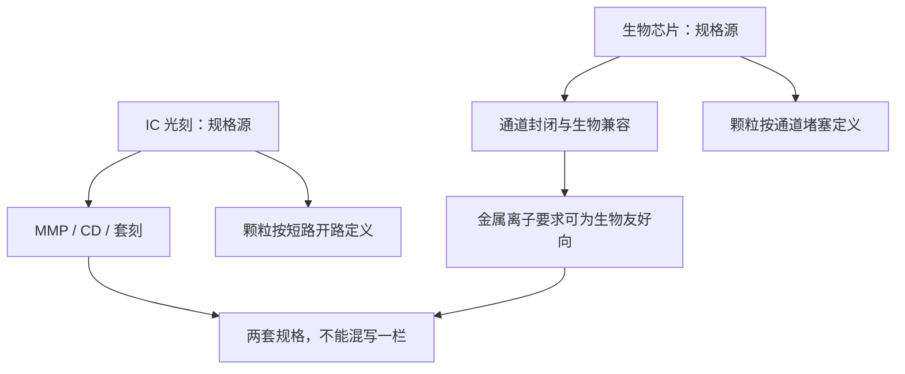
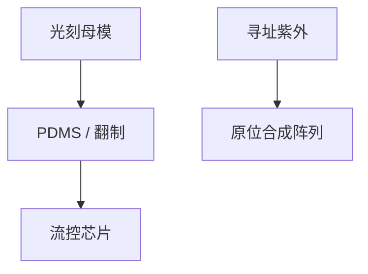

# 生物芯片光刻

流道、微井和原位合成阵列用的是成熟紫外光刻与软光刻；规格源是生物兼容与封闭，不是 MMP。

<footer>—— 对照 bioMEMS / lab-on-chip 光刻与 DNA 微阵列光导向合成的通称</footer>

[上一课](/litho/two-photon-3d)给出研究用三维聚合物。缺口是生物实验室更常用的平面流程。本课钉生物芯片光刻。回到 EUV 源的替代概念，留给[下一课](/litho/fel-euv-source)。

## 问题

微流控：SU-8 一类厚负胶、软光刻（PDMS 从光刻母模翻制）、玻璃/聚合物键合。DNA/肽阵列：光导向原位合成（光敏保护基 + 掩模或 DMD），分辨率在微米，化学步骤数是墙。与 IC 黄光间比：金属离子污染规格可能相反（要对生物友好），颗粒杀手定义按通道堵塞。

缺口是**应用域换规格源**，不是新光学。把生物芯片写进逻辑光刻附录会混五栏——本课明确它是替代形态课序里的应用。

术语翻译：「软光刻」不是不用光刻——先用光刻做出精密母版，再用软的 PDMS 像盖章一样从母版翻出结构。光刻只干一次，之后翻制便宜、可量产；母版成本像刻印章，盖多少次都不用重刻。

数字实例：IC 前道的 CD 以纳米计，微流道宽几十到几百微米，相差三四个数量级。所以生物芯片可以用接触式曝光、激光直写这些「老」手段——规格墙完全不在分辨率，而在通道漏不漏、材料毒不毒细胞。

### 软光刻不是无光刻

PDMS 翻制仍要一块光刻母版。母版可用激光直写或接触式。量产是翻制摊销母版，类似掩模摊销但材料不同。

```mermaid
flowchart TD
  IC["IC 光刻：规格源"] --> I1["MMP / CD / 套刻"]
  IC --> I2["颗粒按短路开路定义"]
  BIO["生物芯片：规格源"] --> B1["通道封闭与生物兼容"]
  BIO --> B2["颗粒按通道堵塞定义"]
  B1 --> B3["金属离子要求可为生物友好向"]
  I1 --> C["两套规格，不能混写一栏"]
  B3 --> C
```

原位合成的「套刻」是多次紫外对同一阵列的对准，化学残差比光学更毒。

## 方法

选：接触式/直写做母模 → 翻制或直接胶器件。洁净：生物兼容清洗，避免 PFAS 课那种 IC 专用化学若被法规波及也要评估。计量：通道截面、泄漏，不是 CD-SEM 为主。

## 机制

厚负胶交联形成通道墙；键合封闭。阵列合成是空间上的保护基脱除，光学只提供地址。信息密度远低于 IC，步骤化学才是良率。

为什么重要：原位合成每一步都要「光照到哪，哪里的碱基才能接下一个」，步数随序列长度线性涨，而每步化学产率不到 100%——就算单步 99%，合成 100 个碱基的长链后成功率也只剩约 37%。这就是「化学步骤数是墙」的算术。

```mermaid
flowchart TD
  MASTER["光刻母模"] --> SOFT["PDMS / 翻制"]
  UV["寻址紫外"] --> ARR["原位合成阵列"]
  SOFT --> CHIP["流控芯片"]
```

## 边界

不讲临床法规。不把 CRISPR 或测序化学当光刻。本课不进入逻辑 fab 污染控制的全套 SEMI。

后课默认：生物应用用成熟紫外与翻制；下一课回到领先逻辑，问 FEL 能否当 EUV 源替代。

## 小结

- 生物芯片光刻规格源是通道封闭与化学兼容，分辨率宽松。
- 软光刻摊销母模；阵列合成的墙在化学步数。
- 不并入逻辑 EUV 主干。
- 出处：bioMEMS 与光导向原位合成通称。
