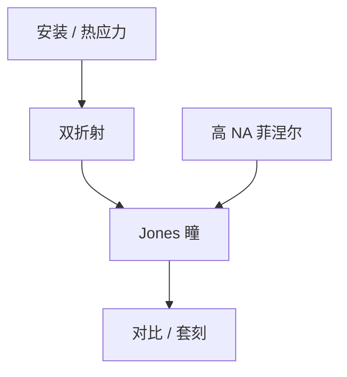
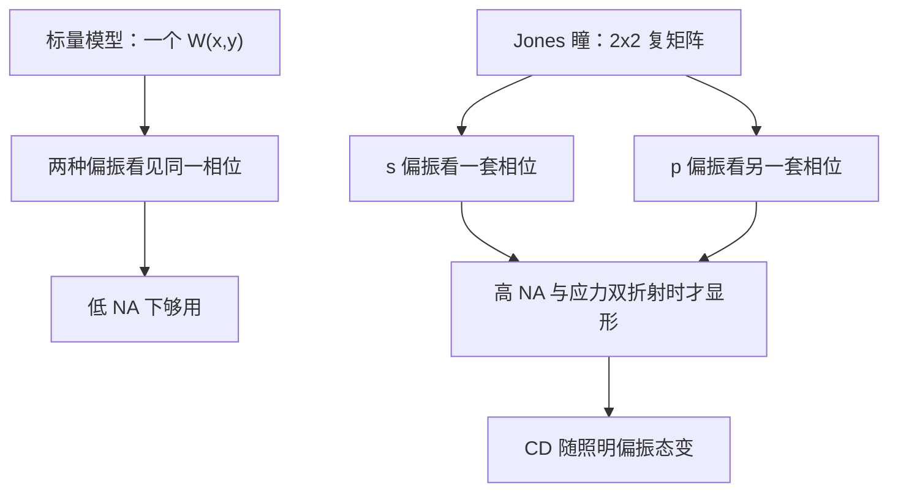

# 双折射与偏振像差

应力双折射把一块玻璃变成弱波片。高 NA 下 s/p 已经分家，再叠材料波片，Jones 瞳就不再是标量相位。

<footer>—— 对照 [Jones 矩阵](/litho/jones-polarization)、[矢量成像](/litho/vector-imaging)；CaF₂ 应力双折射</footer>

[上一课](/litho/lens-aberration-metrology)量标量波前。缺口是偏振：材料与镀膜的二向色性、应力双折射、末片的 s/p 菲涅尔。主干 Jones 课已有符号；本课落到物镜硬件。

## 问题

Zernike 相位假定两种偏振看见同一 $W$。高 NA 浸没下，对照明偏振敏感的层（[照明偏振](/litho/illuminator-polarization)）会把材料波片放大成 NILS 损失或套刻的偏振依赖。只补标量操纵器，CD 仍随偏振态变。

术语翻译：「双折射」就是不同偏振的光在同一块玻璃里看到不同折射率、走得一快一慢；「波片」正是故意用这一点给两个偏振制造固定相位差的元件。镜头里的应力无意中把玻璃变成了这种元件——「弱波片」说的就是它。

## 方法

选低应力双折射牌号、退火、安装应力控制。计量：偏振波前（Jones 瞳）或至少双偏振 Zernike。照明侧用偏振控制匹配物镜特征，而不是「越偏振越好」。

常见误区：以为照明偏振「越纯越好」。偏振控制的目标是匹配物镜自己的偏振特征——哪些方向被削弱、被移相，就把最好的光送进物镜最喜欢的方向；盲目加强某个方向，反而可能踩中被双折射削弱的通道。

```mermaid
flowchart TD
  STR["安装 / 热应力"] --> BR["双折射"]
  BR --> J["Jones 瞳"]
  NA["高 NA 菲涅尔"] --> J
  J --> NILS["对比 / 套刻"]
```

CaF₂ 比熔石英更易因应力露双折射。[熔石英与 CaF₂](/litho/fused-silica-caf2)课的材料分工现在有偏振代价，不是只有透过率。

## 机制

应力光弹性系数把 $\sigma$ 变成 $\Delta n$。快轴沿应力主方向，等效在光瞳上贴位置相关的延迟片，混合 s/p。矢量成像核因此含偏振像差，TCC 标量化失效。

直觉类比：两队人马穿过同一片高低不平的场地，s 队和 p 队各自看到不同的地形，步伐差随位置变——这就是「位置相关的延迟片」。想预报两队出口处的重合程度，就得同时带两套地形图，这套「双地形图」就是 Jones 瞳。

```mermaid
flowchart TD
  SC["标量模型：一个 W(x,y)"] --> F["两种偏振看见同一相位"]
  F --> OK["低 NA 下够用"]
  JP["Jones 瞳：2x2 复矩阵"] --> S1["s 偏振看一套相位"]
  JP --> S2["p 偏振看另一套相位"]
  S1 --> M["高 NA 与应力双折射时才显形"]
  S2 --> M
  M --> R["CD 随照明偏振态变"]
```

## 边界

下一课污染：薄膜脏了也会改相位和散射，但是颗粒与碳氢，不是体双折射。

## 小结

- 物镜像差有偏振通道；标量 Zernike 不够高 NA。
- 材料应力与末片菲涅尔一起进 Jones 瞳。
- 出处：Jones / 矢量成像课；CaF₂ 应力双折射通识。
