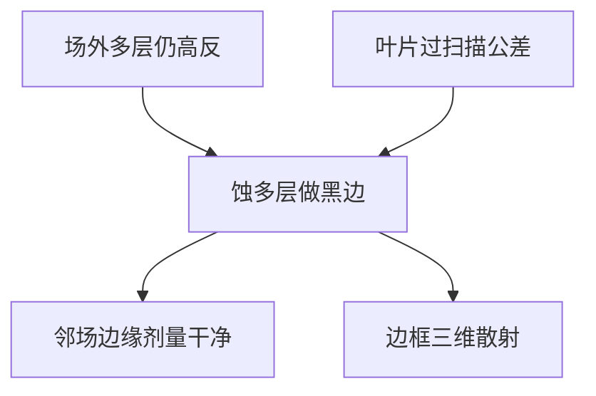

# 黑边

EUV 掩模在场外仍是镜子。相邻曝光场会把这块反射印进芯片边缘。黑边把场周多层去掉，让边缘真正变黑。

<footer>—— 对照 ASML / 掩模厂对 EUV black border 的公开方案</footer>

[上一课](/litho/ruthenium-capping)把图形区多层用钌帽保护起来。缺口是场与场之间：扫描机按场步进，照明和投影的光晕会打到掩模上图形区以外的多层，反射式几何把它当成合法物面，邻场边缘出现「闪光」或 CD 异常。本课钉黑边（black border）。掩模三维导致的最佳焦面偏移，留给[下一课](/litho/mask-3d-best-focus-shift）。

## 问题

DUV 透射版场外是铬挡光，天然较黑。EUV 空白是高反多层，场外若不处理，就是一块亮镜。环形场照明有限，仍有杂散和扫描过扫描（overscan）打到边框。邻场在硅片上拼接时，这块反射造成边缘剂量和套刻干扰。吸收体若只做到图形区，边框多层仍亮。

缺口是把「场外必须不反光」做成掩模结构，而不是靠叶片完全挡死——[遮挡叶片](/litho/reticle-masking-blades) 有衍射和定位公差，EUV 仍需要版上黑边作为合同。

黑边是蚀掉或破坏多层反射，不是涂一圈黑漆。13.5 nm 没有可用的厚吸收涂料当边框。

## 方法

公开做法：在场周把 Mo/Si 堆蚀到低反状态（去掉足够周期或蚀到基板），形成指定宽度的暗框。宽度要覆盖照明过扫描与对准标记布局，又不能吃掉有效场。蚀深和侧壁影响边框本身的三维散射，可能在场边缘加一条 flare。叶片仍用于曝光场定义，与黑边分层：叶片挡大部分，黑边收残余。

检验：边框反射率、宽度、与图形的套准。修复黑边缺陷等于在最边缘动多层，风险高，设计上往往禁止关键图形贴边过近。

### 叶片衍射不是黑边的替代

遮挡叶片有刃口衍射和定位公差，EUV 短波把衍射角铺开。只靠叶片、场外仍是高反多层，过扫描或杂散会在邻场边缘留下剂量尾巴。黑边把物面本身变黑，与叶片串级。宽度规格来自过扫描预算，不是美学边框。

## 机制

多层少若干周期，布拉格峰值塌掉，$R$ 降到百分之几。残余反射仍随角变，斜入射下边框不是理想零。边框台阶是一个深的三维物，衍射会进投影光瞳，表现为场边缘的局部底座——与图形区 flare 不同源。步进重复时，上一场的黑边位置必须与本场叶片对齐，否则亮缝闪一下。

High-NA 半场让「边缘」占场的比例上升，黑边和叶片的相对重要性增加。机制不变，公差更紧。

## 边界

本课不把吸收体 3D 的最佳焦点公式写完，下一课才把图形区 M3D 的焦移钉死。不重写 DUV 铬边框。黑边宽度吃有效场，与环形场弧长是同一张版图边距预算。出处：ASML EUV black border；掩模厂公开工艺叙述；叶片课。

## 小结

- 场外多层必须被做成黑边，否则邻场边缘被反射照明污染。
- 叶片与黑边分工：粗挡与版上合同。
- 下一课：图形区三维电磁如何把最佳焦面拉开。
- 出处：ASML；EUV mask black border 公开材料。
