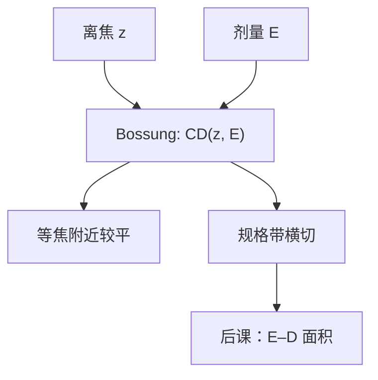

# Bossung 曲线

光学焦深给出一个轴向尺度；Bossung 把实验 CD 画成离焦的函数、按剂量分族，才看见这一层在硅片上还活着多宽。

<footer>—— J. W. Bossung, Projection Printing Characterization, Proc. SPIE (1977) 以来的产线读图惯例</footer>

[上一课](/litho/defocus-as-aberration)（离焦作为像差）。把离焦写成光瞳二次相位，并给出 $\mathrm{DOF}\propto\lambda/\mathrm{NA}^2$。缺口是：那条式子还在空中像里，没有胶阈值，也没有一张可以贴进报告的图。本课钉 Bossung 曲线：横轴离焦，纵轴 CD，每条曲线一个剂量。完整的曝光–散焦面积如何切规格，是后面工艺窗口课的题目；偏振在高 $\mathrm{NA}$ 下如何改这张图，留给[矢量成像](/litho/vector-imaging)。不要从瑞利 CD 公式重讲分辨率——图形已经在印，本课只问它随焦面怎么走。

## 问题

$k_2\lambda/\mathrm{NA}^2$ 告诉数量级，不告诉「这一层、这一照明、这一胶」的可用焦深。曝光矩阵在晶圆上场间变剂量、变焦距，显影后量 CD，得到一族 $\mathrm{CD}(z;E)$。规格带（例如目标 $\pm 10\%$）去切这些曲线，每个剂量得到一段可用 $z$；这才是实验焦深。缺口因此是读这张实验图，而不是再推一次二次相位。

上一课已经点过 Bossung 的名字并把它推给 E–D 课。本课把图本身讲完：弯曲从哪来、何谓等焦、为何密线与孤立线不能共用一张。

### 它不是调焦曲线的别名

调焦传感器给出的是高度图；Bossung 给出的是**印出的 CD** 随设定离焦的变化。伺服可以把平均面放在「光学最佳」附近，Bossung 仍可能很弯——因为空中像调制随 $z$ 变，阈值切点横移。把两者当成同一个「焦点好不好」，会漏掉胶和照明。

剂量族必须画在同一张图上。只看最佳剂量那一条，会把窗口压成线段，看不见剂量一漂焦深还剩多少。

## 方法

横轴：相对最佳焦面的 $z$（纳米）。纵轴：量得的 CD。参数：曝光剂量 $E$。正胶剂量升高通常使清掉区变宽（线变瘦或孔变大），整族曲线上下平移；离焦使调制变浅，曲线弯成笑或愁，视图形是密是疏、切在空中像的哪一段而定。

等焦点（isofocal）附近，某条剂量的 CD 几乎不随 $z$ 变：离焦掉对比与阈值切点的移动大致抵消。孤立线与密线的等焦剂量往往不同，所以「找到等焦」只对那一类图形成立，不能写成整层免费焦深。

### 从曲线到窗口只差一步

用规格带横切 Bossung，得到每个 $E$ 的可用 DOF；再对 $E$ 扫描，得到 E–D 平面上的合格区。曝光宽容度是最佳焦距处剂量轴的相对宽度。本课停在曲线：后课再谈面积与多图形重叠。这里只需承认 Bossung 是窗口的切片。

胶上 SEM 与刻蚀后 CD 不是同一族 Bossung。收缩、倒角、刻蚀偏置会把曲线搬家。写图要声明计量步骤。

## 机制

最佳焦面附近，空中像最陡，NILS 最高，剂量主要沿衬度曲线移动等剂量面，CD 随 $E$ 单调。离焦后二次相位让各级失配，$C$ 与 NILS 一起掉：要维持同一 CD，往往得改剂量，于是固定 $E$ 的那条曲线在 $z$ 方向弯下去或翻上来。三束成像弯得更急；两束成像（离轴）常常在焦轴上更宽——机制在焦深课讲过，这里是它的 CD 读出。

「禁戒节距」在 Bossung 上表现为某族曲线几乎没有平区：再怎么选剂量，离焦几十纳米就出规格。RET 换照明，本质是换哪一族 Bossung 变得可切。

### 后课默认的接口

说到实验焦深，默认去看 Bossung 被规格带切出的 $z$ 宽度，并声明剂量与图形。光学 $\mathrm{DOF}=k_2\lambda/\mathrm{NA}^2$ 只提供尺度，不替代这张图。矢量课会改 $I(z)$，因而改弯曲，定义不变。

## 边界

Bossung 不含套刻，不含跨场镜头指纹的全部——除非每个场点各画一张。曝光矩阵消耗晶圆与机时，产线常用稀疏场加模拟补密；模拟没有校准过的胶模型时，弯曲形状不可信。本课不引用未公开的某代机台焦深验收表。

也不要把「曲线很平」写成 NILS 很高：等焦可以来自对比与切点的抵消，窗口边沿的侧壁和残胶仍可能先死。

## 小结

- Bossung：$\mathrm{CD}$ vs 离焦，按剂量分族，是实验焦深的读图。
- 光学 $\lambda/\mathrm{NA}^2$ 给尺度；硅片曲线给这一层的可用宽度。
- 等焦只对特定图形与剂量成立。
- 规格带横切之后才进入 E–D 面积。
- 计量步骤必须声明（显影后 / 刻蚀后）。
- 出处：Bossung, Proc. SPIE (1977)；读图惯例见 Mack、Levinson。
