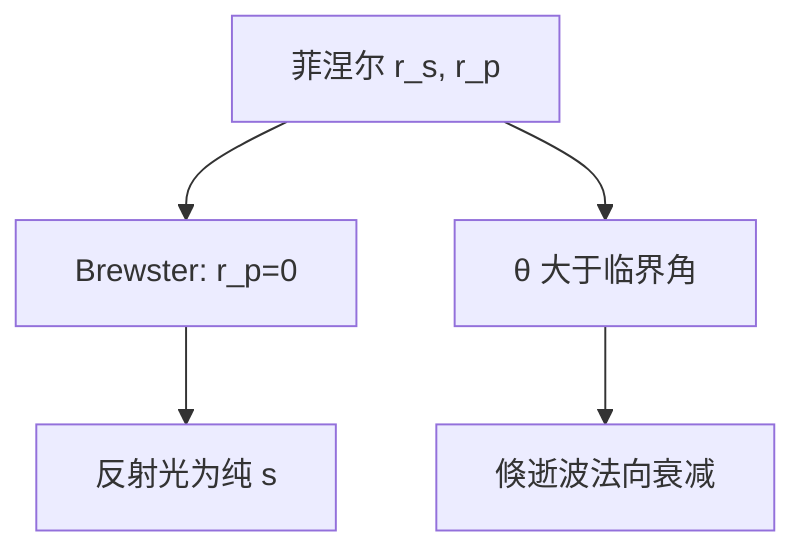

# 布鲁斯特角与全内反射

p 偏振在 Brewster 角反射为零；光从光密媒射向光疏媒且入射角超过临界角时，能量全反射，疏媒一侧只留下倏逝场。

<footer>—— 据 Hecht, Optics 与 Born &amp; Wolf, Principles of Optics 对 Brewster 与全内反射的整理</footer>

[上一课](/litho/fresnel-coefficients)写出了一般入射角下的 $r_s$、$r_p$。本课不重写斯涅尔定律。缺口是两个特殊角：是否存在使 $r_p=0$ 的入射？从密媒射向疏媒时折射角能否超过 $90^\circ$，超过之后能量去哪？后课偏振光路、棱镜转向与近场耦合会碰到这两个角。

## 问题

一般角下 $R_s\neq R_p$。工程上常问两件更窄的事：怎样让窗片对 p 光几乎不反射？怎样用一块棱镜把光束「无损」折转？前者是 Brewster 角，后者是全内反射（TIR）。没有临界角，无法理解倏逝波沿法向衰减；没有 Brewster，无法理解「反射光变成纯 s」这条偏振选择。

投影光刻的主光路通常工作在传播波区，不是靠 TIR 成像。本课把两个角钉在菲涅尔公式上，不把它们写成光刻机的成像机制。

### 全反射不是「折射角等于 90° 的光线」

$\theta_i=\theta_c$ 时 $\theta_t=90^\circ$，透射波沿界面掠射。$\theta_i>\theta_c$ 时 $\sin\theta_t>1$，折射角不再是实数，透射侧场沿界面传播、沿法向指数衰减。能量在无吸收时全部反射，$|r_s|=|r_p|=1$，但场仍然渗进疏媒约一个波长。把 TIR 理解成「光线在界面折回、对面什么都没有」，会丢掉近场耦合。

Brewster 角 $\theta_B=\arctan(n_2/n_1)$（从 $n_1$ 到 $n_2$）。此时反射线与折射线垂直，$r_p=0$。临界角 $\theta_c=\arcsin(n_2/n_1)$，仅当 $n_1>n_2$。

## 方法

令上一课的 $r_p=0$，得到 $\theta_i+\theta_t=90^\circ$，即 Brewster 条件。反射光为纯 s 线偏振（入射若含 p，p 分量全部进入折射）。全内反射：$n_1>n_2$ 且 $\theta_i>\theta_c$。透射侧波矢的法向分量变成虚数，倏逝波振幅 $\propto e^{-\kappa z}$，$\kappa=\frac{2\pi}{\lambda}\sqrt{n_1^2\sin^2\theta_i-n_2^2}$，穿透深度约 $\lambda$ 量级。

无吸收时功率不进入疏媒，但相位 $\arg r$ 随入射角变化，伴随 Goos–Hänchen 横向位移。本课只记 $|r|=1$ 与衰减，精细相位计量留给后课。

## 机制

Brewster 用于降低窗片 p 反射，或构造偏振敏感取样。TIR 在棱镜、光纤与某些对准传感器里作转向：损耗主要来自镀膜与散射，不是「折射把能量带走」。倏逝场随距离指数掉，只有把另一块光密媒凑到衰减长度内（受抑全反射）才会把能量再耦合出去。

浸没光刻的末片与晶圆之间是液体，设计上要让工作角度落在传播区，避免在液体–空气或液体–膜界面误入 TIR 而丢光。临界角语言在这里是警告，不是成像手段。高 NA 下大角度已经靠近一些界面的临界区，$R_s$ 与 $R_p$ 分叉加剧，这与上一课的矢量效应是同一条线。

Brewster 角随折射率比移动：浸没或镀膜会把 $\theta_B$ 挪到另一处，窗片「不反 p」的角度不能从空气–玻璃表上抄来就用。TIR 的相位随角度变，还被用来做移相元件；本课不把移相掩模提前讲完，只承认全反射系数是复数、模为 1。下一课薄膜把「半无限」改成有限 $d$，这两个特殊角仍作为单界面的极限出现在膜系公式里。

## 边界

本课假定两均匀半无限介质、实折射率。有限厚度疏媒上的受抑全反射、金属表面的等离子体反射，不在本课。也不把 TIR 当成扫描投影的成像原理——物镜靠折射与镜面，不是棱镜全反射把掩模搬到晶圆。

下一课 [薄膜干涉](/litho/thin-film-interference) 把单界面换成有限厚度，多束反射相干叠加。后课默认：Brewster 与 TIR 是菲涅尔的两个极限，倏逝波有穿透深度，主成像链仍用传播平面波。

## 小结

- Brewster 角：$r_p=0$，反射光为线偏 s。
- 全内反射：$\theta_i>\theta_c$ 时 $|r|=1$，疏媒侧为倏逝波。
- 倏逝场渗入约一个波长；近场耦合靠受抑全反射，不是本课主线。
- 投影成像通常不在 TIR 区；角概念用于光路与偏振。
- 出处：Hecht, *Optics*；Born &amp; Wolf, *Principles of Optics*。
