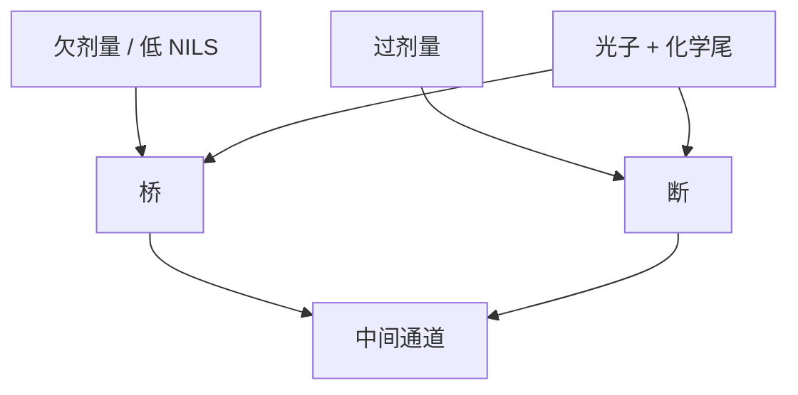

# 桥接与断线缺陷

LWR 是边还连着时的毛；桥与断是连通性翻了面。均值 CD 仍在规格里，良率可以已经死在这两座悬崖上。

<footer>—— 据 De Bisschop 对随机失效（NOK）与桥/断；Naulleau 对印刷缺陷尾的讨论</footer>

[上一课](/litho/ler-device-impact)默认线仍连通，只谈电学调制。缺口是印刷失效：局部过溶则断，局部欠溶则桥（并线）。主干[缺失孔](/litho/stochastic-holes) 把孔层的缺/并写过；本课把线层的桥/断接到同一套尾部语言，并接到酸计数与 MC。[缺陷率与 Z 因子](/litho/stochastic-z-factor) 再把悬崖收成可比较的因子。

## 问题

剂量偏低，有效酸不足，正胶线该断开的空间没清干净——桥；剂量偏高，线本身被溶穿——断。离焦、弱 NILS、flare 抬台基，都把工作点推向悬崖。De Bisschop 的 NOK(CD) 把失效概率写成局部尺寸的极陡函数：平均 CD 在中间通道，两侧是桥崖与断崖。

缺口不是再算光子 $N$，而是：线层要用两个缺陷率曲线同时切窗，只加剂量压断会抬桥，只减剂量相反。孔层缺/并是同一几何的二维版，不要发明第三种泊松。

### NOK 不是 LWR 的 $6\sigma$

LWR 描述还存在的边。桥/断是拓扑事件，概率不必能从高斯 LWR 外推到 ppm。公开测量表明失效与局部 CD 的关系可以比高斯尾更陡或更肥。预算表上缺陷与粗糙必须分列——[光子散粒预算](/litho/photon-shot-budget) 已要求；本课给线层对象。

掩模桥、颗粒、涂胶条纹是系统重复缺陷，不是本课随机。对拍重复曝光：随机会跳位置，系统钉在掩模或轨道指纹上。

## 方法

计量：电子束大面积检，画缺陷密度 vs 剂量（再 vs 焦）。抽样面积必须匹配目标 ppm/ppb，否则「没看见」是无能。MC：用连通性判据（清底通道是否贯通）而不是只报 CD。OPC：平均边外推可以减局部弱点，但工作点贴崖时必须加剂量或改胶。

设计：放宽最小间距、避免最弱 NILS 的禁戒节距走最小线。计算光刻的热区应以失效概率着色，不以 EPE 均值着色。

## 机制

争夺带上局部有效酸的极值让显影前沿连通或断开。电子核与酸核决定极值的空间斑有多大：核太大，斑糊成平均，悬崖后退但分辨率死；核太小，斑锐、尾肥。这是 RLS 在缺陷上的几何。flare 把暗区剂量从零抬起，桥崖向工作点移动——光学杂散在这里变成化学库存够不够，[淬灭剂](/litho/pag-quencher) 是保险丝。

线端、拐角、SRAF 附近空中像更弱，悬崖先到。平均密栅合格不能签核二维热区。

负胶极性翻转：过剂量与欠剂量对应的桥/断要改口令，拓扑逻辑仍是连通性。

## 边界

不把某层 $10^{-8}$ 缺陷规格写成物理常数。不重写孔课的全部图表。下一课 Z 因子试图用一个数比较胶与工作点相对悬崖的远近；本课先把两座悬崖画出来。

## 小结

- 桥与断是连通性失效，与还连着的 LWR 分列。
- 两座悬崖夹一条通道；只拧剂量会此消彼长。
- 不能用高斯 LWR 外推 ppm 缺陷。
- 对拍重复曝光以排除掩模/轨道系统缺陷。
- 出处：De Bisschop NOK；Naulleau 随机缺陷；主干[缺失孔](/litho/stochastic-holes)。
