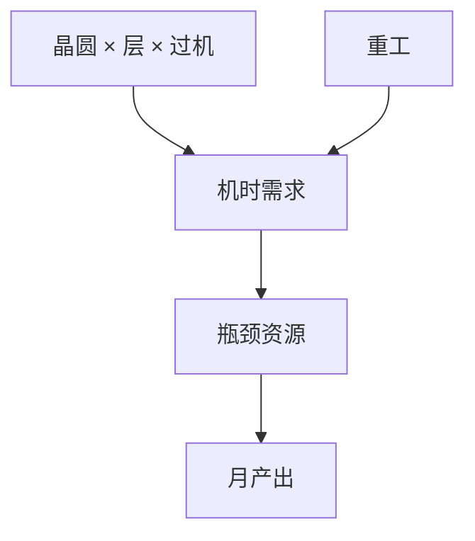

# 产能规划与瓶颈

厂的月产能由最慢的那类约束机台决定；EUV、光化掩模检验和 e-beam 检测常常比浸没扫描机更先成为瓶颈。

<footer>—— 对照 fab capacity planning 与约束理论在光刻区的应用通称</footer>

[上一课](/litho/tool-price-depreciation)给出小时成本。缺口是台数。本课钉产能规划与瓶颈。把扫描机采购放进整厂资本开支，留给[下一课](/litho/fab-capex）。

## 问题

需求：晶圆数 × 每片 EUV 层过机 × 1/有效 wph × 1/可用性 ≈ EUV 台数。浸没同理但层数更多。瓶颈可能在：EUV、轨道、刻蚀、掩模写入、AIMS、e-beam 检测、计量。加一台非瓶颈机不增加产出。多重图形把浸没与刻蚀同时变成瓶颈对。

缺口是**约束识别**，不是买最贵的机。把产能当「有几台 EUV」，会忽略掩模厂与检测。

### Mix 是一等变量

产品组合改 EUV 层数与开口率（刻蚀负荷），瓶颈会移动。规划必须用 mix 场景，不能用单一英雄产品。

重工是对瓶颈的隐性需求。高重工率等于少买了几台扫描机。

## 方法

建资源表：各机类小时需求 vs 供给。缓冲：维护、新品学习、掩模延迟。与交叉课：迁一层到 EUV 是把需求从浸没/刻蚀挪到 EUV/掩模。与学习曲线：爬坡期检测需求峰值。

## 机制

约束理论：产出由瓶颈决定，非瓶颈的利用率高只是在堆 WIP。光刻区 WIP 增加周期与二次缺陷机会。因此规划不仅是买机器，还是控制队列。

## 边界

不预测某厂台数。不把理论 wph 当供给。规划不含劳动力细节。

后课默认：产出由瓶颈机类决定；下一课这些机台的买价如何堆成 fab capex。

## 小结

- 产能由瓶颈资源决定；EUV、掩模检验、e-beam 常入围。
- Mix 与重工移动瓶颈。
- 非瓶颈加机只堆 WIP。
- 出处：fab capacity 与约束理论通称。
