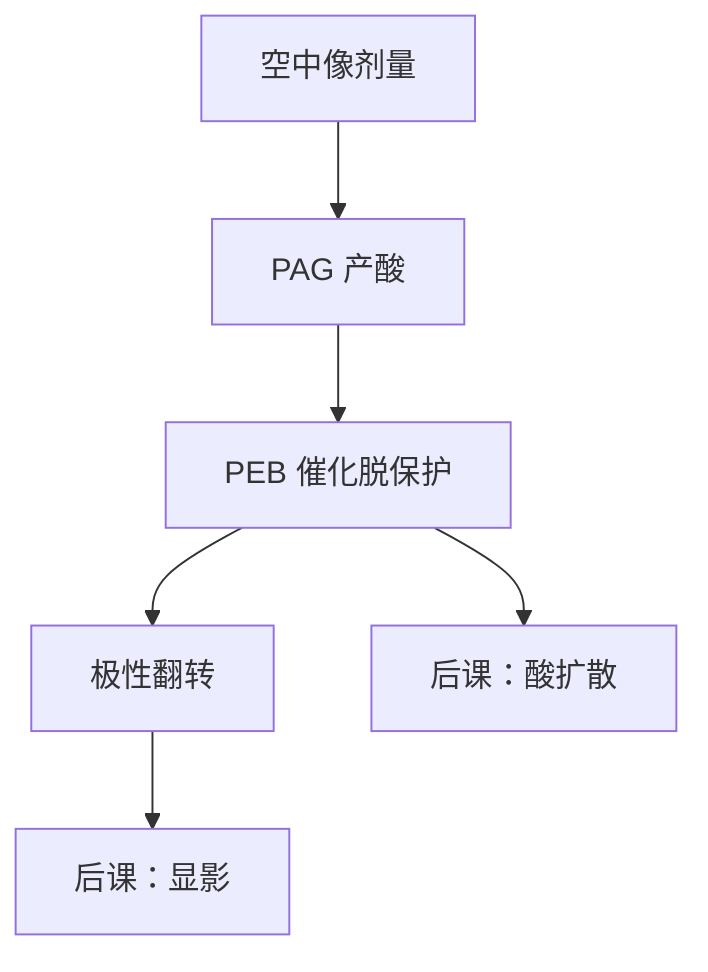

# 化学放大胶

一个光子产一颗酸，后烘里酸催化许多次脱保护：灵敏度靠化学增益买，不是靠把空中像再照亮一档。

<footer>—— 据 Ito / Willson 化学放大思路，以及 Mack 对 CAR 产线链路的表述整理</footer>

[上一课](/litho/stepper-vs-scanner)把工具写成能把空中像扫到晶圆上。缺口是记录介质：扫描狭缝留下的是剂量，还不是线条。本课引入化学放大胶（CAR）——DUV 的默认正胶家族。酸在膜里走多远、如何变成线宽粗糙度，留给[下一课](/litho/acid-diffusion-lwr)。显影衬度曲线再下一课。不要在这里重讲扫描同步。

## 问题

KrF / ArF 的光子能量比 g/i 线高，老式 DNQ–酚醛的吸收和量子产率撑不住薄膜灵敏度：胶要薄（以免吸收把底部吃黑），又要够敏（以免扫描慢到没有产能）。缺口因此是一种增益机制：吸收事件稀，化学事件必须密。

CAR 的答案是：光酸产生剂（PAG）在曝光时放出酸，后烘（PEB）期间酸催化保护基团脱落，极性翻转，碱性显影液溶掉曝光区（正胶）。一个酸分子循环多次，剂量可以被「放大」。没有这套循环，上一课的扫描速度写不出产线 wph。

### 空中像、潜像、显影像

曝光结束时，酸的空间分布是潜像，还不是浮雕。PEB 改酸与保护基的分布；显影才切出厚度轮廓。Mack 把三段分开，本课只钉第一段到催化循环：剂量如何变成酸。把 SEM 上的线宽直接叫「曝光结果」，会把后两课的扩散与显影偷运进来。

化学放大是 DUV 的主流，不是「所有胶」。i 线 DNQ、EUV 金属氧化物胶是不同工作点。本课默认 248/193 nm 的 CAR，EUV 分叉在更后面。

## 方法

配方至少含聚合物（带保护基）、PAG、淬灭剂（碱，用来收酸、定阈值）。曝光波长必须落在 PAG 的有效吸收，而不是聚合物随便染色。PEB 温度与时间是催化时钟：太短增益不够，太长等于把下一课的扩散核做大。本课把 PEB 当作增益旋钮，不展开扩散方程。

淬灭剂让未曝光区的酸被中和，陡化潜像的阈值，也设定「要多少剂量才打得过碱」。这是后课衬度曲线的化学前置，这里只承认阈值不完全由光学 $I_\mathrm{th}$ 决定。

### 增益与出气

增益高，灵敏度好，扫描可以快。代价在下一课写：酸的出生位置被放大成一片脱保护云。另一笔立刻到期的账是出气与镜头污染——193 nm 尤其敏感，产线用上层涂层和受控配方，不是本课的成像问题，但禁止把「更敏」写成无条件目标。

## 机制

光子（或二次电子，在 EUV 上）把 PAG 打成酸。PEB 提供扩散与反应的活化能，酸作为催化剂不按化学计量消耗——直到被淬灭剂中和或离开反应区。潜像的「亮」是高酸浓度，「暗」是保护基仍在。光学对比度高，酸对比也高；光学对比不够，增益只把模糊的酸分布一起放大。

因此 CAR 不能补零级偏置：它放大的是已经存在的剂量差。上一课程的空中像对比与 $k_1$ 窗口，在这里变成「酸图够不够陡」。后课的 $\gamma$ 是显影对这张酸图的再一次非线性，不要与本课的化学增益混名。

PEB 差几摄氏度，同一张空中像的 CD 可以走出规格：CAR 把轨道烘箱做成光刻的一部分。前烘决定残留溶剂和自由体积，间接改下一课的扩散，因此涂胶单元与扫描机是一条工艺，不能只优化镜头。

### 后课默认

说到 DUV 胶，默认正性 CAR：PAG、PEB、淬灭剂。说到灵敏度，默认来自催化循环，不是来自加厚胶。酸扩散长度当作下一课才引入的符号，本课不给纳米数当普适常数。

## 边界

本课不写 LWR 公式，不写 EUV 光子泊松，不写金属氧化物团簇。也不把 Ito 的早期实验剂量当成今日 ArF 浸没的工艺点。负胶 CAR 存在，机制对称（交联而非脱保护），产线逻辑后段仍以正胶为主，本课不并列开两套百科。

底层抗反射（BARC）与上层涂层改的是驻波和出气，不改催化循环的定义。它们会出现在工艺窗口里，但本课的对象仍是「剂量如何变成酸」。193 nm 聚合物本身吸收就强，PAG 不是唯一吸收体；把全部吸收算进 PAG 量子产率会高估增益。

Ito 与 Willson 的化学放大把「一个光子许多反应」写进 DUV。后课引用时指向这条链路，不要另造一篇不存在的 arXiv 作为 CAR 的发明文献。

## 小结

- 扫描机写下的是剂量；CAR 用 PAG + PEB 催化把剂量写成酸潜像。
- 增益买灵敏度，使薄膜 DUV 胶与扫描产能同时成立。
- 空中像对比不够，放大帮不上；增益不是 RET。
- 酸往哪走、边有多糙，是下一课；显影怎么切，是再下一课。
- 出处：Ito &amp; Willson 化学放大；Mack, *Fundamental Principles of Optical Lithography*；Levinson, *Principles of Lithography*。
