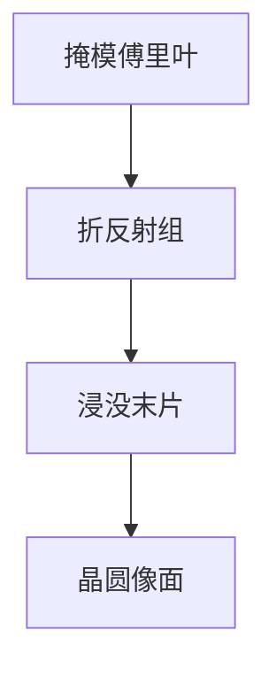

# 折反射物镜设计

193 nm 高 NA 浸没物镜不是一串透镜堆到底：反射面用来折光路、控色差，折射面用来收 NA。折反射是材料与像差预算的解，不是外观。

<footer>—— 对照蔡司投影物镜公开的 catadioptric 架构；[蔡司 EUV 光学](/litho/zeiss-euv-optics) 是多层反射的另一条路</footer>

[上一课](/litho/source-power-stability)收束激光稳定。照明已经进狭缝；缺口是**谁把掩模傅里叶面成像到晶圆**。本课钉 193 nm 浸没用的折反射（catadioptric）物镜：反射+折射，不重推 [NA](/litho/lens-na) 或瑞利公式。后课加热、操纵器、材料都默认这台镜头的几何。

## 问题

纯折射在 193 nm 要很多 CaF₂ / 熔石英，色差与质量迅速失控；纯反射（EUV 那套多层）在 DUV 不是这条产线。折反射用凹面镜转折光路、减少玻璃厚度，折射组提供可变光焦度与浸没最后一片。缺口不是「镜头有多少片」的广告，而是为何必须混合。

浸没最后一片与水接触，材料、镀膜、机械是流体课已经埋的接口。本课只谈投影组整体形态，不写喷淋头。

## 方法

设计自由度：镜面曲率、透镜组、偏振控制、狭缝视场。扫描机只照明狭缝高的环形视场，物镜按扫描缝优化，不是全圆显微镜。装调：各面间隔与倾角进像差表，后课操纵器微调。

## 机制

反射面无色散，帮色差；但仍有中心遮拦或离轴视场约束，必须用折射补场曲与畸变。高 NA 下矢量效应在末片最剧，见 [浸没矢量成像](/litho/immersion-vector-imaging)。

## 边界

EUV 投影是全反射多层，本课不混写。下一课透镜加热：即使设计理想，193 nm 吸收仍把镜头烤变形。

## 小结

- 193 nm 高 NA 浸没物镜走折反射，为材料与色差，不为造型。
- 扫描狭缝视场决定优化域。
- 出处：蔡司 / 浸没物镜公开架构；NA 课。
