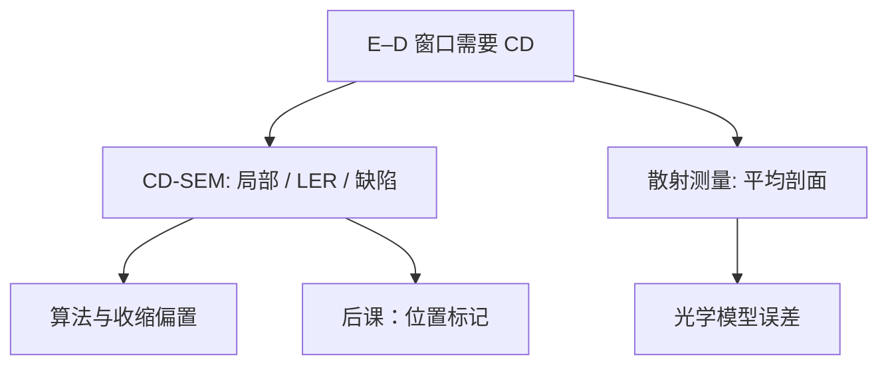

# CD-SEM 与散射测量

工艺窗口的纵轴是 CD；扫描电镜给出局部形貌与粗糙度，散射测量给出光栅的平均剖面，两者量的不是同一个统计量。

<footer>—— 据 Levinson 对 CD 计量的讨论，以及产线 CD-SEM / OCD 分工的公开表述整理</footer>

[上一课](/litho/ed-process-window)把合格区画在曝光–散焦平面上，纵轴默认是「真 CD」。缺口是：真值没有直接读数——CD-SEM 有充电、收缩与边缘算法，光学散射测量（OCD）有模型误差。本课钉两种计量各回答什么。位置误差怎么量，留给[下一课](/litho/overlay-marks)，不要在这里把套刻标记当 CD 垫。

## 问题

Bossung 上每一个点都来自一次测量。SEM 俯视线条，用二次电子边缘判据估宽度，空间分辨率够看 LER，也够看缺陷和局部桥连。代价是慢、有电子束引起的胶收缩、充电使边缘漂移，算法阈值把「SEM CD」变成带偏置的量。

散射测量把宽带偏光打到周期光栅上，反演膜厚、CD、侧壁角。快，适合场内抽样和进机台反馈，给出的是光照光斑内的平均剖面，看不见单根线的毛边，也看不见非周期的随机缺孔。缺口因此是分工，不是选一个「更准」的冠军。

### 窗口用均值，粗糙度用 SEM

E–D 窗口通常切的是平均 CD。OCD 或 SEM 的场均值都可以喂窗口，但必须固定配方：同一套边缘定义、同一校准片。LWR、缺陷、局部 OPC 热点只能 SEM（或 e-beam review）。把 OCD 的漂亮均值写成「没有 LWR」，是把统计量偷换了。

胶上 SEM 与刻蚀后 SEM 不是同一条 Bossung。收缩、倒角、硬掩模偏置都会搬家。写窗口要声明量的是显影后还是刻蚀后。

## 方法

CD-SEM：设定加速电压、束流、帧平均与边缘算法，沿设计点取样。要报 LER 时必须声明滤波与空间频率。剂量矩阵上，电子收缩会让看起来「CD 随测量变细」，需用预剂量或低温、低电压策略，不能把收缩写进胶衬度。

OCD：在划片槽或专用计量垫上放满足周期假设的光栅，光谱拟合堆栈。模型要含材料色散和侧壁；换胶、换底层等于换模型。与 SEM 做相关，得到一个偏置，再把偏置当常数用——工艺漂了，相关要重做。

### 进扫描机的反馈

平均 CD 反馈剂量，用 OCD 或 SEM 抽样都可以；进率决定能不能场级控制。形貌（侧壁角）更偏 OCD。热点与缺陷审查走 SEM。本课不展开 APC 软件，只要求窗口实验在矩阵上写明计量链。

## 机制

SEM 边缘是电子散射与充电的卷积，不是几何切面。同一物理宽度，胶种与形貌变了，二次电子拐点会移，CD 假漂。OCD 是远场衍射反问题，多解与材料色散误差表现为 CD 与侧壁角互换：一个变胖、一个变陡，光谱仍拟合。所以两种方法的符合要在稳定工艺上标定，而不是一次对准永远准。

上一课的重叠窗口若混用两种计量而不声明，交集会假性变窄或变宽。规定：一类图形固定一种量法做窗口，另一种做监护。

### 与 OPC 模拟器对齐定义

OPC 验证常用 SEM 热点对照模拟 CD。若 SEM 边缘算法与模拟器输出的「阈值 CD」不是同一个切点，会把光学模型修歪。散射测量给出的平均截面更接近紧凑抗蚀剂模型，但看不见二维热点。闭环必须声明：哪一种 CD 进了哪一个模型，换胶或换 BARC 之后相关要重做。

不要把 scatterometry 理解成光学显微镜量线宽。它是衍射谱反演，对节距、材料色散和底层薄膜极敏感。叠层一变，库要重算。

## 边界

本课不是 SEM 硬件课，不讲柱体像差。也不把散射测量写成可以替代套刻：光栅可以兼做套刻垫，但物理量是位置差，下一课才定义。EUV 缺孔统计必须 SEM/电镜审查，OCD 平均不到泊松尾。掩模上的 CD 计量（掩模 SEM、AIMS）是掩模厂的链，不要与晶圆 CD 混成一张图。

进机台的剂量控制若用 OCD，要防模型在换胶批次后偷偷漂：看起来 EL 变了，其实是色散表过期。SEM 抽样不足则会把局部热点平均进窗口，方向相反。两种失效都表现为「窗口会说话，硅片不认」。

散射测量的光斑通常几微米到几十微米，比 SEM 视场大、比曝光场小。它量的是垫，不是整场指纹；场内 CD 均匀性仍要另采样。

## 小结

- E–D 窗口的 CD 必须声明计量链与显影/刻蚀状态。
- SEM 看局部、LER、缺陷；OCD 看周期平均剖面，更快。
- 两种偏置来源不同，相关不是物理相等。
- 均值喂窗口，粗糙度与热点喂 SEM。
- 位置如何量，下一课。
- 出处：Levinson, *Principles of Lithography*；Mack 对 CD 与工艺控制的讨论。
