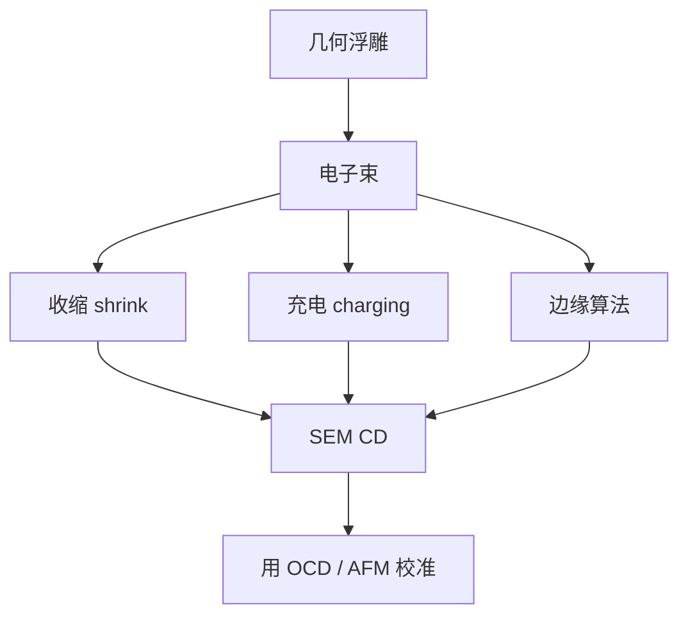

# SEM 收缩与充电

CD-SEM 报出来的宽度，含电子束把胶打瘦、电荷把边推歪的一截；计量剂量不是零，伪影必须进预算。

<footer>—— 据产线 CD-SEM 计量通称：resist shrink、charging 与边缘算法偏置</footer>

[上一课](/litho/cd-sem-scatterometry)把 CD 分成 SEM 局部形貌与散射测量平均剖面，并已经点名收缩与充电。缺口是把这两类伪影写成可操作的计量误差，而不是再比较一次「谁更准」。穆勒矩阵 OCD 留给[下一课](/litho/ocd-mueller）。套刻标记仍不出场。

## 问题

SEM 用电子束扫胶。CAR 尤其不稳：电子引发额外脱保护或挥发，线宽随扫描次数变瘦，这叫 shrink。绝缘胶同时积电荷，局域电位改二次电子产额和边缘判据，表观 CD 漂移，这叫 charging。算法阈值再把「边在哪」定义成灰度的某一百分位，于是 SEM CD = 几何 CD + 收缩 + 充电 + 算法。上一课用它看 LER 和局部桥连，本课钉后三项不是噪声而是系统偏。

把 ADI 窗完全建立在未校正的 SEM CD 上，剂量会跟着计量伪影走。把 shrinkage 写成「胶不好」，会漏掉束流、加速电压、帧数这些计量旋钮。

### 计量剂量不是零

每一帧都在曝光。多次平均为了降噪，同时多打一截收缩。EUV 薄胶更经不起打。必须声明：加速电压、束流、像素、帧数、是否先测后蚀刻。同一条线量第二次，CD 还在掉，就是收缩主导，不是工艺在变。

充电在孤立线和密栅上不同：电荷泄漏路径不同，表观疏密偏差里可以有一截是 SEM 的，不是 OPE。换极性或喷薄导电层，偏置若大动，先查计量。

## 方法

减伪影：降电压、降剂量、少帧、导电涂层、在硬掩模或 AEI 上量（胶已不在）。校正：用同一图形的 OCD 或后课 AFM 做参考，把 SEM 偏置当校准曲线，而不是当真值。时间轴：规定从出显影到进 SEM 的延迟，因为真空里继续出气和充电状态在变。

算法：阈值、导数边、模型拟合各有偏置，对倒锥和圆角尤其敏感——上一课侧壁角会改 SEM CD 而不改「真」底宽。签核要锁算法版本，换版本等于换量纲。

### 与散射测量分工

SEM 伪影是局部的、与束相关的；OCD 伪影是模型简并的。收缩让 SEM 偏瘦，OCD 看不到这次束损伤。两者差一截，不要立刻判工艺变了：先问 SEM 是否刚换束条件。LER 只能 SEM（或 AFM）给，但 LER 谱的高频也被束损伤污染。

## 机制

电子在胶里电离、产热、诱发挥发，聚合物网络收缩，线的顶宽先掉，剖面变圆。化学放大胶有未反应的 PAG 与酸通道，束等于一次微弱的「二次曝光」。充电抬高表面电位，一次电子减速、二次电子产额改，边缘的亮带位移，算法跟着走。密线之间的势阱与孤立线不同，所以充电指纹可以长得像 OPE。

EUV 金属氧化物胶收缩通常小于 CAR，充电与导电性却另一套；不能把 ArF CAR 的 shrink 表贴到锡氧上。AEI 金属或硬掩模上收缩小，充电仍在，尤其是孤立导电图形。

报 CD 时写清 ADI/AEI、SEM 条件与算法。只报「SEM 比 OCD 小 2 nm」而不写束条件，无法判断是收缩、模型，还是真的刻蚀偏置。

## 边界

不编某电压下的纳米收缩常数，不把厂商算法名当物理。不在这里展开穆勒矩阵通道——下一课用更多偏振去解剖面简并，解的是光学反演，不是电子束损伤。不要用 SEM 去跟扫描机脉间剂量噪声：上一课剂量控制已经说过来不及。

破坏性：有的胶量完就不能再当产品。抽样策略属于 CDU，本课只要求抽样点的计量条件一致，否则场内图含束条件指纹。

## 小结

- SEM CD 含收缩、充电与算法偏置，计量剂量不是零。
- 二次扫描还在掉 CD，就是 shrink；疏密差随导电条件动，要怀疑充电。
- 用 OCD/AFM 校准系统偏，锁束条件与算法版本。
- LER 高频可被束损伤污染；AEI 上收缩小，充电仍在。
- 出处：CD-SEM 计量通称；Levinson 对电子束计量伪影的讨论。
