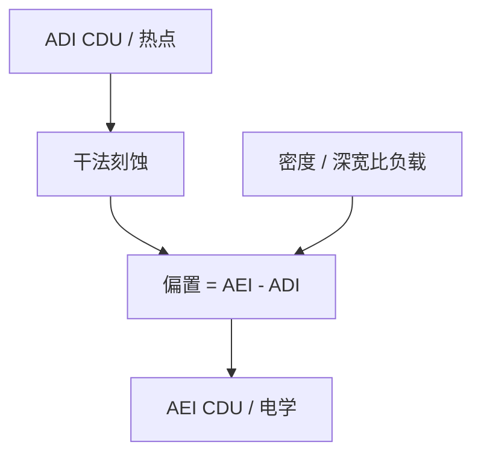

# 刻蚀偏置与 CDU

显影后的 CD 图还不是器件上的图。刻蚀把 ADI 的均值和指纹改写成 AEI：偏置可以修均匀性，也可以把热点放大。

<footer>—— 据 Levinson 对显影后 / 刻蚀后计量与刻蚀偏置的产线讨论整理</footer>

[上一课](/litho/hotspot-pv)把签核停在过程变化下的轮廓包络，默认还在胶上。缺口是转印：[工艺流程](/litho/litho-process-flow)的最后一段把浮雕交给干法，横向侵蚀、微负载与深宽比依赖会让 CD 整表搬家。[CDU](/litho/cdu-uniformity) 若只报 ADI，产品电学认的是 AEI。本课钉刻蚀偏置。浸没水膜如何维持，从下一课程的 [ArF 浸没](/litho/arf-immersion) 架构另起，不在这里灌水。

## 问题

ADI（after develop inspect）是胶上 CD；AEI（after etch inspect）是硬掩模或衬底上 CD。偏置 $\mathrm{AEI}-\mathrm{ADI}$ 随图形密度、节距、局部开孔率和深宽比变，不是一个全局常数。FEM 在胶上很大的窗，刻蚀后可以因负载把密线修细、孤立线修粗，重叠窗改形。热点的 PV-band 在胶上刚合格，刻蚀风一吹，桥连或断开改边。产品规格若写的是电学或 AEI，胶上窗只是中间量。

缺口因此是把 CDU 声明成哪一段的空间图，并承认刻蚀是一层空间滤波器，不是「把胶轮廓向下复印」。

### 偏置可以改善也可以破坏均匀性

各向同性的过刻把所有线瘦一截，均值移动，相对 CDU 有时看起来更好（小图形被吃掉的比例不同则相反）。微负载让密区刻得慢、疏区刻得快，场内密度图变成新的 CDU 指纹，光刻剂量 mapper 补不平。Levinson 把光刻控制与刻蚀控制分成两段计量，原因在此。

报 CDU 必须写 ADI 还是 AEI。把胶上 3σ 和刻蚀后 3σ 排在同一张「进步」表里，是把两段工艺当成一次测量。

## 方法

成对计量：同一垫先 ADI 后 AEI（或相邻片短环），画偏置对节距、对密度。OPC / 刻蚀邻近修正用这张表，而不是假定偏置为零。控制环：光刻管 ADI 均值与光学指纹；刻蚀管负载与腔体漂移。把 AEI 漂移全部打回扫描机剂量，短期能扳均值，侧壁和深度会坏。

腔体换件或换气体之后，偏置表要重测，旧 OPC 邻近修正会过期。

热点验证若签核在胶上，量产失效在刻蚀后，要补 AEI SEM。金属氧化物胶自身硬掩模改变偏置曲线，不能把 CAR 的蚀刻表搬过去——[euv-resist](/litho/euv-resist) 的选择比差在这里兑现。

### 与 FEM 的第二张窗

有的层以 AEI 规格签核，FEM 就要打到刻蚀后，或胶上 FEM 加一张校准过的偏置模型。模型未校准时空心加密，窗口面积不可信。禁戒节距在刻蚀后可能移动：光学禁戒加上负载，交集更瘦。

## 机制

反应离子刻蚀的横向侵蚀与离子角度、聚合物沉积有关。开口大处反应剂足，开口小处耗尽，这就是微负载。深槽底部离子到达差，出现深宽比依赖，底 CD 与顶 CD 分家——OCD / 穆勒量的平均剖面在 AEI 上更关键，SEM 俯视会撒谎。光刻场内指纹若与密度图同相，刻蚀会放大；反相则部分抵消。抵消是运气，不是控制策略。

套刻标记的不对称往往在这一段生成：风把一侧侧壁打斜，DBO/IBO 偏置上升。计量课序把 CD 与 overlay 分开写，根子常在同一刻蚀风。

自对准双重的 spacer 偏置是另一张表：芯轴 CD 的 ADI 误差进入成对线的不对称。不要用单层 LELE 的 AEI–ADI 去解释 SADP。

## 边界

本课不写某腔体的未公开选择比，也不把 ALE / 原子层刻蚀当成已经取消偏置——[ALD/ALE](/litho/ald-ale) 是另一课的纵向控制，横向负载仍在。计量课序到此：窗口、矩阵、均匀性、SEM/OCD、套刻链、flare、热点、刻蚀后 CDU 都已点名。后课默认：产品 CD 规格要写 ADI 或 AEI；只优化胶上窗是半截课。

浸没缺陷与面涂不在本课。下一课程从水作介质抬 NA 讲起，流体卫生另算。

电学 CD 还可能与 AEI SEM 再差一截（掺杂、硅损失）。AEI 仍是光刻–刻蚀链的合同界面，不是器件终点。

## 小结

- 刻蚀偏置把 ADI 的均值与指纹改写成 AEI，密度和深宽比是变量。
- CDU 必须声明显影后还是刻蚀后；两段 3σ 不可混表。
- 剂量补偿补不平微负载；热点要以 AEI 再验。
- 标记不对称常在此段生成，套刻偏置与 CD 偏置同源。
- 出处：Levinson, *Principles of Lithography*；Mack 对图形转印链的分段。
