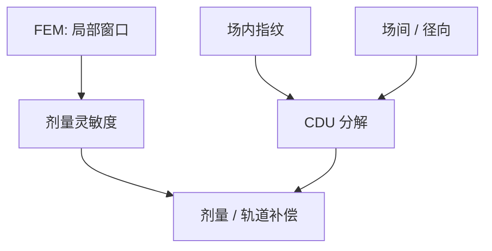

# CD 均匀性 CDU

工艺窗口回答「这一点还活着吗」；CDU 回答「整场、整片、整批是不是同一点」。均匀性不合格时，窗口面积是一张不会兑现的地图。

<footer>—— 据 Levinson 对 CD 控制与均匀性分解的产线讨论整理</footer>

[上一课](/litho/fem-matrix)用一场一个 $(E,z)$ 把 Bossung 铺出来，并默认场代表同一工艺点。缺口是空间：镜头指纹、扫描狭缝、涂胶、PEB 热板、显影喷嘴会让名义同一剂量写出不同 CD。本课钉 CD 均匀性（CDU）。局部随机涨落（LCDU）已在[随机效应](/litho/euv-stochastics)里，这里管的是可重复的空间指纹与场间差。怎么量每一条线，留给后课的 SEM / 散射测量。

## 问题

FEM 给出的 EL 是「若全场都停在该 $(E,z)$」的宽度。真实曝光场里，狭缝方向有照明与镜头指纹，扫描方向有速度与同步，晶圆半径方向有涂胶与热。于是同一产品场内 CD 已经扫过一小段 Bossung。规格若按全场 $3\sigma$ 切，有效窗口比矩阵中心那一场更瘦。

缺口因此是把 CD 的方差按空间尺度拆开：场内（intrafield）、场间（interfield）、片内径向、批次间。只报一个「CDU = 1 nm」而不声明尺度，等于把镜头和热板加在同一个榜上。

### 场内指纹不是随机

场内 CDU 往往可对镜头、照明光瞳、掩模 CD、扫描平均建模，属于可校正指纹。场间更多来自工件台、涂胶、PEB、显影。Levinson 把控制回路按贡献源分开：光学侧用剂量/照明/掩模，轨道侧用热与涂布。把轨道指纹拿去拧光瞳，会修错。

CDU 与 LCDU 不要混表。前者是场/片尺度的可重复图；后者是孔与线边的局部随机。加剂量主要压 LCDU，对 PEB 热板指纹几乎无效。

## 方法

采样：场内多点（含四角与中心、沿狭缝），片内多场（含边场），批次多片。统计写明：均值、$3\sigma$ 或百分位，以及是否已扣掉计量重复性。剂量补偿（dose mapper 一类公开能力）可以扳平场内平均 CD，但侧壁与随机尾部不会跟着一道变平。

监测分短环与产品：短环用稳定栈看设备指纹；产品 CDU 含薄膜与图形密度。两者不可互换验收。换胶或换底层后，旧补偿图要重测。

### 与 FEM 的接法

FEM 应打在 CDU 已经受控的短环上，否则 Bossung 弯曲里混着空间指纹。反过来，产品补偿用 FEM 中心附近的剂量灵敏度：$\partial\mathrm{CD}/\partial E$ 把 CDU 纳米数换成需要的剂量校正。灵敏度来自窗口课，空间图来自本课。

## 机制

照明不均匀与镜头像差给出场内缓变 CD；扫描平均沿狭缝积分，又把时间噪声写成空间条纹。涂胶厚度改吸收与驻波（DUV）或有效剂量（EUV 薄胶）；PEB 热板的温度图直接改 CAR 的增益与扩散，CD 跟着走。显影喷嘴与旋转留下径向与弧形。这些机制在 FEM 的单个场设定里都看不见，只在片图上出现。

边场更差是常态：调平、浸没弯月面、涂胶边缘珠都在半径大处加码。用中心场的 FEM 窗去承诺边场产品，窗口会被边 CDU 吃掉。

掩模 CD 指纹会 1:1（经 MEEF）印进场内 CDU。校正扫描机补不平掩模，除非你愿意用剂量图去买光学侧的债。先分清掩模与镜头。

### 控制环不要跨尺度

场内光学指纹用扫描仪校正；轨道指纹用热板与涂布；批次漂移用 APC 调名义剂量。三环共用一个「加剂量」旋钮时，短期会把均值扳回规格，长期把侧壁和随机推到窗外。CDU 合格必须声明是哪一环的残差。

## 边界

本课不把某机型的场内 CDU 公开规格写成所有层的宇宙常数，也不把刻蚀后 CDU 提前算进光刻——刻蚀偏置是后课。套刻指纹与 CD 指纹会耦合（离焦改 CD 也改有效套准），但本课的对象仍是宽度，不是位移。

后课默认：窗口面积要扣掉 CDU 指纹才能兑现；说到均匀性必须写尺度。计量偏置如何系统平移整张图，在 CD-SEM / OCD 课展开。

报 CDU 必须写：显影后还是刻蚀后、何种图形、场内还是片内、是否含边场。缺一项，纳米数不可比。

## 小结

- CDU 把 FEM 的「一点」展开成场内 / 场间 / 片内的空间图。
- 场内多属光学与掩模指纹，场间多属轨道；修错环等于假均匀。
- LCDU 是随机局部量，与 CDU 分表。
- 边场和密度依赖会吃掉中心场的窗口。
- 出处：Levinson, *Principles of Lithography*；Mack 对工艺控制与剂量灵敏度的讨论。
