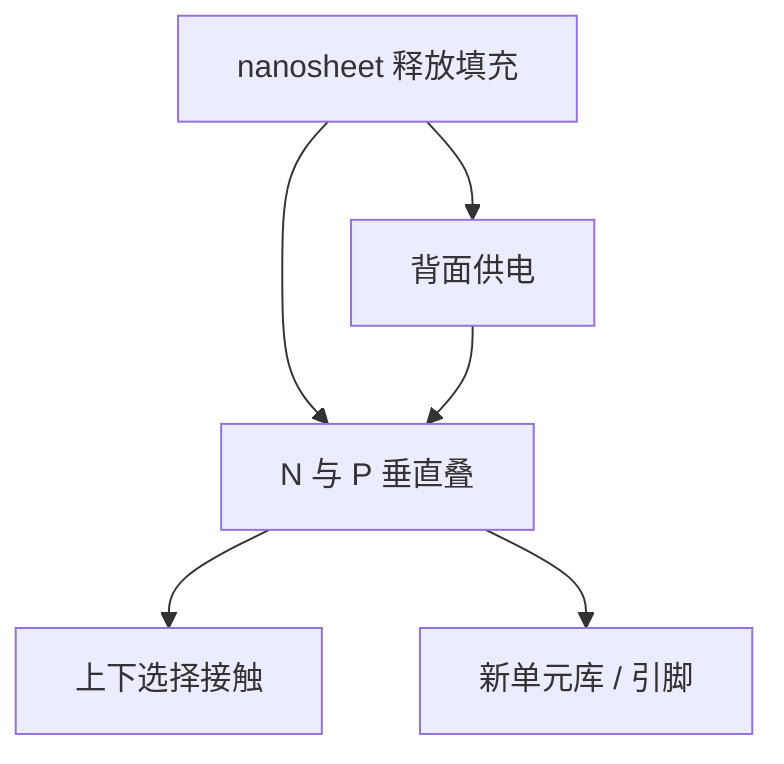

# CFET

把 nFET 与 pFET 叠在同一脚印里，单元宽度再削一截；释放、隔离和供电变成真正的三维布线，而不是再缩一次 CPP。

<footer>—— 对照 imec 对 complementary FET（CFET）的公开展望</footer>

[上一课](/litho/backside-power)把电源移到背面，给正面信号和接触让位。缺口是：N 与 P 仍在平面上并排，单元宽度仍付两套器件的脚打印。本课钉 CFET（互补 FET）。原子层工艺如何填这些空腔，在 [ALD/ALE](/litho/ald-ale) 展开，本课只写拓扑与光刻含义。

## 问题

GAA 纳米片已经四面栅、片宽可调；forksheet 用介电墙把 N/P 靠得更近。再往下，平面上并排的 N/P 成为单元宽度的墙。CFET 把一极叠到另一极之上，逻辑单元的横向脚印趋向「一套器件的宽度」。imec 公开路线把它放在 nanosheet 量产之后的展望位，不是当前节点的默认量产名词。

代价是三维：两套释放、两套功函数、中间隔离、以及上下器件如何分别接到背面电源与正面信号。上一课的 BSPDN 几乎是前提——没有背面，供电 via 要从叠层缝里挤上去。缺口是读懂这座叠层，而不是把 CFET 写成 GAA 的别名。

### 不是「FinFET 再竖一倍」

FinFET 叠 FinFET 的早期 3D 设想与纳米片 CFET 不同。公开展望的主流是堆叠纳米片（或等价 GAA）的 N 在 P 上（或反过来），中间介电隔离。光刻要定义的是各层的横向图形与深孔，垂直周期仍多靠外延与键合/堆叠工艺。

把 CFET 幻灯片的截面写进当前 3 nm 类功耗模型，会把展望当交货。本课的时态是展望，与 nanosheet 量产课要分开。

## 方法

工艺骨架（公开叙述级）：先做底部器件超晶格与释放 → 隔离 → 再做顶部器件 → 分别形成接触。接触必须选择接到上或下，深宽比和套刻同时紧。光刻层包括：各层有源图形、栅（可能共享或分别替换）、底部/顶部接触孔、到背面电源的 via。对准从一层标到另一层，标记在热和减薄后还要活。

DTCO：单元库的轨道高度、引脚位置、与背面网格的通孔表全部重画。布线拥塞的形状与 FinFET/GAA 平面库不同。没有新库，CFET 的脚印优势变不成产品频率。

### 与 BSPDN、nanosheet 的顺序

imec 叙述里，nanosheet 训练释放与填充；BSPDN 训练薄晶圆与背面网格；CFET 在这两块肌肉上再堆一极。跳过前两步直接「上 CFET」，缺少的是工艺窗口而不是一个新名词。

## 机制

脚印减半来自 N/P 共享横向面积；延迟和功耗还取决于上下器件的匹配、中间寄生电容、以及接触电阻。光刻能直接控制的是横向 CD 与套刻；垂直匹配是外延与功函数。任何一层的 OPC 热点会通过共享栅或共享接触把另一极一起拖死，热点修复必须按叠层邻域看，而不是按单层 PV-band。

热：两层器件叠在同一脚印，功率密度上升，背面供电与散热路径更关键。晶圆热套刻的指纹会多一张「叠层发热」图。

CFET 不取消 EUV。最密接触与金属仍按节距选波长。它改的是器件在 z 上的排列。

## 边界

本课不给叠层纳米厚度表，也不把某厂公告写成已量产。不要发明通道材料或层数。上下器件的功函数金属与内间隔仍是 nanosheet 那套空腔工艺，只是做两遍、中间多一张隔离。后课默认：CFET 是 GAA + 背面供电之后的脚印手段，时态是公开路线展望。

引用 imec CFET 公开技术展望。

forksheet 仍是平面近距 N/P；CFET 是垂直互补。两者不要画成一张截面。

## 小结

- CFET 把 N/P 垂直叠放，削的是单元宽度，不是 CPP 物理极限。
- 工艺建立在纳米片释放与背面供电之上。
- 光刻新负担是深接触、层间套刻和按叠层看的热点。
- 没有新库与 BSPDN，脚印优势变不成电路。
- 功率密度上升后，散热与背面网格成为同一张预算。
- 出处：imec complementary FET 公开展望。
