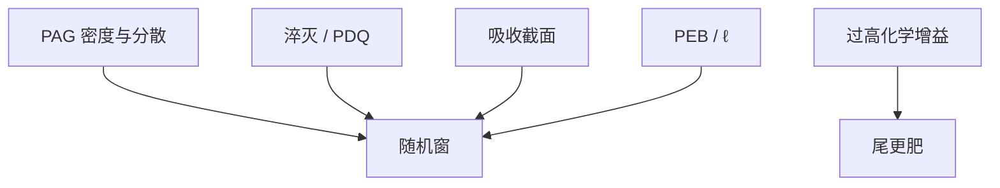

# 化学随机性抑制

光学把 NILS 做高、剂量把 $N$ 做大之后，剩下的地板在分子能不能均匀、事件能不能多而不糊。化学抑制是在 RLS 三角里改材料边，不是另发明一种泊松。

<footer>—— 据 Naulleau / 配方公开叙述对加载、均匀分散与淬灭的讨论；Ito 增益的代价见 CAR 课</footer>

[上一课](/litho/stochastic-process-window)把量产点放在随机窗里。缺口是胶配方还能做什么：在不大改镜头的前提下把悬崖推开。本课钉化学抑制。金属氧化物另一套机制，留给[下一课](/litho/mor-stochastics)。干法显影再下一课。

## 问题

化学杠杆已经在课序里散落：加 PAG 密度提高事件数；加淬灭缩短核、压暗区；降 PEB 缩 $\ell$；提高吸收（氟化、金属）提高单位剂量的 $N$；改善分散减少团聚低频；光可分解淬灭剂让亮区碱消失、暗区仍在。每一项都挪 RLS 的点。缺口是把它们写成「随机窗执行器清单」，而不是再定义淬灭剂。

禁止项：用更高化学增益（酸放大器、过长 PEB）去买灵敏度，通常把出生噪声放大，随机窗变窄。Ito 的增益在光子充裕的 DUV 是产能工具；在 EUV 计数受限区要记账。

### 均匀比「平均加载高」更硬

平均 PAG wt% 高但团聚，有效体积里仍有空斑，低频 LER 与缺孔地板不掉。分散、相容的聚合物–PAG、避免结晶，是化学抑制里最不像「灵敏度广告」的一项。计量要用谱的低频，不只 $E_0$。

环境胺与延迟 PEB 是负向化学：顶部额外淬灭，T-top 加局部阈值噪声。抑制包括轨道卫生，不单是配方。

## 方法

对照矩阵（固定光学）：扫负载、PAG 种类、PEB、$B$ 吸收，同时报 $E_\mathrm{size}$、PSD、缺陷率。成功的抑制：缺陷悬崖外移，而半节距仍可分辩。失败的「抑制」：LER $3\sigma$ 降了（核糊了），缺陷地板不降或分辨率死。与[淬灭剂负载](/litho/quencher-loading)同一条浓度轴，本课只读随机窗那一列。

底层：提高界面电子均匀性、减少底部空斑，属于化学/栈抑制，黏附课的剥落不在此列。

## 机制

事件密度升，相对泊松降，前提是事件在空间上不簇成一团。核缩短，有效体积降，相对涨落升，但 NILS 潜像升——净效果看哪一项主导，必须测，不能从三角口号推断符号。高吸收把光子停在更薄的膜里，$N$ 够、倒塌预算也够，这是 High-NA 薄膜的正道；吸收团簇化则引入新的散粒。

光可分解淬灭剂：亮区 $q$ 下降，灵敏度回升，暗区 $q$ 仍压桥。随机上，亮区碱计数变少，断线侧可能变差，桥侧变好——两座悬崖不对称移动，要两张缺陷曲线。

换显影液 / Notch 陡度会改噪声增益，类似 $\gamma$ 过大。那是显影化学，也属本课清单，但流体力学仍留给轨道课。

## 边界

不写分子式与 wt% 表。不把某供应商「低随机胶」宣传当定律。下一课 MOR：抑制策略从 PAG 计数换成团簇与配体，本课 CAR 清单不能复印。干法显影改的是溶解噪声那一截。

## 小结

- 化学抑制：加载、分散、吸收、淬灭/PDQ、PEB，每项都挪 RLS。
- 用缺陷悬崖与谱检验，不要只用 $E_0$ 或 $3\sigma$。
- 过高化学增益常伤随机窗；团聚造成剂量压不掉的地板。
- PDQ 让两座悬崖不对称移动。
- 出处：Naulleau；[PAG 与淬灭剂](/litho/pag-quencher)；Mack 配方与 PEB。
