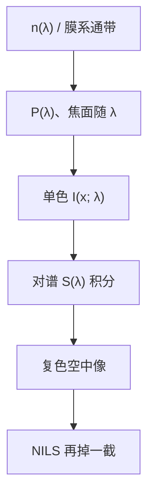

# 色差与光源带宽

单色推导把 $n$ 和光瞳相位当成一个 $\omega$ 上的数；准分子与 EUV 都有有限带宽，成像是许多单色空中像的强度叠加。

<footer>—— 据 Mack 对激光带宽与色差的讨论；准分子线宽与 EUV 多层膜通带见公开光源 / 光学文献</footer>

[上一课](/litho/strehl-ratio)（Strehl 比）。把单色光瞳相位收成 Zernike 系数。缺口是：第一课就声明过单色是零阶模型，真实光源不是 $\delta(\omega)$。折射率 $n(\omega)$、镜头色散、EUV 多层膜反射通带，都会让 $P$ 与最佳焦面随波长走。本课把有限带宽写成对单色像的非相干积分。其后进入产线判据课，本课仍不写 $k_1$ 公式，也不引用未公开的机台色差残差表。

## 问题

上一课的 $c_j$ 是某一个真空波长上的拟合。玻璃（或氟化钙）的 $dn/d\lambda$ 让球差、离焦项随 $\lambda$ 变：纵向色差表现为最佳焦面移动，横向色差表现为倍率随 $\lambda$ 变。光源有宽度 $\Delta\lambda$ 时，晶圆上的强度是各谱元空中像的加权和——等价于把 Bossung 沿焦轴再糊一次，NILS 掉。缺口因此是给「单色 TCC」加上光谱权重，而不是重讲 Zernike 基底。

时间相干长度 $\propto\lambda^2/\Delta\lambda$ 与空间 $\sigma$ 不是同一个旋钮：带宽改的是轴向色差与相干长度，不改照明填充比。

### 准分子与 EUV 的带宽不是一类数

ArF 成像透镜是折射 / 折反射，色散敏感，所以注入锁定的准分子激光把带宽压到**皮米量级**（公开的线窄化激光指标以 pm、E95 或 FWHM 报）。EUV 没有玻璃透镜，色散机制换成多层膜反射率随 $\lambda$ 的通带：围绕 $13.5\,\mathrm{nm}$ 的相对宽度约百分之二这一量级，是多层膜公开设计的通带，不是某台扫描机的内部秘密。等离子体发射可以更宽，镜子先当光谱滤波器。

不要把「EUV 很单色」写成物理事实。相对带宽比线窄化 ArF 宽得多；绝对波长短，色差通道换成膜系与抗蚀剂吸收，而不是 $dn/d\lambda$ 玻璃。

## 方法

单色强度 $I(x;\lambda)$ 由该 $\lambda$ 的 $n$、$\mathrm{NA}$ 约定与 $P(\lambda)$ 计算。光源谱 $S(\lambda)$（再乘光学通带）给出

$$
I_\mathrm{poly}(x)=\int S(\lambda)\,I(x;\lambda)\,d\lambda.
$$

纵向色差主导时，这近似于对焦面做加权平均：带宽越宽，等效通过焦点的混合越重，等焦附近也可能被抹掉。激光线宽控制的工艺含义就是守住这根轴向糊。

横向色差让不同谱元的倍率微差，边缘变色、套刻色相关——扫描投影里通常被设计压到低于套刻预算，本课只指出通道存在。

### 与 σ 分家

$\sigma$ 是光瞳填充，上一课序已经钉死。带宽不进 $S(\mathbf{f})$ 的半径，进的是对 $\lambda$ 的积分。把对比下降全部归咎于「$\sigma$ 太大」，会把色差误诊成照明。配方要同时写线宽（或 EUV 源谱 / 膜系通带）与 $\sigma$。

公开讨论里，ArF 线宽收窄是为了镜头色差；收得过窄会碰到激光功率与频谱稳定性的工程边界。具体瓦数与某代 E95 验收值以厂商公开规格为准，本课不编造。

## 机制

第一课的相位 $k_0\int n\,ds$ 在 $n=n(\lambda)$ 时对每个谱元不同。镜头把这一差收成 Zernike 的 $\lambda$ 导数，最显眼的是离焦项随 $\lambda$ 走。谱积分之后，相干交叉项在不同 $\lambda$ 上对不齐，等效对比下降。这与部分相干的源点积分同构：一个对方向非相干相加，一个对频率非相干相加。

EUV 多层膜的通带还调制各谱元的权重，并与掩模 3D 的光谱响应纠缠。本课停在「必须积分」，把膜系结构留给多层镜课。

### 后课默认的接口

说到单色模型，默认它是零阶；工艺讨论带宽时，空中像指谱积分后的 $I_\mathrm{poly}$。Zernike 表必须声明波长。产线 CD 公式用标称 $\lambda$，不把 $\Delta\lambda$ 写进 $k_1$ 的定义里——带宽的税打进对比与焦深余量。

## 边界

本课不提供未公开的 ASML 镜头色差系数，不用内部 E95 表冒充物理常数。准分子「皮米量级」、EUV 多层膜「约 2% 通带」只是公开量级，设计值随膜系与激光器型号变。也不要把带宽当成免费的焦深扩展（focus drilling 是后课有意扫焦，与源谱是两件事）。

$\sigma$ 定义不改。矢量 TE/TM 对每个 $\lambda$ 各做一次，再积分。

## 小结

- 有限带宽 = 单色空中像按谱加权叠加；纵向色差等效糊焦。
- ArF 靠线窄化（皮米量级）压玻璃色散；EUV 靠多层膜通带（约 2% 量级）滤波。
- 带宽不是 $\sigma$；一个改光谱，一个改空间填充。
- Zernike 系数随 $\lambda$ 变，表上要写波长。
- 本课不编造未公开机台色差数。
- 出处：Mack, *Fundamental Principles of Optical Lithography*；准分子线宽与 EUV 膜系通带的公开讨论。
