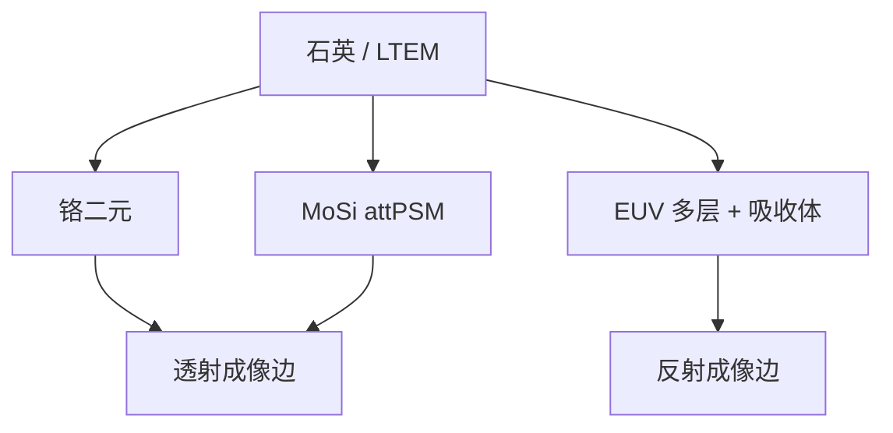

# 铬与 MoSi 膜层

二元版靠铬（或等价金属）挡光；衰减相移靠 MoSi 一类半透膜把相位与透过率绑在同一开口上。

<footer>—— 对照二元铬掩模与衰减相移掩模（attPSM）膜系的教科书与产线通称</footer>

[上一课](/litho/mask-blank-ltem)把坯钉成 LTEM/石英光学元件。缺口是面上要长什么膜：挡光、相移、还是 EUV 吸收体。本课钉 DUV 主流的铬与 MoSi。膜怎么被刻出侧壁，留给[下一课](/litho/mask-etch-sidewall）。

## 问题

二元掩模：开口透、铬挡，相位跳变主要来自石英台阶（若有）和边缘 3D。衰减相移（attPSM）：MoSi 等材料在 193 nm 提供约数百分比透过与约 180° 相移，边衬对比靠相消，而不是靠铬那么「黑」。EUV 不用这套透射 MoSi 故事，而用高 Z 吸收体（Ta 化合物等）盖在 Mo/Si 多层上——本课只对照，不重写 [低 n 吸收体](/litho/low-n-absorber)。

缺口是**膜系选择改成像边**，不是再选基板。把所有 DUV 版当成二元铬，会在 attPSM 层上用错 3D 与修边模型。

### 透过率与相位是一对，不是两个旋钮

attPSM 的设计透过率（历史上常见 ~6% 量级的叙述，具体以技术文件为准）与相移绑定在膜厚与色散上。改厚去贴相位，透过率跟着走。OPC 模型必须用对膜，否则助条与主图形的干涉条件全错。

MoSi 刻蚀与铬刻蚀的负载、侧壁、微沟槽不同，MPC 表不能共用。下一课侧壁会把这件事变成 3D 边缘。

## 方法

膜堆：铬常含防反光氧化层；MoSi 常有氧化帽。厚度按波长与相位目标镀。缺陷：针孔在二元上是亮缺陷，在相移膜上还带相位。来料检验与后段图形检验的灵敏度对不同膜系不同。

与成像：二元边更「硬」，MEEF 与 3D 仍在；attPSM 改善某些节距的 NILS，却对膜厚误差和侧壁更敏感。层选膜是 DTCO/RET 决策，不是掩模厂临时改镀。

## 机制

铬的光学厚度以吸收为主；边缘的电磁是导体/介质过渡，[掩模 3D](/litho/mask-3d-effect) 仍存在。MoSi 半透，开口与膜区的相位差在焦点附近给出更陡的强度边，同时也给出旁瓣——助条与偏置必须按相移成像来，不能按二元经验。EUV 吸收体是反射几何里的阴影与相移，物理另一套，只是「膜决定边」这一句同构。

## 边界

不把 6% 写成所有 attPSM 的定律。不讨论某供应商商标膜名。EUV 膜堆细节不在本课展开。

后课默认：DUV 版的吸收/相移膜已选定；下一课刻蚀如何把膜边做成有倾角的三维物体。

## 小结

- 二元铬挡光；MoSi attPSM 把弱透过与相移绑在膜厚上。
- OPC 必须用对膜系；MPC 随刻蚀化学变。
- EUV 吸收体是反射几何的另一套膜，同构的是「膜即边缘」。
- 出处：Levinson / Mack 对二元与衰减相移掩模的论述；产线 attPSM 通称。
