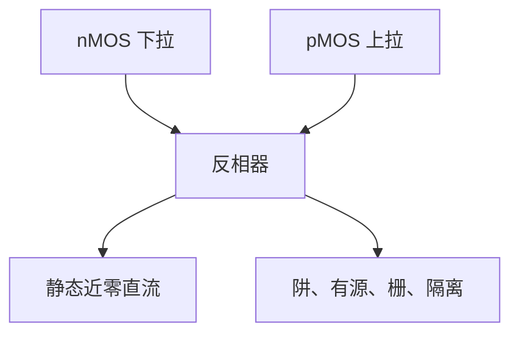

# CMOS 反相器为什么成对

CMOS 用互补的 nMOS 与 pMOS 接成反相器：一个导通时另一个关断，静态几乎无直流通路，输出仍能满摆幅。

<footer>—— 据 Sze &amp; Ng, Physics of Semiconductor Devices 对 CMOS 反相器与互补逻辑的整理</footer>

[上一课](/litho/mosfet-gate-length)钉死了单管 MOSFET 与栅长。本课不重推短沟道效应。缺口是：芯片逻辑不是单个晶体管。为何必须同时有 n 沟道与 p 沟道、因而必须有两套掺杂区与隔离图形？这决定前道有多少层必须被画出来。一种导电类型做不出静态近零功耗的逻辑族，图形化必须为两种沟道分区。

## 问题

只有一种 [MOSFET](/litho/mosfet-gate-length) 也能做开关，但负载要么常耗电，要么噪声容限差。NMOS 逻辑的静态功耗在集成度上去之后不可接受。CMOS 的答案是成对：输入低则 n 管关、p 管开，输出高；输入高则相反。缺口是「成对」对图形化的含义——阱、有源区、隔离各占一块必须用掩模定义的区域——不是再解释一次栅控沟道。一种导电类型做不出静态近零功耗的逻辑族。

### 成对不是把同一根栅画两次

n 管与 p 管可以共用同一层栅图形（多晶硅或金属栅跨过不同阱），但有源区类型、阱类型、阈值注入往往是不同的掩模。成对指电路拓扑与掺杂分区，不是「曝光两次同一根线」。把 CMOS 理解成双重曝光，会与后课真正的多重图形化撞名。

反相器是最小静态 CMOS 单元。NAND、NOR 仍是上拉网络与下拉网络成对。电源与地的引出已经要求接触孔，那是后课；本课先把分区画出来。

## 方法

CMOS 反相器：pMOS 源接 $V_{\mathrm{DD}}$，nMOS 源接地，两栅相连为输入，两漏相连为输出。静态时总有一管截止，电源到地没有直流通路。翻转瞬间两管可能短暂同时导通，尺寸比用来平衡上升与下降，本课不把尺寸优化做完。

只有 nMOS 加电阻负载也能反相，但静态电流在亿只管子上不可接受——这是成对存在的电路理由，图形化只是把这个理由落实到硅上。p 管要做在 n 阱里、n 管在 p 型衬底（或双阱），两套掺杂不能靠「同一层栅」自动出现。每一套都要一次图形选择。本课把理由钉在反相器上；单元库里更复杂的门只是同一成对原则的重复。

图形化清单因此至少包括：阱（定衬底类型）、有源区（定哪里有源漏）、栅（定 $L$ 与逻辑连接）、隔离（定晶体管彼此分开）。每一项都是一次图形定义加后续工艺。没有这些分区，互补对无法同时做在同一块硅上。

p 管与 n 管的迁移率不同，反相器尺寸比常让 p 管更宽。那是 $W$ 的图形，不是再要一根栅。本课成对指导电类型，宽度比是版图细节。

## 机制

互补是 CMOS 成为主流的原因：密度上升后，不能再用常开负载换逻辑。光刻任务因此不仅是「把栅印细」，还要在同一套套刻预算下对准阱、有源与栅——后课 [接触孔、通孔与线](/litho/contact-via-line) 再把竖直连接补上。本课先回答：为什么图形是分区的，而不只是一根线。

阱与有源的交界还决定闩锁与隔离能否成立：n 阱与 p 阱必须被图形化分开，否则互补对在硅里短路。隔离槽本身也是一层图形。于是「成对」在版图上是一串必须对齐的多边形，不是电路图上的两个符号而已。

下一课 [互连半节距与金属层](/litho/interconnect-halfpitch) 指出：即便栅已经做成，门与门之间还要金属线，横向尺度会从栅转到节距。成像如何印这些线，仍不属于本课程。

## 边界

本课不展开传输门、FinFET 的鳍片布局或背面供电。不写光刻胶、照明与分辨率公式。也不把「成对」推广成所有电路都必须 n/p 数量相等——那是单元库设计，本课只要反相器这一最小理由。

动态逻辑、传输门会少用一半管子，但主流标准单元仍是静态 CMOS，图形化清单仍按互补对准备。后课默认：静态 CMOS 逻辑建立在互补对上；前道必须图形化阱、有源、栅与隔离。下一课只补互连节距。

## 小结

- CMOS 反相器用 nMOS 下拉、pMOS 上拉，静态近零直流功耗。
- 成对要求阱与有源等分区，各自由图形化定义。
- 成对不是同一根栅曝光两次；多重图形化是后课另一件事。
- 栅细之外，套刻要把这些分区对齐。
- 只有 nMOS 加负载也能反相，但静态电流在高集成度下不可接受，这是成对的电路理由。
- 出处：Sze &amp; Ng, *Physics of Semiconductor Devices*。
