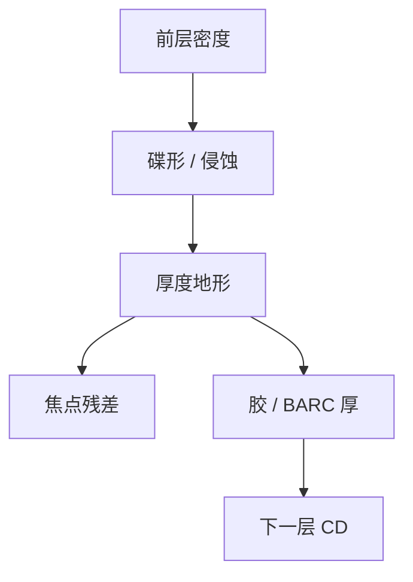

# CMP 与形貌

化学机械抛光把前一层的槽填平，也按密度留下碟形与侵蚀；下一层光刻看见的不是理想平面，是这张缓变地形。

<footer>—— 对照 CMP 碟形 / 侵蚀与铜互连平坦化的公开讨论；SEMI 对 CMP 过程的通称</footer>

[上一课](/litho/etch-bias-opc-loop)把 AEI 偏置分层回写。缺口是垂直：铜或介质 CMP 之后的厚度图，变成下一层的涂胶厚度、反射和焦点。[薄膜反射](/litho/thin-film-reflectivity) 与 [焦点传感器](/litho/focus-sensor-topography) 已有光学与传感；本课钉 CMP 如何制造那张地形。平坦化与焦深预算，留给[下一课](/litho/planarization-dof）。

## 问题

CMP 速率随图案密度、垫片压力、浆料和剩余厚度变。密铜区碟形（dishing），隔离区氧化侵蚀（erosion），长程出现波浪。下一层 BARC/胶厚跟着走，摆动曲线和 CD 成密度图；焦点传感器若跟踪局部，扫描机补偿；若滤波掉高频，残差进 CD。套刻也会走：厚度不均带来应力与对准标记形貌衬度变化。

缺口是**形貌是上一层的遗产**，不是本层镜头像差。把全场 CD 指纹只归因于照明均匀性，会漏掉 CMP。填充规则同时服务刻蚀负载与 CMP，两套最优密度可能冲突，DTCO 要权衡。

### 标记区是特殊地形

对准与套刻标记周围常有禁空或特殊密度，CMP 在此留下与阵列不同的台阶。传感器课已警告形貌；本课要求 CMP 与标记设计联合，而不是事后怪扫描机。

CMP 终点控制失败会留下整片台阶，焦深一次吃完。这是批次级事件，应用缺陷/厚度计量挡，而不是 OPC 修。

## 方法

计量：厚度图、台阶仪/光学、AFM、以及下一层 ADI CD 对密度。动作：密度规则、dummy、多步 CMP、帽层。与光刻：扫描机调平与焦点配方含 CMP 指纹；必要时场内焦点倾斜（已有课）。与刻蚀：过抛后硬掩模厚度变，选择比窗口被偷。

下一层的焦点地图应以产品晶圆的厚度图为输入，而不是只用光罩上的测试芯片。CMP 与光刻的接口是这张图的空间频率是否落在调平带宽内——下一课定量。

## 机制

压力集中在高处，浆料化学对材料选择比不同，图案密度调制局部压力与浆料有效浓度。结果是空间频率从单元尺度到晶圆尺度的厚度谱。胶旋涂有一定平坦化长度，但不抹掉毫米级波浪。高 NA 焦深更薄，同一波浪从「可忽略」变成窗口杀手——下一课定量。

厚度地形同时改焦点和胶厚，下一层 CD 指纹可以长得像照明不均。先叠厚度图再怪镜头。

## 边界

不写浆料化学配方。不把 CMP 当等离子体。本课不进入后端封装研磨。

后课默认：CMP 地形是光刻输入。下一课把它换算成焦深还剩多少。

## 小结

- CMP 按密度留下碟形与侵蚀，成为下一层的焦点与薄膜地图。
- dummy 同时服务刻蚀与 CMP，最优可能冲突。
- 标记区地形要联合设计。
- 出处：铜 CMP 碟形/侵蚀通称；Levinson 对形貌与焦深的讨论。
