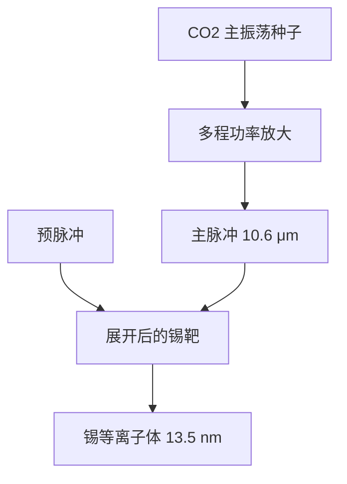

# CO₂ 驱动激光放大链

落到硅片上的 13.5 nm 不是这台激光器的输出。十千瓦级 CO₂ 放大链只负责把能量送到锡滴；EUV 是等离子体自己辐射出来的。

<footer>—— 对照 ASML / Cymer 对 LPP 驱动激光的公开架构；Bakshi, EUV Lithography</footer>

[上一课](/litho/scanner-calibration-cycle)把 DUV 扫描仪的剂量、焦点、网格和照明零点钉成校准周期。曝光机单元收到那里。缺口是：EUV 进阶的第一张合同不是再校一台 ArF，而是另一条光源——[LPP](/litho/euv-lpp-tin) 的驱动激光本身是一条脉冲 CO₂ 主振–功放（MOPA）链。后课谈转换效率、锡谱和收集镜，都默认本课的 10.6 μm 放大链已经读完。

## 问题

校准课把「灯」当成会漂的执行器。EUV 的灯不是放电腔里的 ArF*，而是真空里的锡等离子体；点燃它的是红外驱动光。公开叙述里，主脉冲来自 10.6 μm 的 CO₂，平均功率十千瓦量级，重复频率数十千赫，脉宽纳秒级。单台振荡器给不出这个组合：要窄脉冲、要能量、还要在 50 kHz 量级上打几十亿次而不把增益介质打穿。

缺口因此是放大链，不是再讲一遍锡滴几何。种子从哪来、经过几级放大、脉冲包络怎样被整形，决定主脉冲能不能打在[预脉冲](/litho/euv-prepulse)展开后的盘靶上。链不稳，剂量环会把噪声锁进每场；链饱和，IF 功率广告值永远到不了硅片。

驱动光是 10.6 μm，曝光光是 13.5 nm。投影物镜里没有 CO₂。把「EUV 激光器」画成一台直接出 13.5 nm 的腔，是把本课和 LPP 课一起读错了。

## 方法

公开架构是 MOPA：主振荡器出种子，功率放大级把能量抬到打靶所需。振荡级管时序、重频和包络形状；放大级管能量。工业 CO₂ 常用射频激励的气体放电，多程通过增益介质提取。预脉冲若用另一路固体激光或另一段 CO₂，瞄准与延时和主链锁在同一滴探测伺服上，能量账却分开记——预脉冲几乎不贡献带内 EUV。

计量在两处：激光侧看种子能量、放大后 $E_p$、指向与脉宽；源侧看滴命中率和 [IF](/litho/intermediate-focus) 带内功率。剂量环的执行器包括放电/射频功率和触发延时，不是物镜里的滤光片。刚开机、换气或改重频后的瞬态要丢弃，与 ArF [换气丢脉冲](/litho/source-power-stability) 同构，介质换成 CO₂。

### 链与滴必须锁在同一时钟

50 kHz 量级意味着每 20 μs 一次完整击打。种子触发由滴探测给出，放大链的存储能量和热透镜却有更长的时间常数。链可以平均功率合格，单次脉冲仍打在盘靶边缘。后课 CE 默认：不合格的命中率先修链的指向与延时，再谈等离子体分支。

## 机制

CO₂ 的 00⁰1–10⁰0 带在 10.6 μm。这个波长把等离子体临界密度放在相对稀薄的冕区，有利于带内吸收，细节留给下一课的转换效率。放大链要解决的是提取：准分子式「短寿命、单次放电」在这里换成可重复的气体增益。饱和通量、多程几何和热透镜决定你能从每级抽出多少，而不把光束质量毁掉——指向一歪，主脉冲打在盘靶边缘，CE 和碎屑谱一起变。

重复频率把单脉冲能量与平均功率拆开。单脉冲过高，流体力学把靶打成喷溅；频率过低，扫描狭缝攒不够光子。链的热管理、气体循环和光学损伤阈值，限制的是可维持的平均红外功率，不是示波器上的峰值。Fomenkov 等在 SPIE 先进光刻会议上给出的量产叙事，始终是「可维持的驱动 + 可维持的 IF」，而不是实验室单脉冲。

Bakshi 书里的驱动激光章节解释为什么选 CO₂；ASML/Cymer 公开的是 MOPA 与锡滴集成。不要把会议海报上的放大器级数写成厂内配置表。

## 边界

本课不把 CE、UTA 和收集镜寿命写完。下一课只问：打到靶上的红外，有多少变成 2% 带内 EUV。也不重写 ArF 准分子放电——气体、波长、靶都不一样。Gigaphoton 等另一条 LPP 链同样用 CO₂ 打锡，架构细节以各自公开材料为准，机制同属本课。

## 小结

- EUV 量产驱动光是脉冲 CO₂ 放大链，不是 13.5 nm 激光腔。
- MOPA 把时序与能量分开；指向和包络决定打靶质量。
- 后课默认：说到「加功率」，先问链是否还在线性提取区。
- 出处：ASML/Cymer LPP 驱动激光公开架构；Bakshi, *EUV Lithography*；Fomenkov 等 SPIE 光源论文。
