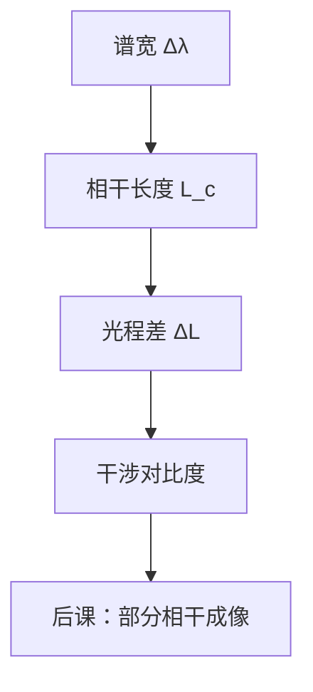

# 相干长度与光源带宽预备

有限谱宽的光源，不同波长的相位随传播逐渐错开；时间相干长度与带宽近似成反比，单色平面波是零阶极限。

<footer>—— 据 Born &amp; Wolf, Principles of Optics 第 10 章部分相干与 Hecht, Optics 的整理</footer>

[上一课](/litho/photometry-etendue-prep)建立了亮度与 étendue。本课不重写功率守恒。缺口是：[平面波与波矢](/litho/plane-wave-k) 里的时谐场 $e^{-i\omega t}$ 隐含无限相干时间——真实光源有线宽 $\Delta\lambda$，多长的光程差内干涉条纹还在？后课部分相干成像与色差都默认相干长度 $L_c$ 是已知概念。

## 问题

准分子激光与等离子体源都有有限 $\Delta\lambda$。两束光的光程差 $\Delta L$ 超过 $L_c$ 时，不同波长的相位关系被洗掉，干涉项减弱。[薄膜干涉](/litho/thin-film-interference) 的条纹、胶层驻波，都对这条差敏感。没有 $L_c\sim\lambda^2/\Delta\lambda$，无法解释为何要把曝光谱压窄，也无法解释为何镜头色差必须在窄带内优化。缺口是时间相干的预备，不是再算一遍照度。

### 时间相干不是空间相干

时间相干由谱宽决定：同一点、不同时刻（或同一束、不同光程）的相关。空间相干由源的横向尺寸与观察距离决定：源面上不同点发出的光能否仍干涉。照明在光瞳上填得越满，空间相干往往越低。本课把 $L_c$ 钉死，空间相干只点名；完整互相干函数是后课成像主线的题目。

高斯型谱的经验式 $L_c\approx\lambda^2/\Delta\lambda$。$\Delta\lambda$ 用 FWHM 时系数会变，数量级不变。空间相干的经典定理是 Van Cittert–Zernike，本课不证。

## 方法

中心波长 $\lambda$、谱宽 $\Delta\lambda$，相干长度 $L_c\approx\lambda^2/\Delta\lambda$。当 $\Delta L\gtrsim L_c$，复相干度 $|\gamma|$ 下降，干涉对比度掉。窄线宽激光 $L_c$ 可以很长；准分子经线窄化后 $L_c$ 仍常大于典型薄膜腔长，单色模型才够用。宽带灯 $L_c$ 只有微米量级，只在近零光程差看见条纹。

色差：$n=n(\lambda)$ 使不同颜色的焦距不同，与 [几何像差一览](/litho/geometric-aberration-tour) 的单色 Seidel 并列限制焦深。压窄 $\Delta\lambda$ 同时服务相干与色差，但可能与上一课的通量打架。

## 机制

部分相干成像是时间相干与空间相干的乘积效应。光瞳填充（常用 $\sigma$ 描述）小则空间相干高、对比度好，但 étendue 利用差、剂量吃紧。$\sigma$ 大则相反。工艺在对比度与通量之间折中，本课不给出一次解完的配方。

本课程下一课 [标量衍射的适用边界](/litho/scalar-diffraction-bound) 收束建模层次：标量 $U$ 已经默认单色或窄带、偏振可平均。带宽过宽时，连「一个 $U$」都只是对谱的积分；那是后课，本课先保证你知道积分核会掉对比度。

时间相干还约束薄膜腔：胶层或抗反射层的往返光程必须远小于 $L_c$，单色干涉公式才直接可用。否则 $R(\lambda)$ 要在谱上积分，振荡被抹平。线窄化因此既是镜头色差的需求，也是薄膜对比度的需求。空间相干则决定掩模不同开口之间能否稳定干涉，那是成像主线的部分相干，本课只留名字。

## 边界

本课不展开互相干函数测量，不证 Van Cittert–Zernike。也不把 $L_c$ 写进 CD 公式：中心波长进衍射，带宽通过对比度与色差间接进入工艺窗口。Fourier 光学的严格处理留给后一课程；本课只预备 $L_c$ 与 $\Delta\lambda$。

后课默认：单色是窄带极限；$L_c\sim\lambda^2/\Delta\lambda$；光程差超过 $L_c$ 则干涉不可靠。下一课问标量 $U$ 何时必须退回矢量麦克斯韦。

## 小结

- 有限带宽给出时间相干长度 $L_c\sim\lambda^2/\Delta\lambda$。
- 光程差超过 $L_c$，干涉对比度下降；光刻源尽量窄带。
- 时间相干 ≠ 空间相干；后者与源尺寸、光瞳填充有关。
- 窄带同时缓解色差，可能牺牲通量。
- 出处：Born &amp; Wolf, *Principles of Optics*；Hecht, *Optics*。
