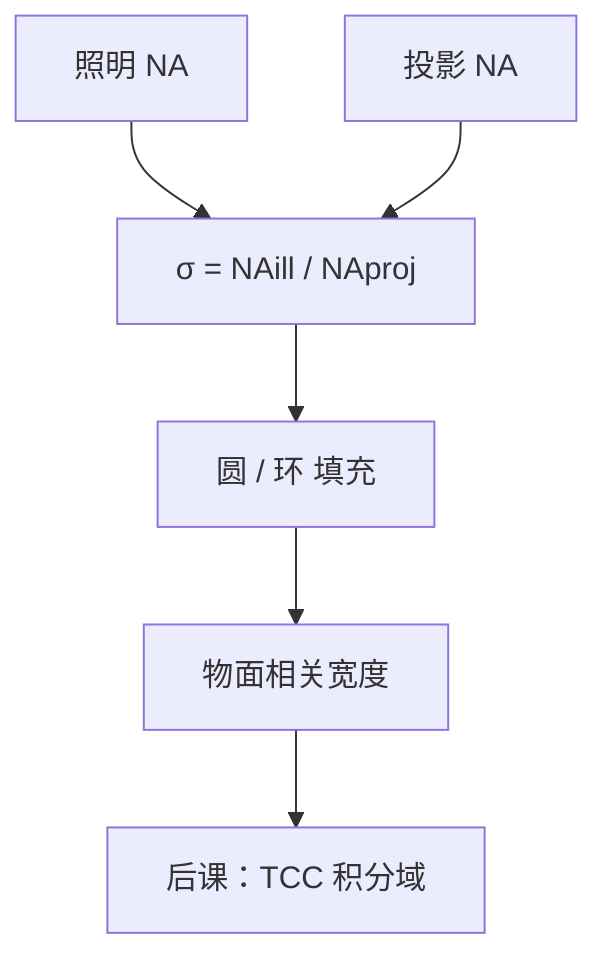

# 相干因子 σ

部分相干不是一种气氛；$\sigma$ 把照明光瞳的半径按投影 $\mathrm{NA}$ 归一，成为可以写进工艺配方的填充比。

<footer>—— 据 Hopkins 对有效光源的定义，以及 Mack, Fundamental Principles of Optical Lithography 对 $\sigma$ 的产线用法整理</footer>

[上一课](/litho/partial-coherence)已经说明：投影光刻既不是单平面波，也不是完全非相干，强度是互不相干源点各自相干成像后的叠加。缺口是把「光源有多大」收成一个相对投影孔径的无量纲数，并写清环形时要两个半径。本课专钉

$$
\sigma=\frac{\mathrm{NA}_\mathrm{illum}}{\mathrm{NA}_\mathrm{proj}}.
$$

四维 TCC 如何把任意光瞳图案收成双线性核，留给[下一课](/litho/hopkins-tcc)。不要回头从瑞利公式讲分辨率：$\sigma$ 改的是通带里哪些级在干涉，不改 $\mathrm{NA}/\lambda$ 这条截止。

## 问题

上一课给出了部分相干的物理图像，但工艺单上不能写「比较相干」。照明孔径与投影孔径之比把 Köhler 光瞳上的填充半径变成一个数：$\sigma\to 0$ 接近点源，$\sigma\to 1$ 接近填满入瞳。同一套镜头、同一张掩模，$\sigma$ 一变，物面互相干宽度变，空中像对比随之变。缺口因此是定义与读法，而不是开始画偶极。

浸没改了像方 $n$，合同 $\mathrm{NA}$ 变了，同样的物理照明角对应的 $\sigma$ 会变。所以配方必须同时写 $\mathrm{NA}$ 与 $\sigma$，只报其中一个没有意义——上一课的 margin 已经警告过，本课把它写成操作规则。

### σ 不是激光线宽

时间相干由光谱宽度决定，空间相干由源的角大小决定。$\sigma$ 只管后者。把准分子的线宽拧窄，是色差课的旋钮；把照明光瞳填大，是本课的旋钮。两个量都叫「相干」，产线上必须分开写。

环形照明用 $\sigma_\mathrm{in}$–$\sigma_\mathrm{out}$ 两个填充半径，仍按投影 $\mathrm{NA}$ 归一。中心遮拦不是「另一个 $\sigma$ 定义」，只是圆盘挖了洞。

## 方法

常规圆照明：有效光源是半径 $\sigma$ 的圆盘，落在以投影光瞳为单位圆的坐标系里。每个源点对应一个入射方向，把物频谱在光瞳里平移 $\sigma$ 量级的一段。$\sigma$ 越大，平移的集合越大，越接近非相干极限的传递；$\sigma$ 越小，越接近阿贝的相干乘法。

互相干函数在物面上的相关宽度与照明角成反比，也就是与 $\sigma\cdot\mathrm{NA}/\lambda$ 成反比。相关宽度与关键节距相比：宽则邻缝相干干涉，窄则近似独立发光。部分相干的工艺含义，就是把这根长度调到与目标周期同一量级。

### 填充形状仍是 σ 家族

圆、环、四级，都先落在 $\sigma$ 坐标系里再谈图案。后课 TCC 的积分域就是这块有效光源。本课不优化像素化光瞳；只要求：说到「$\sigma=0.8$」指圆填充半径，说到环带必须写内外两个数。偶极的极点位置同样用这个归一，那是 RET 课的画法。

Köhler 照明把源成像到光瞳，晶圆各点看到同一套入射角，所以 $\sigma$ 是光瞳几何量，不是掩模面上某点的本地相干时间。

## 机制

源点在光瞳里离轴越远，衍射级整体平移越多。密线栅的一级能否与零级同时进瞳，取决于平移是否把一级从窗外拽回来——这是 $\sigma$ 与节距的耦合，机制上已是离轴照明的萌芽，本课只读圆填充：较大的 $\sigma$ 本身就包含一批轴外源点，密图形的调制往往优于点源，但三束干涉对离焦仍然脆。

$\sigma$ 太大，接近非相干，传递函数变成光瞳自相关，高频掉得快，孤立与密图形的折中会往另一头走。因此 $\sigma$ 不是「越大越像非相干显微镜就越好」，而是针对节距与图形类别的填充半径。

### 后课默认的接口

说到部分相干工艺，先写 $\mathrm{NA}$ 与 $\sigma$（环带写内外）。有效光源 $S(\mathbf{f})$ 定义在单位光瞳上，支撑半径为 $\sigma$。下一课把 $S$ 与两个错位光瞳的重叠叫做 TCC，不再解释 $\sigma$ 是什么。

## 边界

$\sigma$ 不决定波长、不决定胶的 $\gamma$、不包含偏振态。高 $\mathrm{NA}$ 下每个源点还要带琼斯矢量，那是矢量成像的缺口；$\sigma$ 的几何定义不变。光源形状优化把圆盘升级成二维像素，仍用同一归一坐标，不是新的相干物理。

禁止把显微镜的「时间相干长度」写进本课的 $\sigma$。带宽效应留给色差课。

## 小结

- $\sigma=\mathrm{NA}_\mathrm{illum}/\mathrm{NA}_\mathrm{proj}$ 是照明填充比，必须与投影 $\mathrm{NA}$ 一起报。
- 它描述空间相干（源的角大小），不是激光线宽。
- 环带用 $\sigma_\mathrm{in}$–$\sigma_\mathrm{out}$；图案再复杂也先落在这套归一里。
- $\sigma$ 改物面相关宽度，从而改哪些级在干涉；截止频率仍是 $\mathrm{NA}/\lambda$。
- 下一课用这块有效光源构造 TCC。
- 出处：Hopkins 部分相干成像；Mack, *Fundamental Principles of Optical Lithography*。
