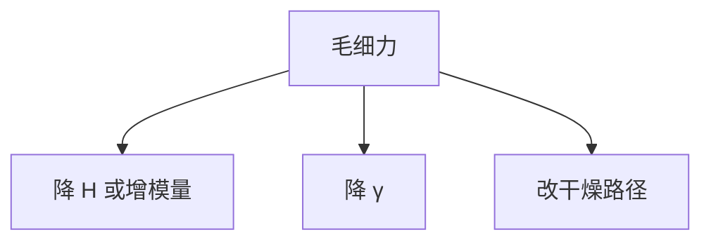

# 倒塌抑制

毛细力给定之后，还能改的是深宽比、模量、表面和干燥路径。抑制是力学预算，不是再加一次 OPC。

<footer>—— 接续 [图形倒塌](/litho/pattern-collapse)；Mack / Levinson</footer>

[上一课](/litho/rinse-surfactant)把液体张力接到干燥。缺口是工程对策清单：轨道上实际怎么压倒塌，而不把责任推回空中像。本课只列抑制手段与代价，不重写毛细压差公式。

## 问题

EUV / 高 NA 薄胶仍可能局部高深宽比（孔、密集线）。光学窗口合格、倒塌仍发生，良率记在随机缺陷或桥连里会分错类。需要一套**显影后、刻蚀前**的力学干预。

## 方法

手段分层。几何：降胶厚（三层把抗刻蚀交给 SOC）、放宽局部深宽比。材料：硬烤、UV 固化提高模量（后课）。液体：表面活性剂、溶剂置换、超临界干燥。表面：疏水化减少弯月面钉扎。每条都有缺陷或 CD 代价，必须进工艺窗口，不能只进一张 SEM 好图。

OPC 加粗根部可以抗倒，但那是成像课已经付过的 MEEF。轨道抑制不应假装能替代根部宽度。

## 机制

倒塌判据大致是毛细力矩对抗弯刚度。降 $H$、增 $E$、降 $\gamma$ 都进同一不等式。随机性课的 LER 让有效 $W$ 更窄，倒塌阈值比光滑线更苛刻。

## 边界

下一课去渣是等离子体或弱氧化，不是干燥力学。已倒塌的线去渣救不回来。

## 小结

- 抑制 = 深宽比、模量、液体、干燥四条预算。
- 与 OPC 根部加粗分工，不互相冒充。
- 出处：pattern collapse 课；轨道对策通识。
