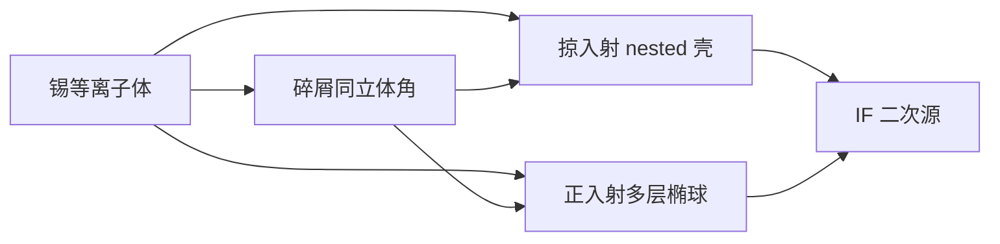

# 掠入射收集镜

等离子体向 2π 发光；能送到中间焦点的，只是收集器真正张开、并且在 13.5 nm 还反射的那一块立体角。

<footer>—— 对照 LPP / DPP 光源公开材料中的收集几何；量产正入射多层收集见 ASML / 蔡司叙述</footer>

[上一课](/litho/tin-debris)把碎屑分成离子、蒸汽和微滴，并指出它们与光子抢同一立体角。缺口是这块立体角由什么镜子围出来。本课钉收集几何：掠入射金属壳与正入射多层椭球各保护什么。镜子如何在锡轰击下退化，留给[收集镜寿命](/litho/collector-lifetime)。

## 问题

13.5 nm 没有便宜的大折射透镜。要从等离子体收光，只剩反射。掠入射（grazing incidence）把金属（公开讨论常见 Ru、Pd 一类涂层）用在小擦角，菲涅尔反射率够高，不必做 Mo/Si 周期膜；几何往往是 nested Wolter 型壳体，一层套一层，把点源成像到下游焦点。正入射（normal incidence）用多层膜椭球：等离子体在一个焦点，[IF](/litho/intermediate-focus) 在另一个，立体角可以张到数球面度。

两种几何对碎屑的暴露完全不同。掠入射壳层多、缝多，离子沿擦角打涂层；正入射多层几乎正对等离子体，溅射与镀锡更狠，但收光孔径大，这是 [LPP](/litho/euv-lpp-tin) 能把 IF 做到数百瓦的几何前提。缺口是先把几何说清楚，再谈寿命数字。

### 不要把「收集镜」默认写成一种

早期放电等离子体（DPP）样机公开走过掠入射收集：电极碎屑大、功率扩展受限，壳体可当牺牲件。量产 NXE 的公开叙述是正入射多层收集器加氢清洗。把 DPP 的 Wolter 壳直接画进 NXE 光源舱，会把蔡司多层椭球和 nested 金属壳混成一件耗材。

掠入射收集不是投影物镜里的掠入射镜子。投影 [POB](/litho/zeiss-euv-optics) 是近正入射多层；本课的壳层只活在光源舱，负责把 2π 里的一块光送进 IF。

## 方法

选几何先选立体角与 etendue。扫描机照明在 IF 上要一个尺寸、发散都合格的二次源。收集器的放大与孔径必须把等离子体光斑映射进这个验收盒，多收的光如果填不满光瞳或变成杂散，只加热、不成像。掠入射 nested 壳用多级反射换角度，对点源友好，但对膨胀等离子体的物方大小敏感。正入射椭球一次反射共轭，结构简单，多层角谱必须覆盖从近轴到大孔径的入射角。

碎屑对策随几何变。掠入射可以用气流缝、缓冲气体和可换壳体；正入射必须让氢自由基够到整个多层面，并接受微滴坑不可化学修复。ASML 公开的量产链是后一条：大立体角优先，再用氢与维护换寿命。

### 立体角不是「镜子越大越好」

收集孔径涨，等离子体边缘的带外辐射、碎屑和热负荷一起涨。光阑、光谱纯度和 IF 洁净度会把名义 Ω 再切一刀。公开功率账里的 $\Omega_{\mathrm{col}} R_{\mathrm{col}}$ 是有效值，不是几何实体角乘出厂峰值反射率。

## 机制

掠入射靠的是界面上的擦角反射：角度越擦，金属在 EUV 的反射率越高，但单壳能张的立体角有限，所以要嵌套。正入射靠布拉格：Mo/Si 周期对准 13.5 nm，角带宽窄，椭球面各处入射角必须设计进膜堆。LPP 的 CE 只有几个百分点，没有大 Ω 就撑不起 [NXE](/litho/asml-nxe) 的 IF 数百瓦，这是量产放弃「更耐打的小立体角壳」的原因。

同一几何也决定维修。壳体可以一片片换；椭球多层往往整件更换，可用性按换镜日历进工厂成本。几何选择因此是光源架构选择，不是光学设计师的审美。

蔡司公开的是投影镜与收集镜多层能力；不要把投影 POB 的面形指标套到收集椭球上。收集镜允许当消耗品，投影镜不允许。

## 边界

本课不给 nested 壳的层数、擦角表或 ASML 收集镜镀膜配方。量产公开事实是 LPP + 正入射多层收集；掠入射作为对照几何与 DPP 史，用来解释为什么碎屑课之后必须先问「光是擦着收还是正对着收」。不要编造市场份额或某代机台的立体角度数。

后课默认：说到收集，先分清几何，再谈氢洗与寿命曲线。

「LPP 公开」包括 Cymer/ASML 对正入射收集加氢的叙述，也包括文献对掠入射收集器的一般讨论。不要把后者写成当前 NXE 的出厂配置。

## 小结

- 收集几何决定能用的立体角，也决定碎屑打在什么角、什么膜上。
- 掠入射 nested 壳靠金属擦角反射；正入射多层椭球靠布拉格、一次共轭到 IF。
- 量产 LPP 公开路线是正入射大立体角，用氢与换镜换寿命。
- 有效收集是 Ω、R、光阑与光谱纯度的乘积，不是镜子外径。
- 出处：ASML / Cymer / 蔡司光源与收集光学公开材料。
