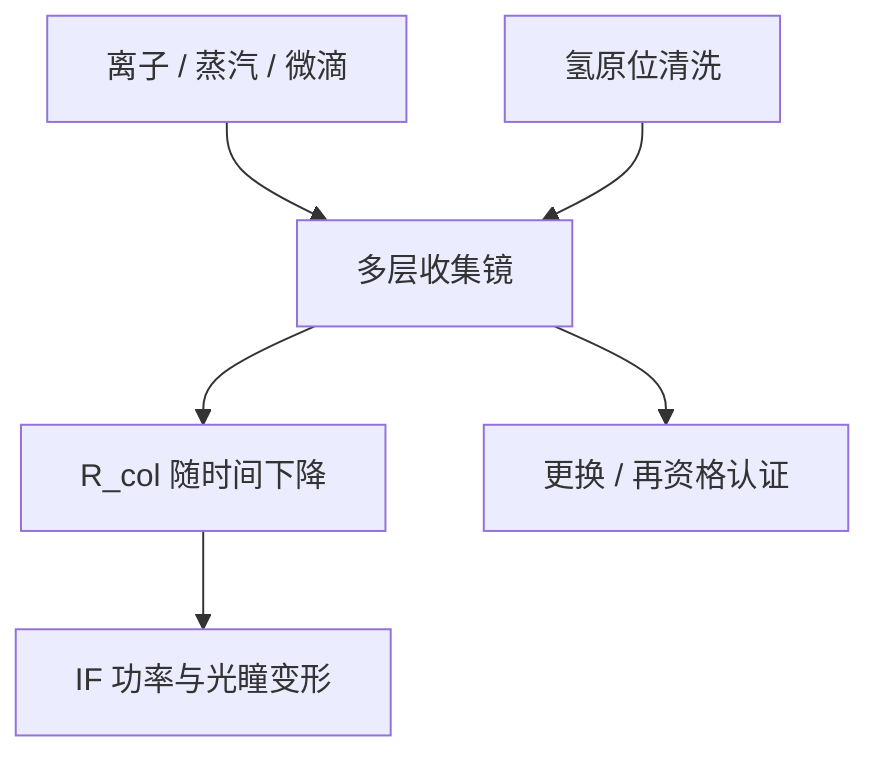

# 收集镜寿命

收集镜是可更换的多层膜椭球：寿命由锡污染与溅射写成反射率曲线，而不是由出厂峰值 $R$ 一次标定。

<footer>—— 归纳自 ASML 对 EUV 收集镜作为消耗品与可用性的公开讨论</footer>

[上一课](/litho/collector-grazing)（掠入射收集镜）。把碎屑分成离子、蒸汽和微滴。缺口是：这些损伤落在同一面[蔡司收集镜](/litho/zeiss-euv-optics)上，带内反射率、光瞳填充和面形一起走——IF 功率不是光源点亮就恒定。本课钉多层收集镜的退化机制。功率如何换成硅片剂量与产能，留给[下一课](/litho/euv-power-throughput)。不要在本课编造更换小时数。

## 问题

收集镜用正入射 Mo/Si 收 2π 附近的光，送到中间焦点。它离等离子体最近，热负荷、氢化学和锡质量流都最大。投影物镜在更干净的扫描腔里，不可当定期耗材；收集镜必须当消耗品设计：可洗、可换、换的时候整机可用性掉下来。

退化首先表现为 IF 带内功率下降，以及光瞳填充变形——照明不再是出厂那张 σ 图。[NXE](/litho/asml-nxe) 的剂量环会加激光能量补偿平均功率，但光瞳变形和散射底座补偿不回来，对比与 CD 指纹先坏。寿命因此是光学合同加工厂成本，不是「镜子还在不在」。

### 清洗有效的和无效的

[氢自由基](/litho/euv-hydrogen-dgl)把镀上的 Sn 变成 SnH₄，碳变成 CH₄，这是薄膜污染的原位通道。溅射造成的周期损失、微滴坑和中频粗糙，化学反应补不回。过激清洗还会攻击帽层（如钌）或改应力，波前与角谱一起漂。寿命曲线是「洗得动的累积 + 洗不动的累积」，公开讨论强调维护与更换，而不是无限原位再生。

ASML 把收集镜寿命写进光源可用性，而不是单独报一个实验室 CE。工厂模型里，停机换镜往往比 CE 差零点几个百分点更贵。本课只写这个结构，不写未公开的更换周期。

## 方法

工程上盯 IF 处的带内功率、剂量稳定度和光瞳传感器。反射率径向不均匀时，椭球不同环带贡献的角度变了，等效源形状变。维护策略是：氢流量与镜子温度构成清洗闭环；到了洗不动或风险过高的点，整镜或模块更换。再镀、再抛是供应商侧的事，晶圆厂合同是更换窗口与再资格认证。

收集镜周期沿径向渐变以跟踪布拉格角。局部镀锡或粗糙等于给这张渐变表加了一个随时间变的滤波器，带内带宽与光源 UTA 的重叠面积缩小。功率账里的 $R_{\mathrm{col}}$ 是时间的函数，不能用新镜峰值代入全年产能。

### 热与氢是同一张寿命图

吸收的 EUV 和杂散红外把镜子加热，周期与面形随温度变；氢刻蚀速率也随温度和自由基密度变。窗口是：够热、够氢以清锡，又不能热到膜系永久漂移。预脉冲改善碎屑谱，等于把寿命曲线的斜率打浅，这是上一课与本课的交接点。

## 机制

带内反射依赖界面锐度和周期对准 13.5 nm。溅射把界面打毛，TIS 上升，能量从镜面反射改道成散射，一部分仍进 IF 成为 flare 前身，一部分打进腔体。镀锡增加吸收，峰值 $R$ 掉。坑是局部散射中心，也是后续沉积的形核点。累积粗糙一旦进入中频，清洗掉表面锡也留着散射底座。

IF 是合同面：功率、发散、光谱一起验收。收集镜老化改的是这三项的耦合，而不是单纯「变暗」。剂量传感器在硅片侧闭环，执行器却在激光能量和气体流量上；用加功率掩盖脏镜，碎屑和热负荷通常一起升，寿命斜率更陡。可用性（availability）与瞬时功率同样进入 HVM 叙事。

投影六镜的污染预算与收集镜不是同一数量级。DGL 的存在，正是为了让 POB 不必按收集镜的更换逻辑来设计。不要把「EUV 镜子都要经常换」写成整条光路。

## 边界

本课不编造收集镜工作小时、脉冲数或某代 NXE 的更换周期。ASML 公开的是：收集镜会退化、可清洗、是消耗品、影响可用性。具体曲线随功率、滴稳定性和氢配方变，厂内数据不在本课。后课默认：写 IF 功率时，要问镜子此刻在寿命曲线的哪一段。

也不要把实验室单面高 $R$ 当成在机收集镜的系统值。角范围宽、氢化学、热梯度都在。High-NA 源功率与立体角若再抬，寿命曲线不能从 0.33 平台直接拷贝，但机制不变：仍是多层膜在等离子体旁当牺牲光学。

「寿命」在公开材料里常与 availability、collector lifetime 一起出现，指维持合同功率的可服务时间，不是物理上镜子碎裂。引用时保持这个工程含义。

## 小结

- 收集镜是消耗品：锡镀膜、溅射与微滴坑把 $R_{\mathrm{col}}$ 写成时间函数。
- 氢清洗管薄膜污染，不管机械坑与周期永久损失。
- 退化先表现为 IF 功率掉和光瞳变形，剂量环加激光不是无代价补偿。
- 更换进入整机可用性，与 CE 同样进成本。
- 不要用未公开的小时数写寿命；下一课用功率—剂量—产能会计接上。
- 出处：ASML 对收集镜寿命与可用性的公开讨论；Bakshi 对多层膜污染。
