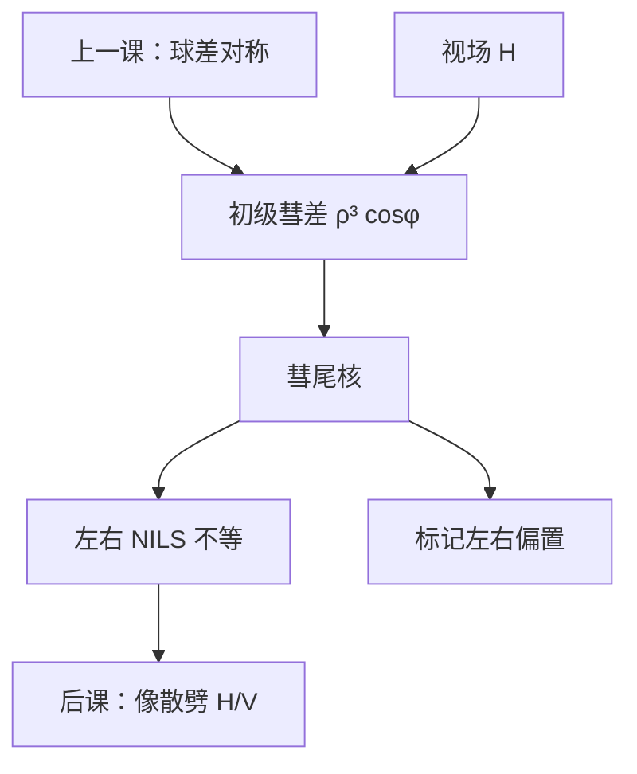

# 彗差

球差还保持圆对称；初级彗差随视场线性出现，波前带 $\rho^3\cos\phi$，点扩散拖出彗尾——左右边的 NILS 不再相等。

<footer>—— Born &amp; Wolf, Principles of Optics 对初级彗差的讨论</footer>

[上一课](/litho/spherical-aberration)把轴上 $\rho^4$ 钉成球差。缺口是：**离轴之后最先到来的不对称项**。像散与场曲留给[下一课](/litho/astigmatism-field)。不要把彗尾写成又一种球差，也不要引用未公开的狭缝彗差表。

## 问题

Seidel 初级彗差（$S_{II}$）对轴上点物为零，随视场半径涨，孔径上是奇数次的 $\rho^3\cos\phi$（或 $\sin\phi$，视子午方向）。几何图像是彗星状：主光线交点旁拖一串由不同环带造成的圆斑。光刻里这表现为线的一边陡、一边缓，以及套刻标记左右臂不对称。缺口因此是这根**奇对称**，而不是再配平一次 $\rho^4$。

正弦条件正是为压低彗差而设。上一课的齐明与本课的彗差是同一设计故事的两面；残差仍进 Zernike（Fringe 里低阶彗差常在 $Z_7$、$Z_8$ 一带，约定仍须声明）。

### 彗差不是远心

远心误差让质心随 $\Delta z$ 线性搬家，最佳焦距上可以很小。彗差在最佳焦距上已经让核带尾巴，离焦再叠加。把通过焦点的套刻扇形全部写成 $\alpha\Delta z$，会漏掉即使 $z=0$ 也在的左右 CD 差。

扫描狭缝两端视场最大，彗差往往在狭缝边缘最明显。报「本台镜头的彗差」必须声明场点；OPC 用单一核等于忽略这根向量。

## 方法

把 $W\propto H\rho^3\cos\phi$ 乘进光瞳（$H$ 为视场）。相干核沿彗差轴不对称：卷积后，孤立线两端一个变钝、一个相对保留，密栅两条边的 ILS 可以一高一低。部分相干不消除奇对称，只是把许多源点的彗尾平均——源若也离轴，有效彗差与照明质心纠缠。

Born &amp; Wolf 用光扇图读彗差：子午光束的交点相对主光线偏移。计算光刻不必画光扇，但读 Bossung 时要分左右边、分视场。

### 套刻标记比密线更早就范

盒中盒、条形标记的边缘走的是中频，核的尾巴把一边的阈值等高线推移，读出假套刻。真套刻（器件层对准）与标记层若空间频率不同，彗差造成的偏置对不上。这是光学像差进套刻预算的一条，不是工件台。

奇数像差对左右边的剂量灵敏度相反：一边 NILS 掉时另一边可能仍陡。只报平均 CD 会把彗差藏进「看起来还行」。

## 机制

奇数相位让脉冲响应失去中心对称。像面卷积把「哪一边先接到能量」固定下来，阈值模型给出定向的边位移。频率上，彗差对光瞳一边加权、另一边反向，对方向敏感的图形（水平 vs 垂直线）表现不同——但与像散的双焦线机制仍不同：彗差是三次、奇函数；像散是二次、$\cos 2\phi$。

Jones 两通道共用几何彗差。取向选择让某一组密线更走光瞳边缘，彗尾可以看起来像「偏振问题」；拆开看，相位仍是 $W$。

### 后课默认的接口

说到左右不对称、线端定向缩短、标记假套刻，先问彗差（及场点），再问照明质心与掩模 3D。像散不要用彗尾去冒充。下一课的 H/V 最佳焦劈裂是另一项。

## 边界

本课不含扫描平均把彗差扫成有效畸变的全部细节——狭缝积分会改有效系数，但不改 $\rho^3\cos\phi$ 的定义。禁止编造未公开的毫波数彗差；Born &amp; Wolf 的 Seidel 项与 Zernike 课的拟合接口已经够用。高阶彗差（$\rho^5$ 等）同样奇对称，截断后残差仍在。

## 小结

- 初级彗差随视场线性出现，波前 $\rho^3\cos\phi$，核带彗尾。
- 左右 NILS 与套刻标记对它最敏感；轴上球差没有这根不对称。
- 不是远心：最佳焦距上已经在。
- 必须报场点与 Zernike 约定。
- H/V 焦线劈裂下一课。
- 出处：Born &amp; Wolf, *Principles of Optics*。
