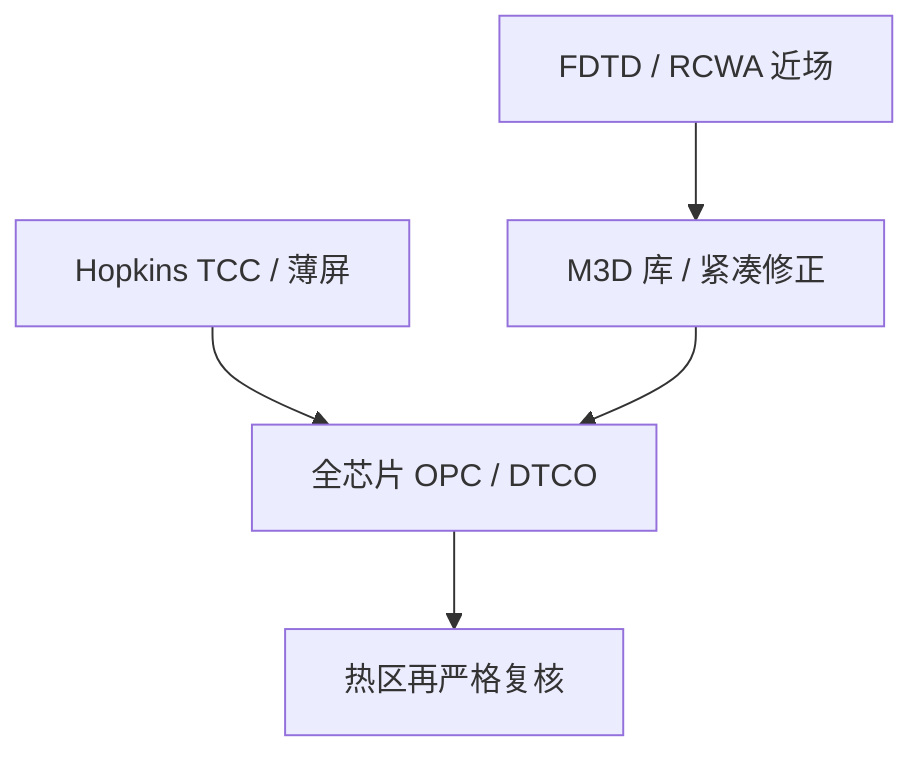

# 紧凑模型对严格电磁

全芯片要的是可重复的前向；掩模开口要的是麦克斯韦边值。紧凑模型把后者收成可调用的核，严格电磁只在核会撒谎的地方出场。

<footer>—— 对照 Wong 对 Hopkins / TCC 成像的表述，以及 Erdmann 对紧凑掩模模型与 FDTD、波导 / RCWA 的对照</footer>

[上一课](/litho/dtco-patterning)把设计规则、单元和工艺窗收进同一条 DTCO 环，前向默认是能每晚跑完全场的紧凑模型。缺口是：薄屏 Kirchhoff 加 [Hopkins TCC](/litho/hopkins-tcc) 在开口尺度接近波长、斜入射和偏振都进预算时，系统误差会被 OPC 修进错误的边。本课钉紧凑与严格电磁各回答什么。胶图形如何变成硬掩模与硅，留给[下一课](/litho/rie-pattern-transfer)，不要在这里开始写腔体化学。

## 问题

DTCO 与模型基 [OPC](/litho/opc) 共享同一类前向：照明与瞳收成 TCC，掩模是平面透过率，胶与刻蚀是阈值、高斯模糊和密度偏置。全芯片变量数只允许这种复杂度。上一课把「可制造」写成在这个前向上关窗；若前向漏掉 [掩模 3D](/litho/mask-3d-effect) 的阴影、HV 偏置和最佳焦漂，关窗是假的。

严格方法对局部几何解麦克斯韦：时域有限差分（FDTD）、严格耦合波 / 波导法（RCWA）。它们给出衍射级的振幅、相位与偏振，而不是乘一个 $t$。代价是不能对全芯片每个边现场求解。缺口因此是分工，不是选一个「更物理」的冠军。

### TCC 不是麦克斯韦的反义词

Hopkins 把部分相干强度写成物体频谱的双线性型，TCC 是照明与两个错位投影瞳的重叠。Wong 的投影成像教材把这条链写成可计算的核：光源与镜头固定则 TCC 可预计算，掩模只进频谱。紧凑的含义是**掩模近场被压缩**，不是光学变成几何光学。Erdmann 的对照是：在 hyper-NA 与厚吸收体上，先用 FDTD / 波导得到近场，再校准边界层、频谱滤波或 Jones 瞳一类紧凑修正，让全芯片仍走 TCC 路径。

把「紧凑」理解成「不严谨」会写错合同。量产 OPC 的紧凑模型必须对校准过的图形族可重复；严格电磁是校准源，不是每晚的求解器。

## 方法

工业分层通常是：代表性夹与热区用 FDTD 或 RCWA 建库；全芯片用 Hopkins / 和差相干分解，叠上库里的 M3D 修正和紧凑胶核。Wong 给出薄屏加 TCC 何时够用：特征远大于波长、正入射、标量。Erdmann 评估波导与 FDTD 对浸没高 NA 的工艺窗与 through-pitch，强调比近场切片更要看窗和偏置。

校准必须声明照明、膜系与偏振。换吸收体厚度或换偶极，库要重算。AI 替代近场可以降成本，外推到未见过的二维拐角时，仍要以严格夹为闸。

### 胶核仍是紧凑的

即使掩模近场改严格，抗蚀剂在 OPC 里仍是阈值与扩散，不是分子动力学。上一课 DTCO 关的窗，纵轴仍是这套紧凑 CD。严格电磁修正的是进入胶之前的空中像；它不自动给出 [随机缺孔](/litho/euv-stochastics)。把 FDTD 空中像直接当良率，会漏掉胶与刻蚀两段。

## 机制

薄屏把开口当成无限薄复透过率，衍射级由傅里叶变换一次给出。厚掩模是波导：开口内传播常数随偏振与宽度变，左右边对斜入射不等价。FDTD 吃任意三维，耗内存与时间；RCWA 吃周期性或可周期延拓的膜堆，对线栅和接触孔阵列更自然。紧凑修正把「级振幅相对 Kirchhoff 的差」做成滤波或边界层，使 TCC 的双线性型仍可用。

这解释了为何 DTCO 不能只在设计规则手册里加减间距：若紧凑核没吃进 M3D，规则是在错误空中像上关的。也解释了为何不能全场 FDTD：变量在多边形边上，求解器在体网格上，数量级对不上。

EUV 斜入射阴影是同一分工的极端：薄屏必错，全芯片仍不能现场麦克斯韦。量产靠的是预计算近场加紧凑成像，不是把 OPC 改写成 FDTD 作业。

## 边界

不要在没有厚掩模校准的偶极上对二维逻辑做全芯片 ILT 并宣称窗已关闭。不要把某一热区 FDTD 的 CD 差写成节点良率。本课不重写 TCC 积分，那是部分相干课与 Hopkins 专篇的对象。也不把某种商业「M3D 开关」写成已经等于麦克斯韦。

严格电磁不修复套刻，不抬 NA。它只阻止计算光刻在错误的前向上收敛。下一课的反应离子刻蚀才是把浮雕变成衬底的物理转移；OPC 里的刻蚀偏置仍是紧凑项，不要和腔体里的离子与自由基混名。

出处：A. K. Wong, *Optical Imaging in Projection Microlithography*（SPIE）；A. Erdmann 等对 FDTD / 波导与紧凑掩模模型的 SPIE 与 JM3 公开对照。不引用未公开的全芯片 FDTD 小时数。

## 小结

- 紧凑模型（TCC + 薄屏 / 校准过的 M3D 修正 + 胶核）支撑全芯片与 DTCO。
- 严格电磁（FDTD、RCWA）校准近场与热区，不替代每晚的前向。
- Wong 给出 Hopkins 可计算核；Erdmann 给出高 NA 下何时必须离开纯 Kirchhoff。
- 模型分层失败时，OPC 会把阴影修进错误的边。
- 刻蚀转印下一课，本课停在空中像进入胶之前。
- 出处：Wong 投影成像教材；Erdmann 严格掩模与紧凑模型公开文献。
