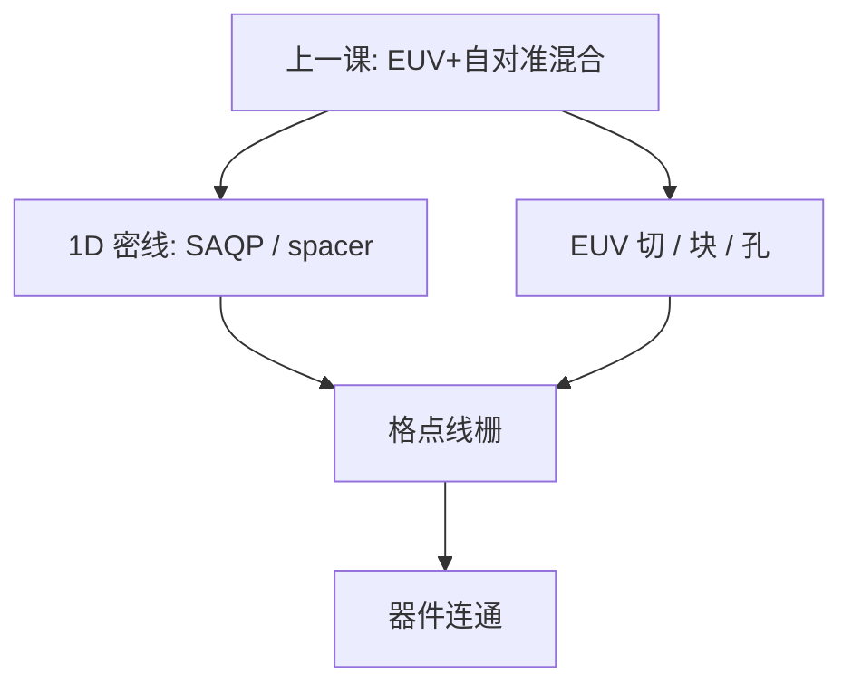

# 互补式 EUV

密集一维线继续用自对准劈节距，切块与孔用 EUV 单次补上：EUV 是互补的那一刀，不是把整层改成一张版印完。

<footer>—— 据先进节点对 complementary lithography / EUV cut-block 的公开层策略整理，不编产能</footer>

[上一课](/litho/euv-sapt-hybrid)把 EUV 与自对准写成可以叠在同一层策略里：EUV 当芯轴，或与 SAQP 共存。缺口是更具体的一种公开分法——互补式：193i（或 EUV）做出单向密线，EUV 专做 cut / block / 孔。本课钉互补，不编 wph、片成本和成品率。

## 问题

混合课已经说：0.33 NA 单次仍有 $k_1$ 窗，更密的鳍和金属会走 spacer。互补式把这句话收成分工：周期方向的密度交给 SADP/SAQP（套刻结构有利），终止与二维连通交给 EUV 的切和块（单次二维能力比浸没多重切更干净）。公开节点叙事里，这是「EUV 插入」的一种层策略，不是「该代所有临界层都变一张 EUV 版」。

缺口因此是切块互补，而不是重算混合课的 mandrel 光源选择。没有这层，会把「上了 NXE」读成 SAQP 与 cut 消失。

### 互补不是对称的两次 EUV

名字里的 complementary 来自一维栅格设计：线与切在功能上互补。线可以仍是浸没 SAQP，切用 EUV；或线也 EUV、切仍 EUV——那是 EUV+EUV，仍叫互补几何，但波长分工不同。必须按层声明：谁印线，谁印切。不要用一个词覆盖两种成本结构。本课不把任何一种写成唯一量产点。

公开策略谈话会提到 EUV 做 via 与 cut、浸没多重做线。那是层类型语言。把它翻译成某厂某年的产能或良率，就是编造。

## 方法

读一层策略时列三行：mandrel/线用哪台、cut/block 用哪台、孔是否单独 EUV。互补式的典型公开组合是：1D 线 = 浸没 SAQP（或 EUV 芯轴 + spacer），2D 信息 = EUV 切/块。设计规则：线单向、拐角靠切拼出来，与纯 EUV 任意二维不同。DTCO 先于光学：布局必须是格点。

计量：线的四相 space 仍按 SAQP 课；切的套刻是 EUV 场对浸没栅，跨平台匹配进 overlay 预算。混合课警告过节点名不是波长，本课加上：同一层内也可以两种波长互补。

### 后课默认

说到互补式 EUV，默认「切/块/孔用 EUV 补 1D 自对准线」，并要求声明线的波长。说到整层 EUV 单次，那是另一工作点，不要混名。产能与源功率不在本课出现。

## 机制

自对准线把最紧的周期误差从 overlay 挪到薄膜；EUV 切把最紧的二维终止从浸没多重着色挪到单次（或少次）短波长。两者各买各的：$k_1$ 地板对长直线和切孔不是同一句。EUV 切的随机缺孔、剂量，是胶与源的账；线的 walking 是薄膜的账。互补意味着失效模式并列，不是互相消灭。

跨波长套刻：浸没栅的指纹与 EUV 场畸变不同，匹配项回到套刻预算课。High-NA EUV 以后切的窗会再变，仍不自动取消 spacer 线——公开策略按层演进，本课不预支时间表。

互补式也曾在纯 193i 时代被谈论（浸没线 + 浸没切）。EUV 进切层，是短波长去补切的 $k_1$，不是新发明一种几何。几何是 1D+cut；新的是谁曝光切。

## 边界

不编某代金属有几张 EUV 版，不编替换几张 DUV 之后的 wph 变化。不把 complementary 写成商标或唯一专利路径——它是公开层策略语言。纯 EUV 二维、EUV LELE、EUV+SADP mandrel 仍与互补式并存，按层选。

下一课程进入 EUV 光源与机台时，本课的切层只是那些光子的一个用户：剂量与随机在切孔上往往比在长直线上更苛刻，但那是胶与随机课，不在这里用产能数字代替。SAQP 加切断已经把几何钉成 1D+cut；本课只换「谁曝光切」，不把几何重讲成新发明。

## 小结

- 互补式 EUV：1D 自对准密线 + EUV 切/块/孔，按层声明谁印线。
- 它是混合策略的一种公开分法，不是整片单次 EUV。
- 失效模式并列：walking 在线，随机与套刻在切。
- 不编产能、片成本、良率；只保留分工语言。
- 几何仍是 1D+cut；新的是谁曝光切，不是新发明一种图形。
- 跨波长套刻匹配进预算；节点名仍不是波长。
- 切孔剂量与随机往往比长直线更苛刻，不在这里用产能数字代替。
- 出处：先进节点 complementary lithography / EUV cut-block 的公开层策略表述。
