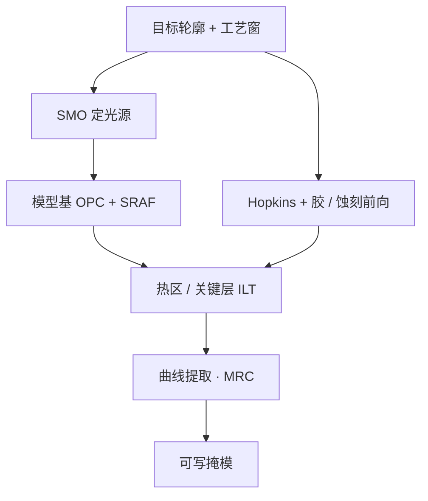

# 计算光刻与 ILT

    
投影光刻是已知的低通前向算子。计算光刻要做的，是在可制造约束下求一个稳定的逆：从目标晶圆轮廓反推光源、掩模与剂量，而不是把版图按相似变换画到铬层上。

    <footer>—— 对照 Mack 对光学邻近、RET 与掩模频谱的论述；逆光刻把掩模当成可优化的透过率图</footer>

[OPC](/litho/opc) 写过多边形边上的模型基修正；[ILT](/litho/ilt-curvilinear) 写过像素/水平集逆与曲线掩模；[SMO](/litho/smo) 写过光瞳与掩模联合。[GPU 加速](/litho/computational-litho-gpu) 写过 cuLitho 一类算力。本篇把这些收成 **Mack 框架下的计算光刻专文**：前向是 Hopkins 成像加抗蚀剂，逆问题病态，表示从规则表走到 OPC 碎片再走到 ILT；算力与掩模写入是同一条闸。不重复碎片循环的逐步伪代码，也不编造未公开的全芯片 ILT 小时数或某厂内部热点清单。

## 问题

瑞利尺度 $k_1\lambda/\mathrm{NA}$ 附近，孤立线与密线的空中像对比、线端缩短、拐角圆化按邻域几何而变。掩模上的图形因此不是晶圆上要的图形。早期规则 OPC 用查表加衬线；图形一复杂，邻域组合爆炸。必须改成可重复模拟的前向模型，再在模型上求逆。

逆问题病态：许多掩模对应几乎相同的低通空中像，噪声和模型误差会被放大。必须正则化（平滑、MRC、剂量/焦点鲁棒项），否则解在像素噪声里打转。问题因此不是「算法是否存在」，而是在扫描仪能实现的光源、掩模厂能写的几何、以及全芯片计算预算上，求一个**可制造的逆**。Mack 把 RET、胶与 OPC 并列进 $k_1$，就是反对只拧光学三个符号里的一个。

### 计算光刻是逆问题，不是美化版图

正向：$I=\mathcal{I}(S,M)$，光源 $S$ 与掩模 $M$ 经部分相干成像得到空中像，再经胶与蚀刻得到轮廓。OPC 限制 $M$ 与设计同拓扑、边只能法向挪。SMO 把 $S$ 的像素也放进同一目标函数。ILT 放开 $M$ 的表示：像素或水平集，直接对 $\mathcal{I}$ 求逆，再收成可写几何。三者不是三代营销名，是同一逆问题在可行集上的三层放松。

曼哈顿折线是 [VSB 写掩模](/litho/multibeam-mask-writer) 的历史约束，不是光学的本征基。透镜通带里有效的形状本来就不是直角；用大量小矩形逼近光滑等高线，是把写入工具的基强加给成像。曲线 ILT 的光学收益来自「梯度下降走在通带内」；若曲线化之后 PV-band 没有改善，只是增加了掩模数据体积，那还不该上。

SRAF 在晶圆上并不作为独立图形存在；它们只改变目标图形的空中像与工艺窗口。把计算光刻理解成「把线条画粗一点」，忽略了助条、光瞳与胶模型。

## 方法

工业链通常分层，而不是一步全芯片纯 ILT。

先 SMO：在代表性图形上选可实现光瞳，定设计规则与照明。再模型基 OPC：把设计切成边碎片，按 EPE 迭代，叠 SRAF，用光学模型（TCC / 掩模 3D）加紧凑胶/蚀刻模型。热区或关键层再上 ILT：像素或水平集优化，鲁棒项扫剂量与焦点，提取曲线，做 MRC 与场拼接连续。评价看工艺窗口带，而不是只看名义剂量、名义焦点的轮廓。

EUV 上前向必须含吸收体厚度与斜入射阴影；用 DUV 透射薄掩模假设做 EUV 逆，会出现系统性的左右不对称。随机效应要把接触孔缺失写成目标的一部分，否则 ILT 会收敛到光学漂亮、统计上缺孔的形状。GPU 把前向与伴随从按周变成按夜，没有这条算力，ILT 只能当研究。

### 从 Hopkins 到 ILT 的表示升级

Hopkins 把空中像写成互强度与掩模透过率的双线性形式；固定光源与瞳下可收成 TCC。OPC 的变量是边碎片的法向位移，搜索空间是「设计图形的形变」。ILT 的变量是掩模平面上的透过率场，搜索空间是通带内的图像。无约束 ILT 倾向曲线，因为伴随梯度本身被镜头低通；强行投影回曼哈顿，损失通常回升。这正是「曲线有光学收益」的来源，也是写入与检测必须改语言的原因：MRC 从边平行间距变成曲率半径与颈宽。

ILT 不是「更强的 OPC」这么一句升级。OPC 在多边形流形上局部搜索；ILT 换了表示与可行集。把 ILT 当 OPC 的更高迭代次数，会低估数据格式、写入与检测要改的量。

## 机制

损失对掩模像素的梯度，是伴随成像：把晶圆上的轮廓误差反投到掩模平面。低通意味着梯度光滑，解自然走曲线。ILT 会自发「长出」助条状结构，因为它们降低损失；必须靠鲁棒项和 MRC 投影按住「在某些工艺角会印出来」的旁瓣。全芯片纯 ILT 的变量数在 OPC 碎片的数量级之上，实践是热区先上、关键层再全芯片曲线。

Mack 的空中像—潜像—显影浮雕链，决定模型要分几段：只逆光学、不管胶，窗口会在 PEB 扩散上丢；胶模型若是域外插值，ILT 会把错轮廓当目标。计算光刻签核域必须覆盖新胶、新硬掩模、新 NA；AI 替代胶模型可以降前向成本，外推风险见 GPU 加速篇。

### 算力与写入是同一条闸

长期卡住 ILT 的不是算法存在性，而是 VSB 炮数与全芯片 CPU 小时。多束机台让写入时间与图形复杂度近似解耦；GPU 让每晚能迭代全场。两条闸同时松开，曲线 ILT 才从热区补丁变成可讨论的量产选项。缺一则另一条会把数据路径堵死：算得出写不进，或写得进算不完。

## 边界与工程取舍

不要在没有 SMO 的固定偶极上对二维逻辑做全芯片 ILT 并期待窗口自动够。不要把某一层热区 ILT 的 PV-band 改善写成全节点良率。不要用未公开的内部 OPC 小时数做产能规划。High-NA 变形光瞳与拼接缝是新的模型项，DUV/NXE 的旧核不能直接当 EXE 的前向。

计算光刻不修复套刻预算，也不抬高 NA；它只在给定 $\lambda$、$\mathrm{NA}$ 与扫描仪约束下挤 $k_1$ 与窗口。随机缺陷在高剂量下仍不可接受时，还要靠胶与设计规则（冗余通孔、放大接触）。

出处：Mack, *Fundamental Principles of Optical Lithography*；模型基 OPC 与 SMO 公开方法；逆光刻 / 曲线掩模公开文献。本篇不引用未公开的全芯片 ILT 运行时间表。

## 小结

- 计算光刻是对投影成像加胶蚀刻的可制造逆问题；RET 与 $k_1$ 在 Mack 框架里是同一件事的两面。
- 表示从规则表 → OPC 碎片 → ILT 像素/水平集逐步放松；曲线是通带内的自然解。
- 量产节奏受 GPU 前向与多束写入同时约束。
- 出处：Mack 教科书；OPC / SMO / ILT 公开文献。
