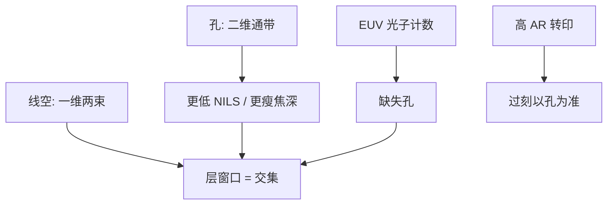

# 接触孔与通孔图形化

线空是一维节距问题；孔是二维通带里的暗点。对比更差、随机更毒、刻蚀更深宽比，三件事叠在同一类图形上。

<footer>—— 对照 Mack 对接触孔空中像与工艺窗的讨论，以及 EUV 孔阵列随机缺失的公开论述</footer>

[上一课](/litho/etch-loading-ar)说明深孔先付 ARDE 和过刻。缺口是：孔在成像端本来就比线空难——两个方向都要进瞳，NILS 更低，EUV 上还先死在泊松缺孔。本课钉接触孔与通孔图形化，对照线栅。后道各层并不共用这一套波长，留给[下一课](/litho/beol-wavelength-mix)。

## 问题

密线可以靠两束干涉在瞳内站住；接触孔的频谱是二维的，要同时过 $x$ 与 $y$ 的截止。同样 $k_1$ 叙事下，孔的空中像对比和边缘陡度通常差一截，Bossung 先关。Mack 把孔写成与孤立线、密线并列的图形族：层的工艺窗是交集，孔常常是短板。

EUV 把短板从「对比不够」加成「计数不够」。小孔体积里光子少，缺失孔随剂量陡变，见[随机效应](/litho/euv-stochastics)。DUV 多重可以用两次线空拼孔，或用负显影，但套刻和循环进来。缺口是：孔不是「短一点的线」，不能把线栅 OPC 配方直接贴到孔阵列上。

### 孔的焦深更瘦

离焦时高频先死；孔更依赖高频，轴向窗更窄。浸没与 High-NA 再削 $\mathrm{NA}^2$。设计上放宽孔、加冗余通孔，是在买统计与窗，不是承认光学公式失效。

通孔（via）与接触孔（contact）成像同类、衬底不同：一个进金属间介质，一个进前层介质/硅化物。ARDE 与选择比要按膜堆重标，光学对比可以共用讨论。

## 方法

照明：常规圆照明对孔往往比强偶极更稳，因为孔要各向同性；十字或弱四极是常见折中，强线栅偶极会把孔拉成长圆。掩模：衰减相移对孔是产线默认之一，暗区漏光加相位抬对比。OPC：孔要修的是直径、长短轴和邻近孔的合并风险，SRAF 更易印出旁瓣，MRC 要按住。

EUV 单次孔：剂量、胶吸收和 SMO 先服务缺陷密度，再服务平均 CD。随机感知的目标函数把缺孔写进损失，而不是只盯名义直径。电学冗余通孔把泊松尾从良率里挪走一部分。刻蚀端按上一课：过刻以最慢孔为准，线层不要用同一过刻百分比。

### 阵列与孤立孔不是同一条 Bossung

密孔阵列有光学邻近，也有刻蚀微负荷；孤立孔对比和负荷都不同。OPC 和食谱必须分族。把阵列 CD 合格写成「孔层已通」，孤立孔或不规则二维通孔仍可能桥或封。

## 机制

成像：孔的暗区靠周围亮区的衍射级在中心相消；级一少，中心抬起来，阈值胶切出的孔变小或封死。这与线空「暗线靠两级干涉」同构，但自由度少一维。Mack 用 NILS 在孔边缘取值，而不是只用一维对比度公式。

随机：平均空中像可以「刚开孔」，泊松使一部分孔落在阈值下。缺陷率对剂量近似指数，产线表现为剂量一降缺孔爆炸。刻蚀：孔 AR 高，ARDE 让底部聚合物和钝化更易封口，过刻与高选择比是在补成像留下的深坑，不是补 $k_1$。

缺孔看起来像掩模缺陷或颗粒，统计上随剂量和孔面积变。分析要把重复性掩模缺陷与泊松尾拆开。

## 边界

不要把某一代 EUV 孔的未公开缺陷密度表填进本课。不要说「孔必须 EUV」——后道松节距通孔仍用 ArF 甚至 KrF。本课不重写 LELE 染色，只承认两次线空拼孔是 DUV 的一条路。也不把金属氧化物胶写成孔层唯一解；胶三角在[EUV 胶](/litho/euv-resist)。

下一课把后道多层写成波长分层：不是每一层通孔都配最先进的孔工艺。

出处：Mack, *Fundamental Principles of Optical Lithography* 中对接触孔与图形族窗口的讨论；EUV 孔随机缺失的公开综述与产线表述。不编造某厂孔缺陷 ppm。

## 小结

- 孔是二维图形，NILS 与焦深通常差于同类 $k_1$ 的线空。
- 层窗口是孔与线的交集；孔常先关窗。
- EUV 小孔先付光子统计（缺失孔），再付 ARDE。
- 照明与 OPC 不能从线栅配方直接拷贝。
- 后道波长分层下一课。
- 出处：Mack；EUV 孔随机效应公开论述。
