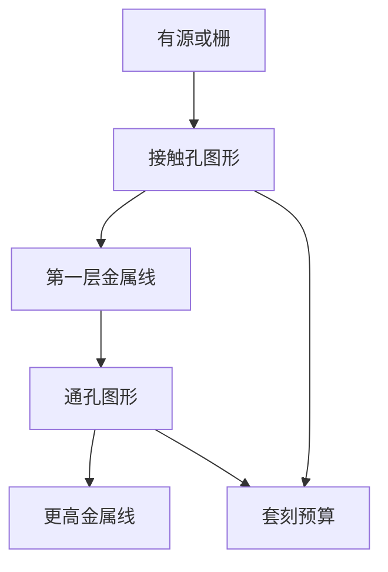

# 接触孔、通孔与线

接触孔把有源区接到第一层金属，通孔连接相邻金属层；线在同一层内走线。孔与线是两套图形，孔更小、更吃套刻。

<footer>—— 据 Mack, Fundamental Principles of Optical Lithography 对接触孔与通孔层作为独立图形层的整理</footer>

[上一课](/litho/node-vs-gate-length)说明节点名与物理尺寸脱钩。芯片除了 [互连半节距与金属层](/litho/interconnect-halfpitch) 的横向线，还要竖直连接。缺口：接触孔、通孔与线在图形化上各是什么，为何孔层常常比线层更难做对。没有竖直开口，横向再密的金属也接不进晶体管。

## 问题

[CMOS 反相器为什么成对](/litho/cmos-inverter-pair) 要把源漏接到电源与下一级，栅也要接到输入网。竖直方向：接触孔从有源或栅到 M1；通孔从 Mx 到 Mx+1。孔是紧凑的二维开口，套刻错一点就落到隔离上或连错相邻线。没有这套词汇，无法理解产线为何单独盯「孔层」窗口。缺口是图形种类，不是再争论节点叫什么。线解决平面连通，孔解决层间连通，缺一则网表落不到硅上。孔层窗口单独建，是因为对象本来就不是短线，套刻与开口面积才是第一约束，线宽均匀性则是线层的尺子。两类窗口不能混用同一张曝光菜单。

### 孔不是短线

线层的关键是节距与线宽均匀；孔层的关键是开口面积、圆度、以及相对下层的对准。把孔当成「很短的线」会用错设计规则：密集线的极限与孤立孔的极限往往不是同一条。后课单次曝光极限主要用节距说话；孔另有一套孤立图形的窗口，本课先分开对象。

接触孔：前道到 M1。通孔：金属层之间。线：同一金属层内的布线。孔的目标尺寸常常小于或相当于同层最小线宽，套刻预算常更紧。

## 方法

每层仍是「定义开口 → 蚀刻或开槽 → 填金属 → 平坦化」，但掩模数据不同：线是长条网络，孔是离散阵列或稀疏点。接触必须落在有源或栅的合法着陆区；通孔必须同时打中上下两层金属。套刻把孔中心对到着陆区中心，误差直接变成电阻或开路。

孔层还常是检验与缺陷学习的先行层：开口小，同样的颗粒更容易致命，爬坡时先暴露图形化稳定性。线层则更敏感于节距与线宽均匀性。工艺窗口分开建，是因为对象本来就不是同一种多边形。本课把对象分开；如何曝光，仍然留给成像主线。

图形化动机：没有孔层，亿级晶体管无法接到金属网；没有线层，孔只是一些不相连的柱。两者缺一不可，且必须在同一套对准标记系统里串起来。

孔的工艺窗口常用曝光宽容度与焦点宽容度来画，和密集线的过程窗口形状不同。本课不画窗口，只指出对象不同，窗口才会不同。

## 机制

孔层良率往往在工艺爬坡时先亮红灯：随机缺陷更容易塞死或桥接小开口，下一课之后的缺陷密度课会回到这件事。本课只要：竖直连接与横向走线是不同的图形对象，套刻是它们之间的合同。

孔的着陆区是有限的：接触必须落在有源或栅的合法窗口内，通孔必须同时打中上下金属。套刻把三维对准收成平面上的误差椭圆；孔越小，同一纳米偏差占开口直径的比例越大，电阻分布越宽。线层的致命模式更常是桥连与断线，孔层则是开路、高阻与落到邻线的短路。两类缺陷进入同一张 [良率](/litho/yield-defect-die-area) 账，但工艺窗口不是同一条。

不要在这里展开如何用离轴照明或孔专用掩模增强来印孔。成像主线尚未开始；本课程只说明为何必须有这些层。下一课 [多重图形化之前的单次曝光极限](/litho/single-expose-limit) 用节距问：线层密到什么程度，一次图形化就不够。

## 边界

本课不展开自对准接触、通孔居中或背面通孔等进阶结构。不写抗蚀剂与照明配方。也不把孔的临界尺寸塞进某一条分辨口诀。

自对准方案是为了放松套刻，不是取消孔层：图形仍然要定义，只是着陆区由侧墙或硬掩模代劳一部分对准。本课对象仍是「必须有竖直开口」。后课默认：接触孔连前道到 M1，通孔连金属层，线是同层布线；孔更吃套刻。下一课只问线/空节距的一次成像下限，仍不把成像课写完。

## 小结

- 接触孔连前道到 M1；通孔连金属层；线是同层布线。
- 孔与线是不同图形，孔更孤立、更吃套刻与开口面积。
- 没有孔层就没有电路；没有线层孔只是柱。
- 成像方法不在本课；下一课用节距谈一次图形化的下限。
- 套刻是孔与着陆区之间的合同，误差直接变成电阻、开路或落到邻线的短路。
- 出处：Mack, *Fundamental Principles of Optical Lithography*。
