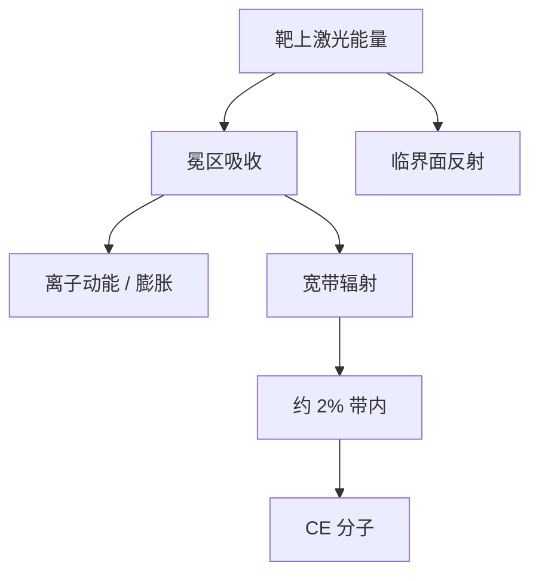

# 转换效率的物理

转换效率是带内 EUV 能量除以打到靶上的激光能量。几个百分点是整厂功耗和收集镜热负荷的杠杆，不是光谱仪上的峰值亮度。

<footer>—— 据 Bakshi, EUV Lithography；ASML 对 in-band CE 的公开定义</footer>

[上一课](/litho/co2-drive-laser-chain)把十千瓦级 CO₂ MOPA 送到锡靶。缺口是：红外瓦数不等于中间焦点的带内瓦数。中间隔着等离子体耦合、辐射分支和收集几何。本课钉转换效率（conversion efficiency, CE）的物理定义与上限来自哪里。锡离子为什么在 13.5 nm 亮，留给[下一课](/litho/tin-plasma-emission)。

## 问题

驱动链可以再加一级放大，墙插功率跟着涨。若 CE 停在约 1%（实心滴、无预脉冲），激光白烧、镜子更热、碎屑更猛，IF 仍到不了 [NXE](/litho/asml-nxe) 公开的 250 W 级里程碑。[预脉冲](/litho/euv-prepulse)把 CE 抬到约 5–6%，是把靶的密度标长改到 CO₂ 能吸收的窗口，不是把放大链再乘一个系数。

缺口因此是能量分支，不是再画一张 MOPA 框图。打到靶上的激光，一部分被临界密度面反射，一部分变成离子动能和流体力学膨胀，一部分变成宽带辐射；只有落在多层膜约 2% 窗口内的那一份，才进 CE 的分子。

$$
\mathrm{CE} = \frac{E_{\mathrm{EUV,in-band}}}{E_{\mathrm{laser,on-target}}}.
$$

公开数字通常按主脉冲激光能量归一。把预脉冲能量加进分母，会把同一套实验说成两个 CE。引用时核对原文定义。

## 方法

工程上把 CE 拆成可调的三块：靶（滴径、预脉冲展开、盘的光学厚度）、激光（波长、强度、脉宽、焦斑）和等离子体状态（温度、密度、停留时间）。CO₂ 的临界密度 $n_c\propto\lambda^{-2}$，把吸收区放在相对稀薄的冕，有利于把能量停在带内价态而不是过密反射。短波长固体激光更容易耦进过密区，实验室可以出光，量产 CE 往往更差——这是选 10.6 μm 的效率理由，上一课只写了链，本课才写为什么这条链的波长不能随便换。

计量在带内通道做：多层膜标定的探测器看 13.5 nm 附近积分，激光量热计看靶上能量。立体角要声明：有的实验报 $2\pi$ 内的 CE，量产合同是收集镜实际收到、再扣 $R_{\mathrm{col}}$ 和气体之后的 IF。两者差一个几何因子，不能拿大阪大学单脉冲纪录直接当 NXE 的 CE。

## 机制

最优窗口是辐射流体力学的交集。太冷，锡离子价态不够，UTA 暗；太热，能量跑到更高电离和动能，CE 掉、碎屑更硬。Nishihara、Fujioka 等对激光等离子体 EUV 的辐射流体模拟，把这块写成「在膨胀尚未拆完靶之前，把温度钉在数十电子伏」。预脉冲负责把靶送到这个状态，主脉冲负责在微秒寿命里把能量耦进去。

O'Sullivan 等对锡未分辨跃迁阵列的原子物理给出光谱上限：即使每个激光光子都变成辐射，带内分支比仍受 UTA 宽度与多层窗口重叠限制。CE 的几个百分点不是「工程没做好」，是原子物理加几何收集的乘积。量产再抠的是：在 50 kHz、氢气流和逐渐变脏的收集镜下，把 CE 维持在这个窗口，而不是单次打出纪录。

IF 功率还要乘收集立体角、收集镜反射率和氢柱透过率。CE 高而 $R_{\mathrm{col}}(t)$ 掉，产能照样垮。本课只钉激光→带内这一段；功率路线课再把整条账乘开。

## 边界

本课不展开 Sn⁸⁺–Sn¹⁴⁺ 的具体跃迁，那是下一课的辐射。也不把 5–6% 写成与滴径无关的物理常数——发生器改尺寸，膨胀时间和光学厚度都要重调。出处：Bakshi 对 CE 与 LPP 能量流；ASML 对 in-band 定义；Fujioka / Nishihara 等辐射流体工作；O'Sullivan 等锡 UTA 光谱。

## 小结

- CE 是带内 EUV 相对靶上激光的比值，不是全谱亮度。
- 波长、靶形态和等离子体温度密度共同决定分支；预脉冲改的是靶，不是定义。
- 后课默认：加激光之前先问 CE 窗口还在不在。
- 出处：Bakshi；ASML in-band CE；Fujioka、Nishihara、O'Sullivan 等。
