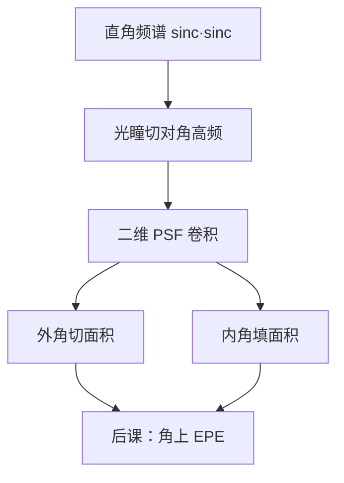

# 角圆化

直角的频谱沿对角拖得很远；光瞳切掉那一角，空域里内角外角都被核磨圆，不是显影液专咬尖角。

<footer>—— 二维傅里叶低通；光刻拐角与邻近见 Mack</footer>

[上一课](/litho/forbidden-pitch)处理了周期性一维（及阵列）的 TCC 谷。缺口是非周期二维：**凸角与凹角**在设计上是 90°，印出来是圆弧，SRAM 与逻辑拐弯处的 CD 和间距都按圆弧走。主干 OPE 已点名拐角圆化；本课把它接到 circ–jinc 骨架。边缘放置误差留给[下一课](/litho/edge-placement-error）。不出 OPC 衬线表。

## 问题

矩形拐角处，两个方向的锐边同时存在，频谱是 $\mathrm{sinc}(f_x)\mathrm{sinc}(f_y)$，对角高频最丰富。光瞳是圆（或 SMO 形状），对角方向先丢分量。空域：凸角被切掉一块面积，凹角被填进一块，曲率半径约光学直径量级，随离焦增大。阈值一漂，圆弧的弦长变化比直边更敏感——NILS 沿角平分线往往最差。

缺口不是再讲 LES（端是「一条边终止」），而是拐弯处**两条边互相当邻居**。内角桥连、外角缩颈，常常先于中段 CD 超差。

### 内角与外角不对称

同样一只正核，凸角丢面积、凹角得面积，阈值模型下外角显得更「瘦」、内角更「肥」。正胶 / 负胶、明场 / 暗场会把肥瘦对调，但光学低通这一层不变。矢量成像让 H/V 边斜率不同，直角会变成椭圆弧，不只是圆。

计量用角到角的距离或面积损失报 round。必须声明阈值与焦点。把圆化全部归因于酸扩散，会去拧 PEB，而改 NA / 照明时圆弧半径其实先动。

## 方法

前向：在 SOCS 核上放 L 形或矩形，读等强度线相对顶点的倒角。比较「只有光学核」与「再乘胶模糊核」，拆光学半径与工艺半径。照明若带强方向性，圆弧变各向异性，与孔椭圆是同一机制。

设计：内角间距要按圆弧而不是按曼哈顿直角留余量；外角到邻线的间隙同样。这是设计规则，不是修版。衬线、倒角、内衬是后课 OPC 对这场低通的逆。

### 与禁戒节距的关系

周期线的谷是频率轴上的点；拐角是宽带二维谱，不对应单一 pitch，但邻域里若存在禁戒周期，拐弯处的局部环境可以同时踩谷。热点审查要看角，不能只看长直线的 through-pitch 表。

## 机制

卷积 $t*|h|^2$（非相干极限）或场卷积再模方：物体指示函数的曲率为无穷的点，被核的矩抹成有限曲率。曲率半径随核二阶矩走，离焦、像差、$\sigma$ 都改矩，因而改圆化。上一课序的 NILS–像差敏感度在角上通常大于直边，因为角已经在核的斜坡上。

扫描平均沿一方向再糊，狭缝方向与扫描方向的圆化可以不等——画正方形接触会印成圆角矩形，取向相对扫描要声明。

## 边界

刻蚀微负载在内角加速或减速，会再改圆弧，拆法仍是改光学半径是否先动。本课不给「圆角半径 = 0.5 λ/NA」当公式：系数随相干与阈值变。禁止用显微镜 Airy 暗环直接当倒角半径。

## 小结

- 角圆化是二维低通，对角高频先丢。
- 外角丢面积、内角得面积；阈值上肥瘦不对称。
- 方向性照明和矢量通道把圆变成椭圆弧。
- 光学半径与胶/刻蚀半径要拆开。
- 下一课：把边的偏差收成 EPE。
- 出处：Goodman；Mack；Born &amp; Wolf 的衍射极限成像。
