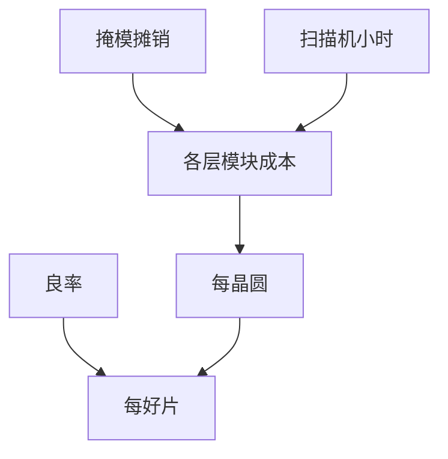

# 每层成本与每晶圆成本

晶圆成本是各层光刻–刻蚀–薄膜之和再加测试；比较 EUV 与多重必须按层加总，不能按「用没用 EUV」一句话。

<footer>—— 对照晶圆成本结构与 per-layer litho cost 的产业讨论；不编造美元表</footer>

[上一课](/litho/irds-roadmap)给出需求骨架。缺口是钱。本课钉每层成本与每晶圆成本。EUV 与多重的交叉点，留给[下一课](/litho/euv-vs-multipattern-cost-crossover）。

## 问题

一层成本 ≈ 扫描机折旧与维护 + 轨道化学 + 掩模摊销 + 计量 + 重工税 + 刻蚀/薄膜若算进「图形化模块」。EUV 层：光源、pellicle、剂量时间、抗蚀剂、掩模更贵，但张数可能更少。浸没多重：扫描机便宜些，过机次数、套刻、掩模张数把模块成本抬上去。晶圆成本还含非光刻（注入、CMP、清洗）。

缺口是**按层模块账**，不是节点名。不引用无来源的「EUV 晶圆 xx 美元」。

### 掩模摊销随片量

工程 lot 掩模主导；量大后扫描机与胶主导。[掩模成本](/litho/mask-cost-cycle) 已写。本课把它嵌进每晶圆。

wph 是单次过机。LELE 模块有效产能是 wph 除以次数再扣轨道刻蚀节拍。用标称 wph 去除以晶圆成本会乐观。

## 方法

建层表：每层曝光策略、过机次数、掩模数、计量密度。求和。灵敏度：剂量、pellicle 透过、重工率。与良率：低良率把所有成本摊到好片上，往往超过省一次曝光的钱。

## 机制

成本随步骤数近线性（机会缺陷也近线性增加机会），随随机剂量近超线性（wph 掉）。交叉点课将用这张结构，仍不填假数字。

## 边界

不给美元。不把测试、封装算进本课除非声明。成本不自动等于价格。

后课默认：比较必须按层模块；下一课专门画 EUV 单次 vs DUV 多重的交叉逻辑。

## 小结

- 每晶圆 = 层模块之和；图形化模块含掩模、过机、计量、重工。
- 标称 wph 必须除过机次数。
- 良率把成本摊到好片，常主导。
- 出处：per-layer litho cost 产业讨论结构；无来源报价不用。
