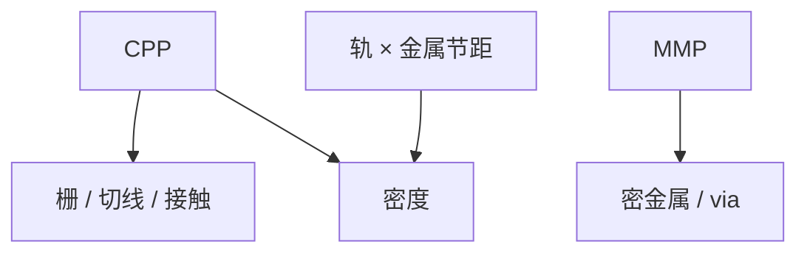

# CPP 与 MMP

接触多晶节距卡住栅方向密度；最小金属节距卡住互连。两根尺子分开缩，光刻层的分解策略也可以分开选。

<footer>—— 对照 contacted poly pitch 与 minimum metal pitch 作为 DTCO 度量的通称</footer>

[上一课](/litho/node-naming)丢掉商品名当尺子。缺口是代用尺子。本课钉 CPP 与 MMP。如何合成晶体管密度，留给[下一课](/litho/transistor-density-metric）。

## 问题

CPP（contacted poly pitch）：相邻栅（含接触落地）的周期，约束鳍/片上的逻辑密度。MMP（minimum metal pitch）：最密金属周期，约束布线与 via 网格。前端 EUV/多重与后道 EUV/多重可以不同步——BEOL 课已见混波长。轨道高度 = 轨数 ×（某层金属节距），与 CPP 正交。

缺口是**两根独立节距**，不是一个「节点 nm」。把 CPP 当成所有层的节距，会误判金属是否该上 EUV。

### 与单次极限的关系

浸没单次半节距约 38–40 nm 量级（Mack/ASML 公开叙事，主干已用）。MMP 低于约两倍半节距就要分解或换波长。本课不重推，只把尺子对上那条墙。

公开 CPP/MMP 数字随演讲年份变。课文用定义，不把某年 ISSCC 一页当永远真值。

## 方法

DTCO：分别扫 CPP、MMP 的可印路径（SAQP、LELE、EUV 单/双）。成本按层加总。SRAM 往往两边都最紧。报告节点进展时同时报两数与轨道高度。

## 机制

逻辑晶体管占地 ≈ CPP × 单元高度；高度又是 MMP 与轨数的函数。所以密度对两尺都敏感。光刻机台选择按层跟尺走：栅切线跟 CPP，M0/M1 跟 MMP。

## 边界

尺子不包含 3D 堆叠的垂直密度（后课 3D NAND）。不把 CPP 当 Fin 节距——鳍节距是第三尺，有时单独报。

后课默认：平面密度用 CPP×高度；下一课把多种密度口径（MTr/mm²、NAND2、SRAM）拆开。

## 小结

- CPP 与 MMP 是正交的可缩尺子，层策略可不同步。
- 单元高度把 MMP 接到密度公式。
- 对单次极限时用这些尺，不用商品名。
- 出处：代工/imec 对 CPP、MMP 的 DTCO 通称。
