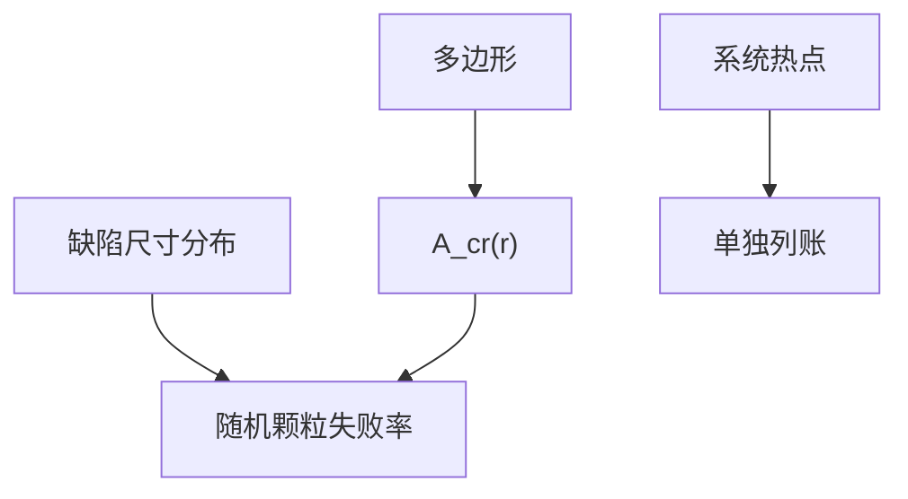

# 关键面积

同样大小的颗粒，落在密线缝里会桥，落在空白里无事；关键面积把版图与缺陷尺寸合成「能杀死管芯的那部分面积」。

<footer>—— 对照 Maly 等对 critical area 的论述；IC 良率对布局灵敏度的通称</footer>

[上一课](/litho/yield-models)用 $DA$ 做账。缺口是 $A$ 不是芯片外形面积：只有能造成短路、开路、via 失效的几何才算。[设计规则起源](/litho/design-rule-origin) 已说规则是失效代理；本课钉关键面积（critical area）计算。系统热点对随机颗粒，留给[下一课](/litho/systematic-vs-random-defects）。

## 问题

关键面积 $A_\mathrm{cr}(r)$ 对缺陷半径 $r$ 积分，再与尺寸分布相乘得失败率。密金属、小 tip、via 覆盖不足让 $A_\mathrm{cr}$ 膨胀——同一洁净度下良率更差。冗余 via、加宽、放宽 tip 是用面积换良率，与 LFD 的可印性谈判叠在一起。

缺口是**布局灵敏度**，不是再拟合负二项。DTCO 加轨或加 dummy 会改 $A_\mathrm{cr}$，也改刻蚀负载，账要联立。

### 光刻系统失效不是颗粒关键面积

OPC 热点在每颗管芯同一地点桥连，关键面积公式假定缺陷位置随机。系统失效应单列，否则 $D$ 会被估爆，洁净室会去抓不存在的颗粒。

缺陷尺寸分布通常来自检测，有漏检。$A_\mathrm{cr}$ 对小 $r$ 敏感，而小缺陷恰是光学检测最弱处——电子束课会补。

## 方法

提取：对每层做短路/开路关键面积（多边形膨胀–重叠一类算法）。输入：缺陷尺寸分布。输出：按层的失败率贡献，指导哪层该加冗余 via 或放宽。与 SRAM：阵列 $A_\mathrm{cr}$ 极高且周期，单独算。与 via 协同：enclosure 进入开路关键面积。

尺寸分布要用复检校准后的检测数据，并声明漏检。Maly 的 critical area 是布局灵敏度；输入错了，冗余 via 会加在错误的层上。

## 机制

半径 $r$ 的圆（或方）缺陷，若其落点使两导体间距 < 2r 则短路。积分对间距分布敏感，故最小间隔规则直接杠杆 $A_\mathrm{cr}$。多重图形的异色间距还含套刻，有效间隔随机化，关键面积要用套刻分布卷积——EPE 预算在良率上的样子。

系统热点单列，不并进 A_cr D。缺陷尺寸分布必须经复检校准，否则冗余 via 会加错层。

## 边界

计算不替代硅上检测。不把某 EDA 关键面积模块当物理定律。颗粒形状不是圆，模型是工程近似。

后课默认：随机颗粒良率用关键面积加权。下一课强制把系统图形化失效从 $D$ 里拆走。

## 小结

- 关键面积是布局对随机缺陷的灵敏度，不是芯片外形。
- 系统热点不可并进 $A_\mathrm{cr}D$。
- 冗余 via 与 tip 规则直接杠杆 $A_\mathrm{cr}$。
- 套刻使异色间距随机化，关键面积要对 EPE 卷积。
- 出处：Maly critical area；IC 布局良率灵敏度通称。
