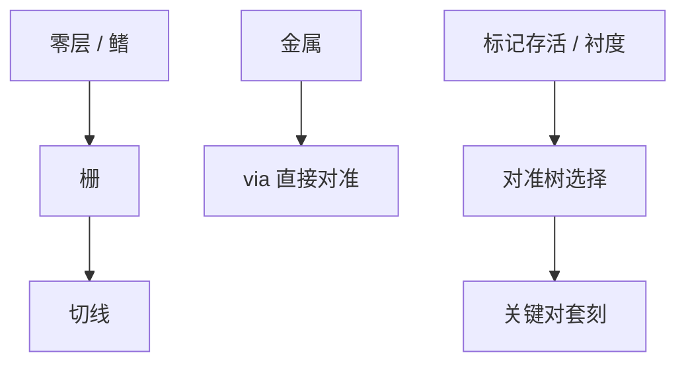

# 关键层对准

不是每一层都对到同一张零点；关键层选谁当参考，决定套刻账花在栅对鳍、via 对金属，还是切线对芯轴。

<footer>—— 对照多层对准策略与 ASML 对准公开论述；[套刻 Overlay](/litho/litho-overlay) 已定义量</footer>

[上一课](/litho/planarization-dof)把地形写进焦深。缺口是位置：关键层之间要对准到谁，标记在哪一层、经过哪些 CMP 与薄膜。[对准传感器](/litho/alignment-sensors) 与 [标记设计](/litho/alignment-mark-design) 已讲怎么读；本课钉**策略**：哪一层是关键对、直接对还是间接对。过程控制门的 APC 从下一课开始。

## 问题

逻辑栅对鳍、切线对 SAQP 芯轴、via 对金属、BPR 对前层槽，套刻规格不是同一数。对准树若全部指回晶圆零层，中间层的工艺位移会叠成随机游走。直接对准（via 对金属标记）缩短链条，但标记必须在 CMP 后仍可读，衬度与损伤要设计。间接对准省标记面积，把误差预算留给建模。

缺口是**对准树**，不是再选一次 DBO/IBO。金属–via 协同的 enclosure 规格必须与对准树一致：via 若对错层，覆盖规则是空的。

### 关键对不是最多的层

曝光次数最多的层不一定是最严的套刻。切线、接触、via0 往往是关键对；厚金属可能松。策略按 EPE 与电学，不按「光刻课程序号」。SRAM 与逻辑可能不同树，因为阵列标记与边缘标记经历不同 CMP。

工艺位移（薄膜应力、热）让标记网格不等于器件网格。高阶校正后课会补；本课要求关键对的标记尽量靠近器件环境。

## 方法

列出层对矩阵：规格、直接/间接、标记层、读数次数。与扫描机：多标记、多色、AH 校正地图。与集成：硬掩模开窗保护标记、CMP dummy 在标记周围。失败模式：错对层、标记损伤、层间滑移。与 [套刻预算](/litho/overlay-budget) 数字对齐，本课只决定树的拓扑。

矩阵要进 MES 与扫描机食谱，避免现场「习惯对到某层」。ASML 对准公开论述把读数策略和校正地图绑在一起；本课把「对谁」放在读数之前，否则地图再密也对错对象。

## 机制

对准测量的是标记中心；器件套刻是功能图形中心。两者差 = 标记–器件偏置，来自 OPC、刻蚀负荷、CMP。关键层应用产品内标记或专用校准去估这条偏置。树的深度增加方差；直接对准减深度、增工艺对标记存活的要求。

对准树的深度叠加工艺位移。via 直接对金属，是为了缩短链条，不是为了少画标记。错对层会使 enclosure 规则落空。

## 边界

不重写套刻光学。不把某厂对准树当标准。本课结束转印单元；APC 从下一课起是厂级闭环，不再解释等离子体。

后课默认：关键对有明确对准树，标记环境代表器件。下一课程过程控制用这些读数做 APC。

## 小结

- 关键层对准是树的拓扑：直接对缩短链条，要求标记存活。
- 规格按 EPE/电学分配，不按曝光次数。
- 标记–器件偏置必须进预算。
- 出处：ASML 对准公开论述；Levinson 套刻；多层对准策略通称。
