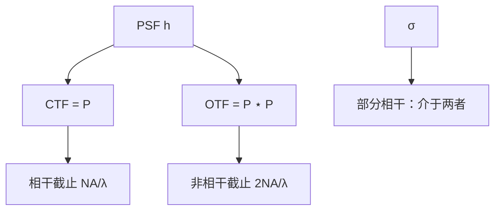

# 相干与非相干传递函数

点扩散在空域卷积；它的傅里叶伙伴在频域相乘。相干乘的是光瞳，非相干乘的是光瞳的自相关。

<footer>—— Goodman 对 CTF 与 OTF 的定义；光刻读法对照 Mack 的 MTF 讨论</footer>

[上一课](/litho/psf-airy)把圆孔核叫做 Airy。缺口是：后课要扫节距、要读「哪根齿还在」，必须把核翻回频率轴，并分清**相干传递**与**非相干传递**不是一条曲线。[MTF](/litho/mtf-optics)已经用正弦物说过调制；本课补的是与 PSF 成对的定义，以及部分相干为什么不能只用其中一条。Sparrow 两种两点判据留给[下一课](/litho/sparrow-criterion)。

## 问题

卷积定理要求：$h$ 的傅里叶是 $H$。相干成像对场线性，

$$
\mathrm{CTF}(\mathbf{f})=P(\mathbf{f}),
$$

截止 $\mathrm{NA}/\lambda$，通带里还可以带像差相位。非相干成像对强度线性，光学传递函数

$$
\mathrm{OTF}(\mathbf{f})=\frac{\iint P(\boldsymbol{\xi})P^*(\boldsymbol{\xi}-\mathbf{f})\,d^2\boldsymbol{\xi}}{\iint |P|^2},
$$

即光瞳的归一化自相关，截止 $2\mathrm{NA}/\lambda$。MTF $=|\mathrm{OTF}|$。缺口因此是这对名字与支撑，不是再画一次 Airy 截面。

产线照明是部分相干：强度对物**不是**线性滤波，完整对象是 TCC。单条 CTF 或单条 OTF 都只是极限切片。把 MTF 验收曲线直接叫成「本层能印的节距」，等于又发明了一条没有胶、没有 $\sigma$ 的 $k_1$。

### 通带形状不同

圆孔 CTF 在截止内接近矩形（无像差时振幅为 1）。圆孔 OTF 从 1 近似三角降到 $2\mathrm{NA}/\lambda$ 处的 0。同一物频率 $f$，相干通道可能仍满通，非相干通道已经只剩自相关的尾巴。斜照明平移的是 CTF 相对 $T$ 的窗；OTF 没有「斜照明」这一说，因为非相干源已经填满光瞳。

OTF 可以为负（对比反转），MTF 取模会丢掉符号。光刻里反转意味着峰谷对调，阈值切错边。主干 MTF 课已经警告过；本课把它钉在 OTF 的定义里。

## 方法

从 PSF 出发：$\mathrm{CTF}=\mathcal{F}\{h\}$，$\mathrm{OTF}=\mathcal{F}\{|h|^2\}$（再归一到零频为 1）。这就是为什么上一课要先有核。有像差时 $P$ 带相位，OTF 掉、并可能振荡；切趾改 $|P|$，自相关变，OTF 旁瓣改形状。

部分相干：对每个源点用一个平移后的 CTF 做相干成像，强度相加。有效「正弦传递」介于 CTF 与 OTF 之间，随 $\sigma$ 连续变——与[相干因子](/litho/coherence-sigma)是同一旋钮的频率语言。定量工艺仍回 NILS 与 TCC，本课不替代。

### 与 Hopkins 的接口

完全相干：$\mathrm{TCC}(\mathbf{f}_1,\mathbf{f}_2)=P(\mathbf{f}_1)P^*(\mathbf{f}_2)$，即一对 CTF。完全非相干：TCC 只依赖差频，退化为 OTF。部分相干保留四维。后课 Abbe 对 Hopkins、SOCS，都只是在这条轴上选计算顺序，不改定义。

## 机制

非相干 OTF 在高频变小，几何图像是：频率 $f$ 对应光瞳里相距 $f$ 的两点；两点都要落在孔径内才有相关面积。孔径是圆，能放下的最大距离是直径，故截止加倍。相干没有「两点相关」，只有「该频率的平面波进不进瞳」，故截止是半径。

这就是密节距先死的传递机制。一维线栅只碰径向的一条切片；二维孔同时要 $x$、$y$ 的传递，下一课序会用到，本课先把轴准备好。

### 后课默认的接口

正弦语言：非相干用 OTF/MTF，相干用 CTF。部分相干默认 TCC，需要时才画一条有效调制–节距曲线，并声明 $\sigma$。不要在后课把三条截止写成一个数。

## 边界

传递函数是等晕标量光学的对象。矢量成像、薄膜、胶扩散会再乘各自的核，那些核不是 CTF。禁止把未公开的镜头「衍射极限 MTF」表当作本课数据；Goodman 的圆孔 OTF 与 Mack 的光刻读法已经够用。

## 小结

- CTF 即光瞳，截止 $\mathrm{NA}/\lambda$；OTF 即光瞳自相关，截止 $2\mathrm{NA}/\lambda$。
- MTF 是 $|\mathrm{OTF}|$，可能丢掉对比反转的符号。
- 部分相干介于两者之间，完整核是 TCC。
- PSF 与传递函数是傅里叶对，不是两套物理。
- 下一课：两点分辨的 Sparrow 对 Rayleigh。
- 出处：Goodman；Mack；Hopkins (1953) 的相干/非相干极限。
