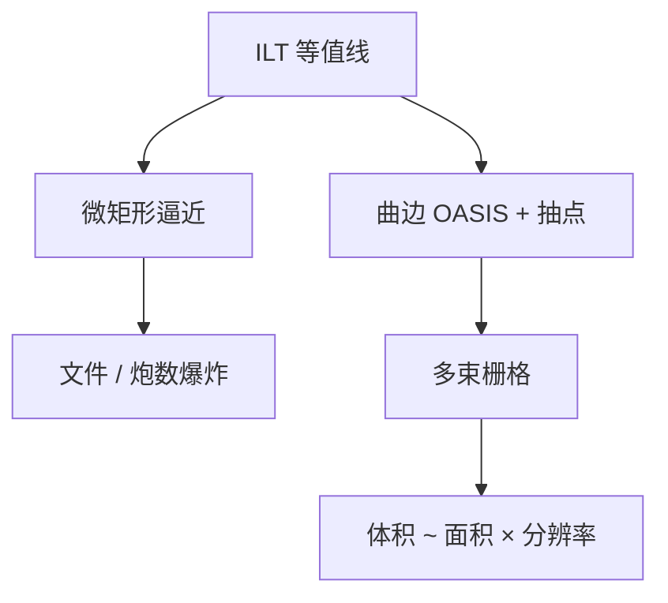

# 曲线掩模数据量

ILT 的等值线一旦折成微矩形，文件与炮数一起爆炸；曲线格式把复杂度从「边数」改写为「控制点与栅格」。

<footer>—— 对照曲线掩模、OASIS 与多束数据路径的公开可制造性讨论</footer>

[上一课](/litho/mpc)把掩模工艺偏置收进数据链。缺口是 ILT 输出不是稀疏曼哈顿：全芯片曲边会让 GDS 边数、MDP 墙钟和检验比对同时爆。本课钉曲线数据量。写入时间怎么从数据变成小时，留给[下一课](/litho/mask-write-time）。

## 问题

[曲线 MRC](/litho/curvilinear-mrc) 已经声明：可写曲线要有曲率与颈规则。本课补的是**体积**：同样一层，曼哈顿 OPC 可能几十 GB 量级的中间文件；曲线若用微矩形逼近，可以再涨一到两个数量级，网络、磁盘、校验器与 fracturing 先于写束成为 TAPOUT 墙。OASIS 重复记录救得了 SRAM 阵列，救不了每条助条都独特的 ILT 噪声边。

缺口是数据路径容量，不是再优化一次水平集。把「多束已量产」写成「文件大小无所谓」，会漏掉：检验 die-to-database 仍要展开几何；MPC/PEC 仍要卷积密度图。

### 三种计量不要混

边数（多边形复杂度）、炮数（VSB）、像素数（多束栅格）是三张账。曲线的光学收益来自通带内的光滑边；数据灾难来自用错误基去存这条边。原生曲边或紧凑折线 + 多束栅格，才可能让「光学复杂度」与「存储复杂度」脱钩。

报 ILT 窗口时同时报全芯片输出体积与 MDP 墙钟。只展示热区 clip 的曲边，不能外推 TAPOUT 日历。

## 方法

工程选项：限制 ILT 为热区补丁（其余曼哈顿）以封顶数据量；全芯片曲线则必须走曲线感知的 OASIS、简化（抽控制点）在 MRC 之后、以及写模侧直接栅格化以免二次微矩形。抽点过度会制造新颈，与曲线 MRC 冲突——简化是优化问题，不是压缩软件。

与 [GPU 计算光刻](/litho/computational-litho-gpu) 的分工：GPU 缩短反演；数据量是反演**之后**的物流。两者都要进节点周期时间。

## 机制

透镜通带是低通：描述一条光学上有效的边，理论上只需要截止频率对应的采样。微矩形用远高于通带的阶梯去存同一条边，信息论上浪费，写模与检验却按浪费后的复杂度付钱。多束位图的采样由束距决定，这才是与光学截止匹配或故意过采样的那张栅格。

## 边界

数据格式不增加光子。它只决定曲线层能不能进产线日历。知识产权比对（多边形等价）在曲边上更难，合同要另写容差。不要编造某层「一定 10× 压缩」——压缩比随重复性与抽点策略变。

后课默认：曲线层的复杂度按面积栅格估，不再默认随 jog 数线性涨；下一课把这张估计变成写入小时。

## 小结

- 曲线数据量爆炸来自错误的微矩形基，不是来自光学信息本身。
- 边数、炮数、像素数分账；多束体积近似面积 × 栅格。
- 抽点必须在曲线 MRC 之后，否则制造新颈。
- 出处：曲线 ILT 与多束数据路径的公开可制造性讨论；OASIS 重复记录的能力边界。
