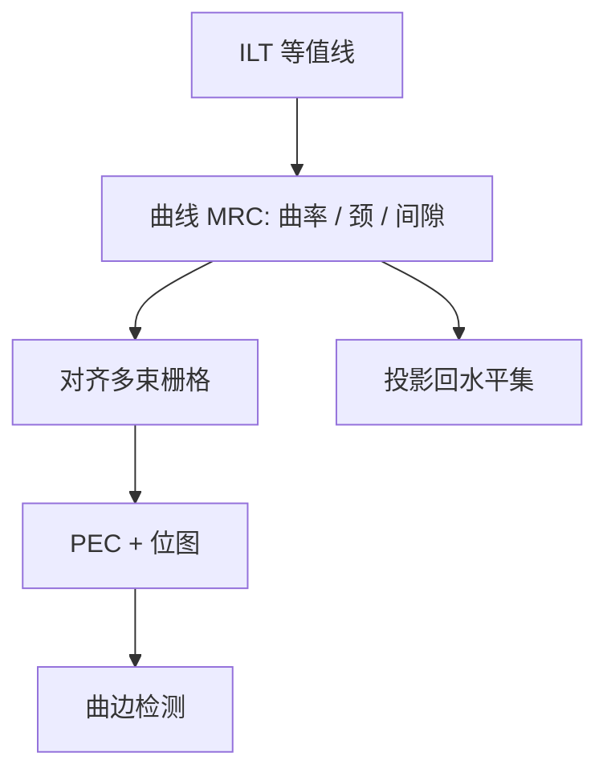

# 曲线 MRC

曼哈顿规则量的是平行边距离；曲线掩模的颈、曲率半径和孔圆度是另一套可写性语言，必须按多束栅格重写。

<footer>—— 对照多束写入与曲线 ILT 的公开可制造性讨论</footer>

[上一课](/litho/mrc-fixup)（MRC 修复）。把可写集合写成多边形 MRC：宽、距、面积、jog。缺口是 ILT 的自然输出不是直角。曲边上「最小间距」不再是两条平行边的距离，颈宽、曲率、面积与检测算法全部要换定义。多束机把写入从炮数换成面积，但栅格分辨率和 PEC 仍拒绝过尖的拐、过细的颈。本课钉曲线 MRC。多束与 VSB 的写入物理对照，留给后课与[多束写入](/litho/multibeam-mask-writer)衔接。

## 问题

把曲线先折成大量微矩形，再跑旧 MRC，会得到两种假结果：要么微矩形自己违例（ jog 爆炸），要么折线「通过」而真实曲颈在蚀刻后断开。曲线 MRC 的对象是样条或曲边多边形：最小曲率半径、最小颈宽、孔/岛的最小面积与圆度、相邻曲线的最小间隙（沿法向而非沿轴）。

检测（掩模 SEM、光化检验）若仍用直角边算法，会把合法曲边当缺陷，或漏掉真缺陷。ILT 项目失败常常失败在这条后处理与检测链，而不是优化没收敛。缺口是规则、数据格式、计量一起换，而不是只允许多束。

### 栅格是隐藏的一条规则

多束按位图或等效栅格曝光。曲率半径小于若干个束距，形状在栅格上退化成噪声，PEC 与剂量补偿失真。因此曲线 MRC 必须声明写入器栅格，而不能只给「光学上光滑」的连续曲线。公开叙事里，多束让写入时间对复杂度解耦；它没有让任意曲率免费。

「曲线」不是无规则。它是另一本规则书。把 MRC 关掉再展示窗口，不是曲线掩模的量产论证。

## 方法

规则从掩模厂与多束供应商的公开能力出发：最小特征、剂量台阶、拼接缝连续性。计算侧在水平集或像素更新后，对提取的等值线做曲率裁剪、颈宽检查、间隙的法向距离检查，再投影回去。简化（降控制点）必须在 MRC 之后或之中做，否则简化本身制造新颈。

数据路径：曲线格式 → 分档 → PEC → 多束位图 → 二次曲线 MRC（对位图等效形状）。与曼哈顿流并行时，同一套版图的不同层可能一张走 VSB 规则、一张走曲线规则，签核工具要能分层套不同规则书。

### 助条与曲颈

ILT 自发长出的助条往往是最细、曲率最大的部分，最先撞 MRC。鲁棒项若不允许它们印出，又要求它们够宽可写，可行集可能空。这时应放宽设计或改照明，而不是把曲颈规则降到写入器宣称的地板以下。

## 机制

光学低通并不关心直角还是圆角，只关心通带内的频谱。曲线 MRC 删掉的是通带外、却让写入和蚀刻失败的那些模态，所以合理的曲率裁剪对 PV-band 伤害应当很小——这是「曲线可写且仍有光学收益」的前提。若裁剪必须砍掉通带内的助条结构，收益消失，层就不该上全芯片曲线。

蚀刻微负载对曲边更平滑的密度场可能更友好，但颈区的局部负载仍尖锐。规则里的颈宽含蚀刻偏置，不能只用显影后模拟。阵列指纹（多束各通道电流不均）会在曲边上留下周期性粗糙，光学 OPC 修不掉，因为 OPC 假定掩模误差不是写入器周期指纹。

比较曲线与曼哈顿窗口时，双方都必须 MRC 干净。用未检查的像素解去对比已 MRC 的 OPC，是不对称实验。

## 边界

曲线 MRC 不消除空白片缺陷，不替代 pellicle，不提高 NA。它只定义多束 ILT 的可写流形。规则过严，曲线退回「圆了一点的曼哈顿」，GPU 白花；过松，掩模良率从「写不完」变成「测不准、修不好」。修补工具若只能贴曼哈顿补丁，会在曲谱上打出新热区。知识产权与数据比对也要换：曲线特征难以做传统「多边形等价」逐边核对，TAPOUT 合同必须另写比对口径。

后课默认：可写曲线已经受曲线 MRC 约束；下一跳是写入器家族——同一条曲线在 VSB 与多束上的时间墙完全不同。

多束课默认读者已经知道：曲线不是「关掉 MRC」，而是换了一本规则书。

引用多束 ILT 时写清 MRC 是否为曲线规则、检测是否为曲边算法。只报热区 clips 的窗口，不能外推到全芯片数据量与检测产能。

## 小结

- 曲线 MRC 用曲率、颈宽、法向间隙取代平行边距离。
- 必须对齐多束栅格；连续光滑不等于可写。
- 规则、断裂、PEC、曲边检测是同一条链，缺一则 ILT 停在后处理。
- 合理裁剪应只去掉通带外模态，否则曲线化没有光学理由。
- 出处：多束写入与曲线 ILT 的公开可制造性 / MRC 讨论。
