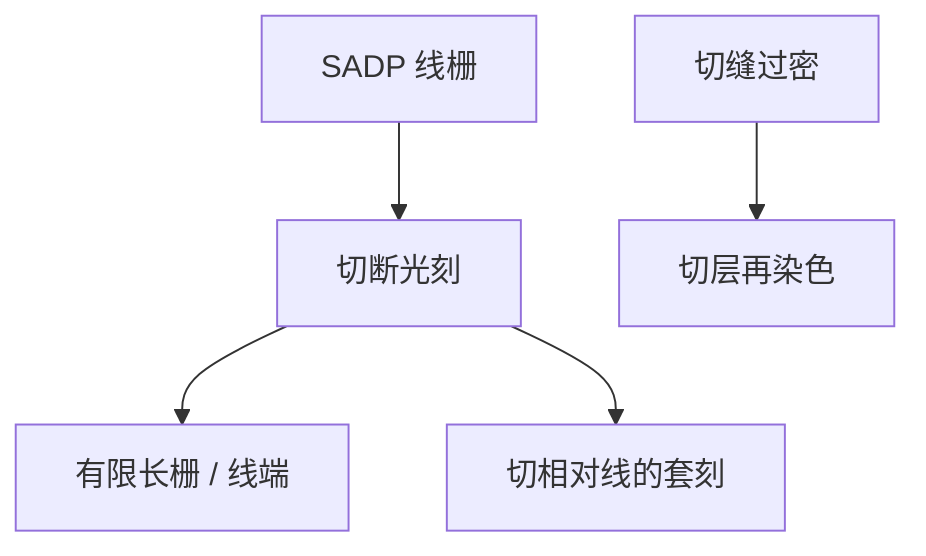

# 切断掩模

自对准线栅可以很长、很密；晶体管要的是有限长栅极。切断掩模在格点上把线打断，套刻从「对内半节距」回到切与线的对准。

<footer>—— 据一维栅极 / gridded design 与 cut-mask 双重图形的工艺通称</footer>

[上一课](/litho/odd-even-pitch)（奇偶节距）。把芯轴侧与间隙侧的奇偶误差钉成节距漂移。缺口是：spacer 留下的是连续（或成环）的线，器件要在指定位置终止。切断掩模（cut mask）用另一次光刻在允许的栅格上切。代价账留给[浸没多重图形成本](/litho/duv-multipattern-cost)，本课只钉切与 1D 栅的几何。

## 问题

SADP 擅长固定节距的长线。逻辑栅、鳍、某些金属轨道必须在单元边界或接触处断开。侧墙闭合环若不切，会在线端短路或无法定义栅长。切的位置是二次图形：切孔或切缝之间的间距若太密，单次切层又撞 $k_1$，于是切层自己也要 LELE 染色——「线自对准、切多重」。

缺口因此是「自对准线 + cut」，而不是再调 mandrel CD 去消 walking。Walking 让奇偶 space 不同，切在错误的 space 相位上还会碰到不同的线宽，但切的一阶问题仍是 overlay 与切层分解。

### 切的是线，不是再做一次线层 LELE

Cut 多边形的并集定义「哪里不要线」。对准对象是已存在的 spacer 线栅（或先切 mandrel 再长 spacer，切的对象变成芯轴）。套刻误差让切缝滑离目标：欠切则线连在一起，过切则切到邻线。这与 LELE 两套线之间的 $\delta$ 不同源：这里没有第二色线，只有切相对线。

1D 栅极工艺把标准单元轨道和切位置限制在格点上，正是为了让 cut 可印、可着色。任意二维线端不是本课的友好对象。

## 方法

后切：先完成 mandrel + spacer 转印成线，再涂胶曝光切缝，刻蚀打断。先切：在 mandrel 上切出缺口再长 spacer，线端形状由芯轴缺口决定，套刻对象是芯轴。两种都要 OPC；切缝往往是孔或短缝，照明与线层偶极完全不同，不能共用栅极光瞳。

切太密则对切层做颜色分解：两次切曝光，套刻进入两张切版之间以及切与线之间。公开 1D 流程里「线一层 SADP + 切两层 DPT」是常见句子，不是每个厂的掩模张数表。

### 设计规则：在哪切

合法切位置、最小切–切间距、切相对线端的伸出（keep-out），构成单元库的格子。布线若在非格点停线，不是 OPC 能救的。这与 LELE 金属的可染色性同类：都是把设计空间卖给可制造性。

## 机制

光学上切层是另一张掩模的空中像，通常 $k_1$ 比 mandrel 舒适，但二维孔、线端缩短、切缝圆化会让电学栅长漂。套刻：扫描机 overlay 加掩模 PPE，把切缝中心相对线栅平移。Pitch walking 使相邻 space 不等，切缝若按理想等节距摆，会系统靠近某一种 space 的线，桥接风险不对称——所以切层 OPC 有时要感知奇偶。

产能：线层可能一次 mandrel，切层一次或两次，仍少于同等密度的全 LELE 线，但多了切专用掩模与刻蚀。不要只用「自对准所以少曝光」来结账。

切缝的空中像是孔类或短缝，[SRAF](/litho/sraf-assist) 与孔照明（环带或四极）往往比线层偶极更合适。把栅极偶极抄到 cut，稀疏切孔的旁瓣和焦深会先爆。这是「一层一个光瞳」在多重图形里的具体例子。

切偏造成的短路/开路在电性上像缺陷，计量要用切后 CD-SEM 或电压衬度，而不是只看 walking 分桶。

## 边界

本课不把 EUV 单次切层写成已经取消所有 cut DPT：是否一张 EUV 切得下，看切密度与孔 $k_1$，各厂不同。也不把 fin cut、gate cut、metal cut 当成同一张版——对准层级不同。下一课才把这些张数乘进 7/5 nm 代价；本课禁止编 wph 与良率。

EUV 当 mandrel、DUV 当切（或反过来）是混跑策略，属于更后的混合课。这里只要求：有自对准线，就几乎一定有 cut 这种二次图形。

环状 spacer 的「不需要的边」有时用 block / keep 掩模大面积去掉，而不是细切。Block 与 cut 都是二次图形，规则与照明不同，合同上不要混名。

## 小结

- 切断掩模把 spacer 长线变成有限长 1D 栅极图形。
- 套刻是切相对线（及切与切），不是成对 spacer 的线层 $\delta$。
- 切过密则切层自己要染色。
- 设计必须格点化；walking 会让切桥接风险不对称。
- 多重曝光的成本结构下一课。
- 出处：1D 栅极 / cut-mask 工艺通称；SADP 公开流程中的 cut 模块。
