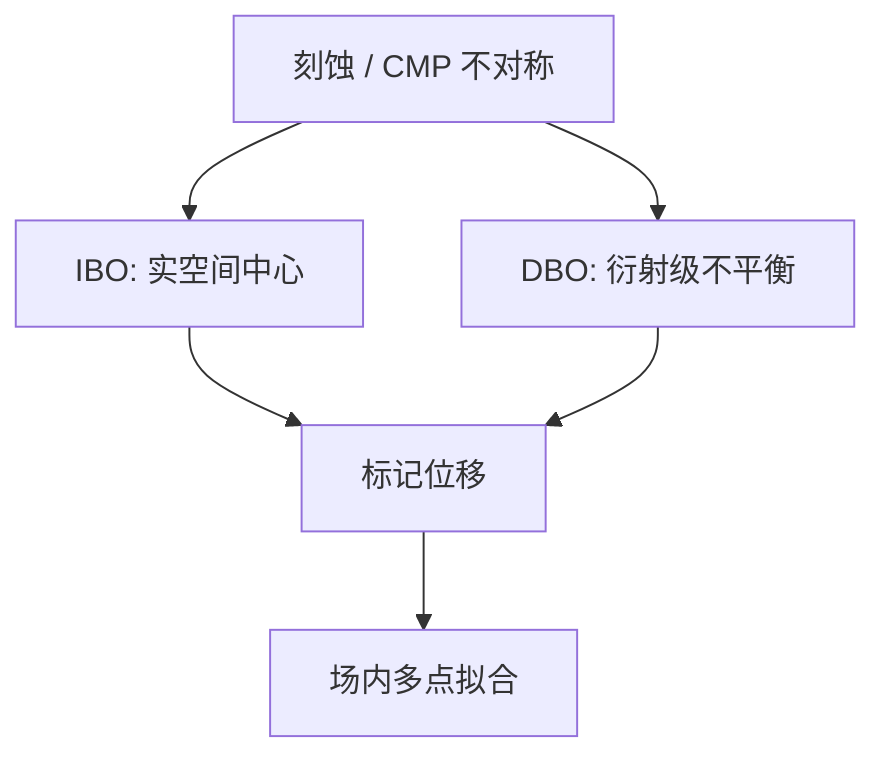

# DBO 对 IBO

成像式套刻看盒子的中心；衍射式套刻看叠栅左右级的不平衡。量的都是标记位移，怕的工艺不对称却不是同一类。

<footer>—— 据 ASML 对衍射套刻（YieldStar 一类）与成像套刻的公开对比整理</footer>

[上一课](/litho/overlay-marks)已经点名成像式（IBO）与衍射式（DBO），并警告工艺不对称会假扮 overlay。缺口是产线怎么选：对比、吞吐、对 CMP/刻蚀风的敏感、以及能不能加密到够拟合芯片内残差。本课把两者对打。高阶校正项怎么吃这些读数，留给[下一课](/litho/high-order-overlay)。

## 问题

IBO 用显微镜看盒中盒或条中条的中心差，光学分辨率和算法阈值限制噪声；膜层一暗，对比垮，要换色或换结构。DBO 用两层叠栅，位移写成 ±1 级强度差或相位差，小位移线性灵敏，ASML 公开材料把这条路做成 YieldStar 的主干。缺口不是「衍射一定更先进」，而是：在这层薄膜与这套刻蚀风下，哪一种标记的不对称偏置更小、采样更快。

划片槽面积有限。IBO 标记往往更大、更吃对比；DBO 光栅可以做得密，便于一场多点。加密的是拟合，不是把标记做成晶体管。同一层若 IBO、DBO 混采，必须先做相关，再进 APC，否则高阶项会吃进两套尺子的差。

### 光学套刻仍是代理

无论 IBO 还是 DBO，读的都不是器件图形。电学套刻或专用电学垫才是最终。两种光学法都可以与电学差一截，差的来源不同：IBO 偏算法与低对比噪声，DBO 偏两层栅的形状差。选边是选偏置的可控性，不是选「更接近真值」的形而上学。

单机、匹配、产品套刻仍是三个数。DBO 换 IBO 改变的是产品上那个数怎么读，不改设备规格书里的工件台能力。

## 方法

IBO：选波长与焦面使内外图形同时清晰；多层金属后常要多色。对焦误差会把表观中心拉开，必须进测量配方。DBO：选叠栅周期让 ±1 级进计量光瞳；多波长减轻某一色上的不对称。ASML 公开口径是衍射套刻对某些工艺噪声更稳、适合高阶采样密度，而不是公布一条「所有层必须 DBO」的法令。

工艺不对称：刻蚀风让一侧侧壁斜，IBO 的实空间中心和 DBO 的衍射质心都会搬家，搬家量不同。缓解仍是标记设计、多波长、对称密度，不能靠把扫描机再拧一纳米消掉。上一课写过的原则，本课只强调：两种技术的残差对同一风的传递函数不同，相关要分开做。

换 CMP 或换硬掩模之后，相关要重做，不能把上一代的 DBO–IBO 偏置表接着用。

### 与 CD 光栅的边界再钉一次

OCD 垫反演剖面，DBO 反演位移，可以共用划片区域设计，不可共用拟合目标。穆勒矩阵看见的侧壁不对称，会进 DBO 偏置；那是工艺，要用刻蚀和标记设计收，不是换一套 IBO 算法就能假装没有。

## 机制

成像式把套刻写成像素质心差，受光学传递函数限制，对低空间频率的膜层起伏敏感。衍射式把套刻写成傅里叶差，对栅的占空比和侧壁同样敏感——那部分不是位移。多层膜的有效光学中心可以离开几何中心，于是「DBO 更稳」只在该栈的光学中心与电学中心够近时成立。换一层低 k 介质，结论可以翻面。

吞吐：DBO 的公开卖点包括较快的单点时间和因而更高的场内密度，供高阶模型吃。IBO 在某些厚膜、高对比层上仍然够用，且历史配方成熟。混跑时必须锁算法与滤波，否则匹配套刻里会混进计量差。

DBO 叠栅周期远大于器件节距，为的是让衍射级进计量光瞳。它不测量 $k_1$ 极限线宽，只测量层间位移。

## 边界

本课不把 YieldStar 的未公开精度表写成所有层的合同，也不把某种 IBO 商标开除出量产。LELE 的「第二次对第一次」要另定义标记层级，与前层金属那套盒不是自动同一物理。对准传感器（曝光前）与套刻计量（曝光后）仍是两条链，即使都用光栅家族。

后课默认：产品套刻读数来自 IBO 或 DBO 之一，且必须声明；高阶项吃的是这些读数的空间密度，不是换一种光学就会少几个多项式系数。

把 DBO–IBO 相关一次之后当永恒偏置，会在换 CMP 浆料时把整条 APC 带沟里。相关是工艺状态，要定期重做。

## 小结

- IBO 看中心，DBO 看衍射不平衡；都是标记位移的代理。
- 对同一刻蚀风，两种偏置传递函数不同，要分开校准。
- DBO 便于加密采样，服务后课的高阶拟合；不是所有层的强制答案。
- 电学套刻仍是最终，光学再稳也是在线代理。
- 出处：ASML 对衍射套刻 / YieldStar 与成像套刻的公开说明；Levinson 对 overlay mark 的讨论。
