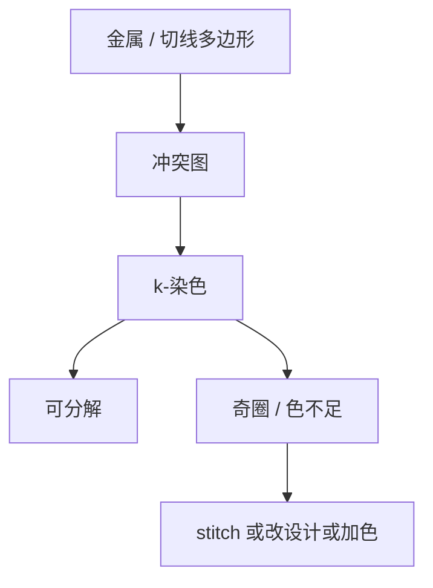

# 分解着色冲突

双重图形先是一张冲突图能不能染色；奇圈、stitch 和三色不足，不是 OPC 修边能消掉的红。

<footer>—— 对照双重/多重图形着色、冲突图与 stitch 的公开算法传统；[LELE 颜色分解](/litho/lele-color-decomposition) 已钉过两次曝光</footer>

[上一课](/litho/ml-hotspot-prediction)把学习模型限制在排序。缺口是分解：间距小于单次可印极限的边必须分到不同曝光（不同「色」），这是图论约束，不是风险分。[LELE 颜色分解](/litho/lele-color-decomposition) 已写两次曝光的染色；本课把冲突收进签核门：LRC 必须能报无法着色，而不是留给掩模厂。设计规则为何长成现在这样，留给[下一课](/litho/design-rule-origin）。

## 问题

单次 EUV 或浸没仍覆盖不了的节距，用 LELE、LELELE、切线或多色金属。冲突图：多边形（或边段）为顶点，间距小于最小同色间距则连边。2-色可染当且仅当图是二分的；奇圈即冲突。三重曝光对应 3-色，成本跳一层掩模与套刻。SADP/SAQP 不是染色，芯轴与 spacer 的「颜色」是自对准的，冲突形态不同，本课不改写成 spacer 工艺。

缺口是**签核时的冲突**，不是重讲一遍 LELE 流程。布线器在合法 DRC 下仍可画出奇圈；LFD 若没把可染性当约束，热点预测再准也修不回一张不可分解的网。

### stitch 是冲突的另一种债

同一根导线被拆到两色，接头（stitch）引入套刻敏感的接缝和局部 CD。允许 stitch 可以消灭部分奇圈，却把套刻预算写进导线可靠性。禁止 stitch 则更多设计必须改拓扑。合同要声明：本层是否允许 stitch、最小重叠、是否禁止在 via 落点。

着色冲突是硬失败：没有「OPC 再跑一晚」这回事。报告应指向圈上的边，而不是一串 EPE 纳米。

## 方法

分解工具：冲突图构建（含投影间距、jog、via 覆盖）、染色启发式、stitch 候选、合法化。签核：LRC 甲板含「未着色 / 同色间距 / stitch 规则」。与设计协同：轨道方向、via 网格、优选节距使图更易二分——这是 LFD 的分解侧。与 [切线多重](/litho/cut-mask-dpt) 的关系：切线层有自己的冲突，不要和金属色混报。

换节点若从 LELE 改 EUV 单次，冲突图应整层删除，而不是留着旧色当装饰规则。

冲突报告要能回到版图坐标和圈上的边，供布线器或手工改拓扑。只报「本层冲突数」无法修。DPT 着色文献把 stitch 规则写成与最小同色间距并列的条款，LRC 甲板应同样并列，而不是藏在 OPC 日志里。

## 机制

最小同色间距来自光学 + 套刻：两次曝光的相对位移把「不同色」的有效间距吃掉一截，所以着色规则比单次最小间隔更宽。奇圈无法 2-染是组合事实。工具用删除边（改设计）、加 stitch（改几何）、或加色（加掩模）三条路；三条都有成本函数，DTCO 已在上游选过哪条路允许。

## 边界

着色不保证可印：同色合法仍可能是光学热点。不把某分解器的「冲突为零」当硅上良率。本课不写限价簿，也不把图染色算法竞赛当光刻物理。

后课默认：不可着色是挡磁带的硬规则。下一课从这些硬规则回溯：设计手册里的数字从哪来。

## 小结

- 着色冲突是冲突图可染性，OPC 修不掉奇圈。
- stitch 用套刻债换可染性，必须进层合同。
- LRC 要报圈与同色间距，而不是只报 EPE。
- 出处：DPT 着色与冲突图传统；LELE 分解公开论述。
