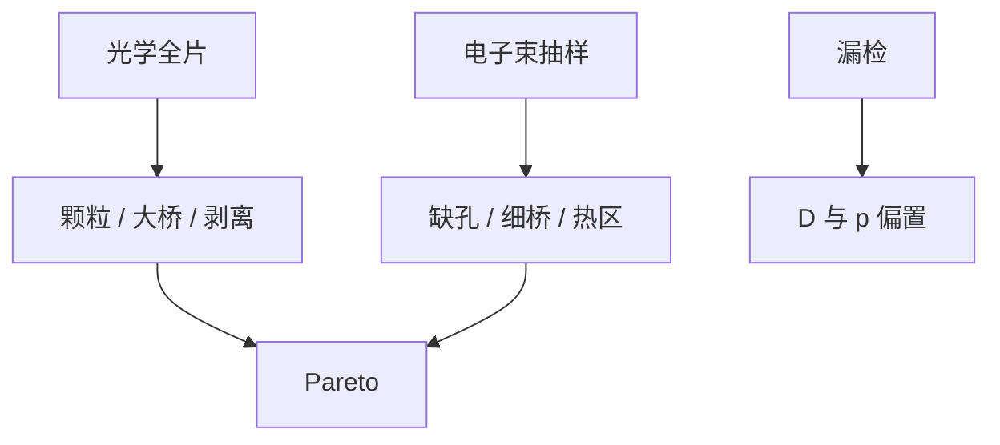

# 缺陷检测：光学与电子束

光学检测买面积与速度，电子束买分辨率与材料衬度；随机缺孔和细桥往往落在光学的盲区，必须由电子束抽样补上。

<footer>—— 对照 KLA 一类对宽带等离子体 / 激光检测与电子束检测的公开分工；[图形化检测设备](/litho/patterning-inspection-tools) 已列角色</footer>

[上一课](/litho/stochastic-yield)要求看见 ppb 级事件。缺口是仪器：[图形化检测设备](/litho/patterning-inspection-tools) 已分检测与量测；本课钉光学对电子束在**图形化缺陷**上的能力边界，不重写工具市场。复检与分类，留给[下一课](/litho/defect-review-classification）。

## 问题

亮场/暗场光学（激光或宽带等离子体）扫整片，找颗粒、大桥、残胶、剥离。分辨率与光学噪声限制了最小致命缺陷，尤其是 EUV 后的细桥与缺孔。电子束检测（EBI）分辨率够，吞吐低，只能抽场、抽阵列。合同：光学做全片随机颗粒与大系统缺陷；电子束做热区、孔阵列、SRAM 的随机计数。

缺口是**漏检对良率 Pareto 的偏置**，不是再介绍 KLA。只看光学 Pareto 会低估 stoch、高估大颗粒。PWQ 必须声明用哪类检测。

### 检测不是量测

CD-SEM 不扫整片找缺陷；缺陷检测不报准确 CD。混用机时会把 APC 样本和缺陷样本抢崩。设备课已强调；本课从良率数据链再钉一次。

同一次光学扫描的灵敏度配方（阈值、像素）决定 Pareto。换配方等于换计量机，要重新匹配历史。

## 方法

光学：全片、多模式（亮/暗、多波长）。电子束：热点 clips、via 阵列、PWQ 矩阵。抽样：与随机 $N$ 匹配，否则 $p$ 的置信区间跨数量级。与 ADC（自动缺陷分类）预筛，细类留给复检课。与边缘：光学对边缘剥落敏感，注意与部分场失焦区分。

电子束抽样点要固定一套「随机哨兵」阵列，才能做周与周的 $p$ 比较。换 clips 等于换计量。KLA 一类公开材料把光学与电子束当互补覆盖；本课把互补写成两份不可互相替代的 Pareto 输入。

## 机制

光学散射截面随缺陷体积与材料对比走，亚分辨率缺陷信号淹没在图形噪声里。电子束二次电子衬度看形貌与材料，慢。漏检率进入 $D$ 与 $p$ 的估计偏置：光学漏小缺陷 → 关键面积模型用错尺寸分布。

光学 Pareto 与电子束 Pareto 不可互相替代。漏检会偏置 D 与 p，PWQ 必须声明用了哪类探测器。

## 边界

不报未公开的每小时片数。不把商标当物理。复检 SEM 的分类下一课才做，本课只到「找到」。

后课默认：光学全片 + 电子束抽热区，Pareto 才完整。下一课把检出物变成可行动的类。

## 小结

- 光学覆盖面积，电子束覆盖致命小缺陷与随机计数。
- 漏检偏置 $D$ 与 $p$；PWQ 要声明探测器。
- 检测与 CD 量测机时分家。
- 出处：晶圆缺陷检测公开分工；KLA / 电子束检测公开方法。
