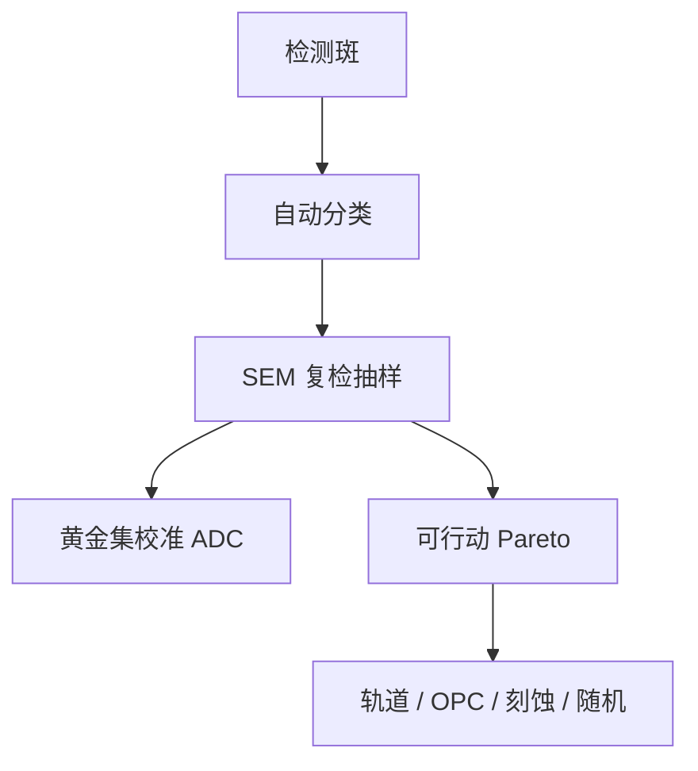

# 缺陷复检与分类

检测给出坐标与模糊斑；复检 SEM 才把斑变成桥、颗粒、残胶或假点。分错类，Pareto 就会把轨道和 OPC 的人派错房间。

<footer>—— 对照缺陷复检（review SEM）与 ADC 自动分类的产线通称</footer>

[上一课](/litho/defect-inspection-optical-ebeam)找到候选。缺口是标签：自动分类（ADC）快而错，人工 SEM 慢而准。本课钉复检与分类。良率如何随时间被这些标签推着学，留给[下一课](/litho/yield-learning-curve）。

## 问题

分类树：颗粒（来源：轨道、扫描机、刻蚀、环境）、图案缺陷（桥、断、缺孔）、残留、划伤、假点（颜色噪声、充电）。系统热点在复检里长得一样并对齐设计。ADC 用光学图像训练，换层换配方即漂移，必须抽检人工黄金集。

缺口是**行动映射**，不是再买一台 review SEM。每类对应责任：轨道缺陷 → 涂胶/显影；图案 → OPC/PWQ；缺孔 → 随机窗/剂量；金属颗粒 → 刻蚀/CMP。分派用的 killer / nuisance 划分也在此：nuisance 进规格但不挡批，killer 扣留。

### 假点会毒死学习曲线

假点当 killer，重工爆炸、学习曲线假装「缺陷很多」。阈值过严则漏 killer。黄金集与计量匹配同样要版本化。

SEM 复检会收缩胶、污染热点。ADI 复检策略要限制剂量与次数，尤其 EUV 薄胶。

## 方法

流程：检测 → ADC 预分类 → 抽样复检 SEM → 修正 ADC → 更新 Pareto。与设计：图案类回写热点库（匹配课）。与 FDC：某类突然升，对设备事件。与客户失效：测试失败位的复检是另一条链，本课只要求能 join 坐标。

黄金集按层、按配方版本保存，定期盲测 ADC。分类漂移是学习曲线假平台的常见原因：其实是标签乱了，不是缺陷没了。

## 机制

光学斑欠定，多种物理共像。SEM 高分辨闭合。ADC 是该层光学外观的分类器，不是物理因果模型——与 VM 同一限制。人工偏差（班次）要用黄金片监控。

ADC 校准靠黄金集。假点当 killer 会毒死学习曲线，阈值过严则漏掉真桥连。

## 边界

不写商业 ADC 准确率数字。不把分类当失效分析 TEM（末课）。CSAM 等封装检测不在此。

后课默认：Pareto 基于复检校准的类。下一课用这本账画学习曲线。

## 小结

- 复检把检测斑变成可行动类；ADC 必须靠黄金集防漂移。
- killer/nuisance 划分进分派。
- 图案类回写热点库。
- 出处：review SEM 与 ADC 产线通称；缺陷分类工程实践。
