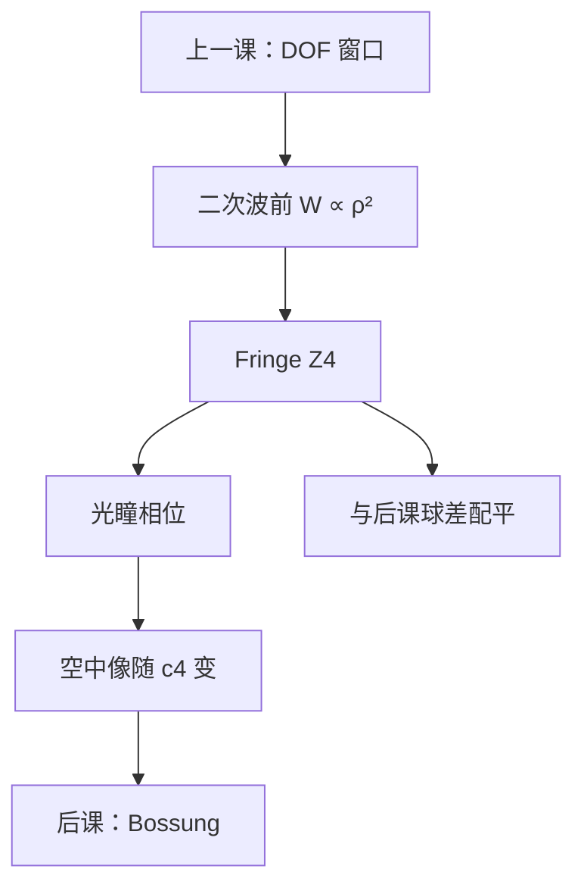

# 离焦作为像差

焦深把离焦当成轴向窗口的宽度；同一件物理在光瞳里只是一项二次径向相位——计量上常记作 Fringe Zernike 的 $Z_4$。

<footer>—— 离焦波前的车间读法见 Malacara, Optical Shop Testing</footer>

[上一课](/litho/depth-of-focus)已经把离焦写成光瞳二次相位，并给出 $\mathrm{DOF}=k_2\lambda/\mathrm{NA}^2$。缺口是：**还没有把它认作像差基底里的一项**，因而无法与后课的球差配平、无法与干涉仪系数对表。本课只完成这层更名与归一；CD 随焦面怎么弯，留给[Bossung 曲线](/litho/bossung-curve)。完整 Zernike 表在更后面的像差课，本课不背诵全套。不要从瑞利 CD 重讲分辨率。

## 问题

焦深课问的是 $C(z)$、$\mathrm{NILS}(z)$ 还剩多宽。镜头计量问的是：这块波前里有多少「纯离焦」、多少必须另补偿。同一 $\rho^2$ 相位，工艺叫轴向误差，车间叫像差系数。缺口因此是把二次项编进可拟合的基底，而不是再推一次 $n(1-\cos\theta)z$。

小角度下额外光程 $\propto z\,\theta^2$，换成归一光瞳 $\rho$ 就是 $W\propto z\,\mathrm{NA}^2\rho^2/n$。这正是初级离焦。Fringe 约定里它与 $Z_4\propto 2\rho^2-1$ 对应（含一项活塞，整体相位不影响强度）。报系数必须声明约定——后课会重复这句，本课先用在 $Z_4$ 上。

### 离焦可以拿来配平别的项

球差带 $\rho^4$，加一点 $Z_4$ 能把某个孔径环的焦点拉回，牺牲近轴或边缘。焦深公式里的「最佳焦面」往往已经是这种配平后的面，不是抛物面顶点。把 DOF 窗口中心当成「零像差」，会把配平残差误记成工艺焦漂。

Malacara 的车间语言里，离焦是最容易用镜间隔或物距吃掉的项。光刻机台上对应调焦与镜头加热补偿，不是改 $\mathrm{NA}$ 定义。

## 方法

把晶圆离焦 $z$ 写成波前 $W(\rho)=c_4 Z_4(\rho)$（Fringe），$c_4$ 与 $z$ 成正比，比例里有 $\lambda$ 与 $\mathrm{NA}$——具体数字随软件把 $Z_4$ 归一到峰值还是 RMS 而变，对表必须写清。TCC 或相干核乘 $\exp(ik_0 W)$，空中像随 $c_4$ 变，就是上一课的 $C(z)$。

干涉仪出厂数据同样报 $c_4$。扫描时热漂移会让 $c_4$ 走，调焦闭环追的是有效 $c_4$ 回到窗口中心。本课不写伺服；只承认离焦是可驱动的像差通道。

### 与倾斜、像散的差别

倾斜（远心课的主光线）是 $\rho\cos\phi$，离焦是旋转对称的 $\rho^2$，像散是 $\rho^2\cos 2\phi$。三者都「像在动或在糊」，对称性不同：离焦各向同性糊，倾斜质心平移，像散把 H/V 焦线劈开。后课逐项展开；本课只把离焦从「轴向预算」里拎到「$Z_4$」。

有限带宽让不同 $\lambda$ 的最佳 $c_4$ 不同，等于把离焦再沿谱糊一次。那是色差课；本课仍单色。

## 机制

二次相位等效于给不同空间频率施加不同的传递相位，密图形（光瞳边缘）先失配，调制掉——与焦深课「高频先死」同一机制，只是现在系数有名字。加活塞不改 $|U|^2$；加 $Z_4$ 改核的轴向位置。胶面若不在配平面上，阈值等高线按 NILS 允许的宽度搬家，Bossung 开始弯曲。

矢量通道共用同一几何 $c_4$，再乘 TE/TM 点积。离焦不是偏振，但 TM 在 $z=0$ 已弱的图形，对 $c_4$ 更脆。

### 后课默认的接口

说到离焦，默认可以在工艺语言（$z$、DOF）与像差语言（$c_4$、$Z_4$）之间换算，并声明 Zernike 约定。完整多项式基底留给 Zernike 课；本课只钉二次项。下一课用实验 CD$(z)$ 读窗口，不再只看空中像。

## 边界

$Z_4$ 不含工件台同步误差的时间结构，也不含掩模倾斜造成的场相关焦面。那些会进入有效 $z$，拟合时可能被一部分吸进 $c_4$，一部分吸进别的项。禁止编造未公开的镜头离焦灵敏度表；Malacara 的计量定义与上一课的 $\lambda/\mathrm{NA}^2$ 已经够用。

标量二次相位在很高 $\mathrm{NA}$ 下对能量流向不够，矢量课再补；像差名字不变。

## 小结

- 焦深是窗口；同一二次相位在 Fringe 约定下是 $Z_4$。
- $c_4$ 与 $z$ 成正比；最佳焦面常常已与球差配平。
- 离焦各向同性糊，不同于倾斜平移与像散劈焦。
- 工艺与计量必须能对上这一项，后课才好谈其余 Zernike。
- 下一课把 $z$ 画成 Bossung。
- 出处：Malacara, *Optical Shop Testing*；波前与成像亦见 Born &amp; Wolf。
