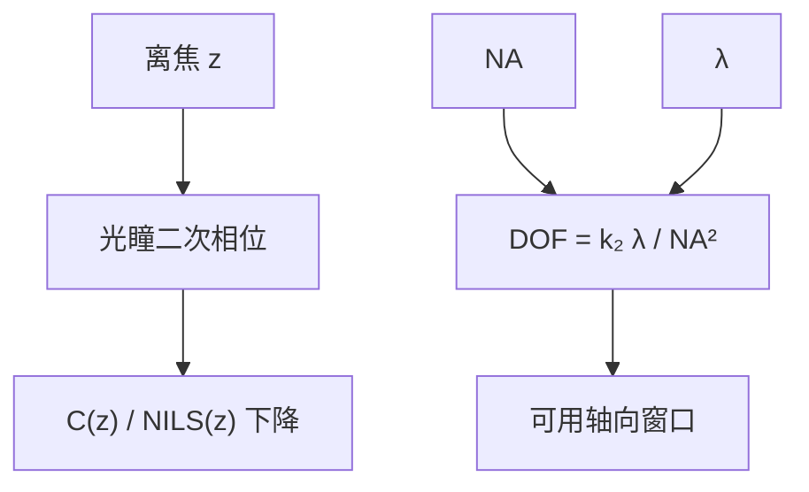

# 焦深与瑞利焦深

孔径角一大，离焦带来的光程差按 $\mathrm{NA}^2$ 涨；焦深因此不是「镜头再调一调」的软指标，而是与分辨率绑在同一根 $n\sin\theta$ 上的轴向预算。

<footer>—— 瑞利关于四分之一波长容差的讨论；产线形式见 Mack 的 $\mathrm{DOF}=k_2\lambda/\mathrm{NA}^2$</footer>

[上一课](/litho/aerial-image-contrast)在最佳焦距上定义了空中像对比度与 NILS。缺口是：晶圆并不落在一个数学平面上——翘曲、薄膜台阶、扫描同步误差都把局部移出最佳焦面。本课把离焦写成光瞳里的二次相位，并给出瑞利焦深 $\mathrm{DOF}\propto\lambda/\mathrm{NA}^2$。偏振与高 NA 下标量离焦不够用，留给[矢量成像](/litho/vector-imaging)。产线 CD 公式仍不在本课。

## 问题

对比度只在焦面上有意义。离焦 $z$ 时，孔径角 $\theta$ 的光线相对轴上光线多走一段光程。小角度展开，$n(1-\cos\theta)z\approx n\theta^2 z/2$，而 $\mathrm{NA}=n\sin\theta\approx n\theta$，于是额外相位按 $z\cdot\mathrm{NA}^2/n$ 的量级涨。NILS 掉下去之后，同一套剂量再也切不出规格内的 CD。缺口因此是给轴向一个与 $\lambda$、$\mathrm{NA}$ 相连的尺度，而不是开始写 $k_1$。

若把焦深理解成「自动调焦行程」，会漏掉真正的限制：调焦可以把平均面放到最佳，但不能把一台扫描场内的台阶、一块晶圆的翘曲、一次扫描的同步误差同时压成零。DOF 是这些误差必须钻进去的窗口。

### 四分之一波长与 k₂ 不是同一个数

瑞利把波前误差 $\lambda/4$ 当作「刚可察觉」的容差，代入球面离焦，得到量级 $\lambda/\mathrm{NA}^2$ 的轴向深度。光刻把它写成

$$
\mathrm{DOF}=k_2\frac{\lambda}{\mathrm{NA}^2}.
$$

$k_2$ 是工艺因子，依赖照明、图形密度和「多重可印」的判据（对比度掉到多少算死）。不要把显微镜的 $\lambda/4$ 系数直接叫成产线 $k_2$，正如不要把 0.61 叫成 $k_1$。浸没的 $n$ 出现在更完整的形式里（有效焦深还与像方介质有关）；本课先钉 $\mathrm{NA}^2$ 在分母。

抬 $\mathrm{NA}$ 缩 CD 按一次方，缩 DOF 按平方。这是后课浸没与 High-NA 必须付的轴向账。本课只把账本立上，不讨论水层或 0.55 NA。

## 方法

光瞳坐标 $\rho$（已按 $\mathrm{NA}$ 归一到 1）上，离焦对应相位 $\exp\bigl(i\pi z\rho^2/\mathrm{DOF}_0\bigr)$ 一类的二次项（具体归一随软件约定）。把它乘进光瞳函数，重新算空中像，$C(z)$ 与 $\mathrm{NILS}(z)$ 成峰形。工艺窗口的轴向宽度，就是 $C$ 或 NILS 仍高于阈值的 $z$ 区间；那才是「这一层」的可用焦深，可能比教科书 $k_2\lambda/\mathrm{NA}^2$ 更窄。

Bossung 曲线（CD vs 离焦，按剂量分族）把光学焦深和胶阈值绑在一起，是[曝光–散焦窗口](/litho/ed-process-window)的题目。本课停在光学：$z$ 如何进光瞳，尺度为何是 $\lambda/\mathrm{NA}^2$。

### 透过焦的对比度崩溃

三束成像对离焦尤其脆：零级与正负一级的轴向相位失配把调制打掉。两束成像（离轴照明）的焦深往往更宽——这是 RET 买焦深的机制之一，本课只指出原因，不选偶极。孤立线与密线的 $C(z)$ 宽度不同，因此「这一层的 DOF」必须声明图形类别。

调平传感器量的是晶圆高度图，曝光时按图补偿 $z$。补偿的是场级、片级的平均面，不是胶厚内部的驻波节点。驻波是另一层轴向问题，与 $\mathrm{NA}^2$ 焦深叠加。

## 机制

几何上，边缘光线与近轴光线在离焦平面上不再交于一点，点扩散沿轴拉伸。频率上，离焦是光瞳的径向二次相位，等效于对不同空间频率施加不同的传递相位，密图形（高频）先死。因此焦深不是对所有节距一律的毫米数：越接近截止频率，轴向窗口越瘦。这与上一课「NILS 对密图形更苛刻」是同一件事的 $z$ 方向。

$n$ 增大（浸没）时，同样的 $\sin\theta$ 对应更大 $\mathrm{NA}$，DOF 公式里的 $\mathrm{NA}^2$ 立刻变差；同时像方波长变短、光程按 $n$ 计，完整推导要回到[第一课](/litho/em-wave-index)的 $n$。本课不展开浸没流体，只要求后课改 $n$ 时必须重算 DOF，不能只改瑞利 CD。

### 与分辨率旋钮同源

缩短 $\lambda$、增大 $\mathrm{NA}$，都在分辨率公式里出现，也都按各自幂次改 DOF。减小 $k_1$ 主要改横向对比，对 $k_2$ 的影响是间接的（照明变了 $k_2$ 会变）。本课把轴向尺度独立写出来，免得后课只背 $\mathrm{CD}=k_1\lambda/\mathrm{NA}$ 却忘了平方惩罚。

三束成像对离焦尤其脆：零级与正负一级的轴向相位失配把调制打掉。两束成像（离轴照明）的焦深往往更宽——这是 RET 买焦深的机制之一，本课只指出原因，不选偶极。调平传感器补偿的是场级、片级的平均面，不是胶厚内部的驻波节点。

## 边界

DOF 公式不含工件台伺服带宽、不含掩模倾斜、不含 pellicle 热鼓包。那些会吃掉窗口，但不改 $\lambda/\mathrm{NA}^2$ 的定义。标量二次相位在 $\mathrm{NA}\gtrsim 0.7$ 时对偏振与能量流向不够；下一课用矢量场补。也不要把「焦深 200 nm」写成与胶厚无关：厚胶内部本就跨一段 $z$，自身占用预算。

## 小结

- 最佳焦距上的对比度不够用；离焦以光瞳二次相位毁掉 NILS。
- 产线焦深写成 $\mathrm{DOF}=k_2\lambda/\mathrm{NA}^2$，$k_2$ 不是显微镜 $\lambda/4$ 系数。
- $\mathrm{NA}$ 一次方帮 CD、平方次罚 DOF。
- 可用焦深随图形类别与照明变，须用 $C(z)$ 或 NILS$(z)$ 实测。
- 本课仍是标量；矢量修正下一课。
- 出处：Rayleigh 波前容差；Mack, *Fundamental Principles of Optical Lithography*。
