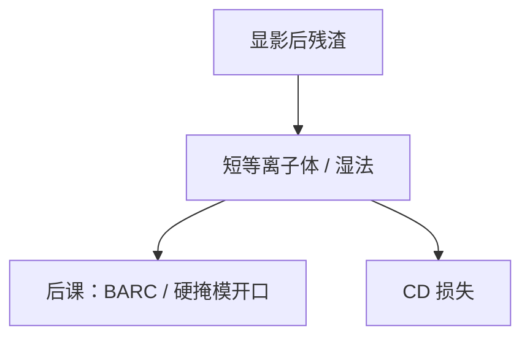

# 去渣

显影后的残膜和脚不是空中像的一部分；去渣用弱氧化或温和等离子体把它们清掉，也会吃掉真 CD。

<footer>—— 对照 descum / ashing 在显影后、硬掩模开口前的公开位置</footer>

[上一课](/litho/collapse-mitigation)处理还立着的线。缺口是脚下和孔底的残渣：光学上像桥、电学上开路。本课钉去渣，不把全量胶剥离提前写完。

## 问题

欠显影、BARC 不溶、驻波谷，都会留残胶。SEM 上看见的「关不掉的底」若直接进主刻蚀，选择比可能不够，或把残渣当掩模打出钉。去渣过猛，线宽被吃、LER 升。把残渣全写成剂量不足，会漏掉这一步的独立窗口。

## 方法

典型：短时间 O₂ 或形成气体等离子体，或湿法弱氧化。终点靠时间或光学发射。须与成像胶、SOG、SOC 的选择比匹配——三层堆叠里去渣往往只清成像胶残，停在 SOG。剂量以「残渣消失、CD 损失可接受」为窗。

EUV 金属氧化物胶的残渣化学与 CAR 不同，同一 O₂ 去渣可能无效或过刻。换胶要重新定去渣。

## 机制

残渣薄、真图形厚，短氧化可以在真图形被明显削薄前清底。LER 的高频成分有时被「磨掉」，有时被等离子体粗糙化——要分气体。

## 边界

本课不是 [胶去除](/litho/resist-strip-ash)。去渣保留图形；剥离去掉全部掩模。下一课硬烤：去渣前后的热，改模量与残留溶剂。

## 小结

- 去渣清显影残，付 CD 损失。
- 停层必须与三层选择比一致。
- 出处：descum 工艺通识；接续显影与倒塌课。
