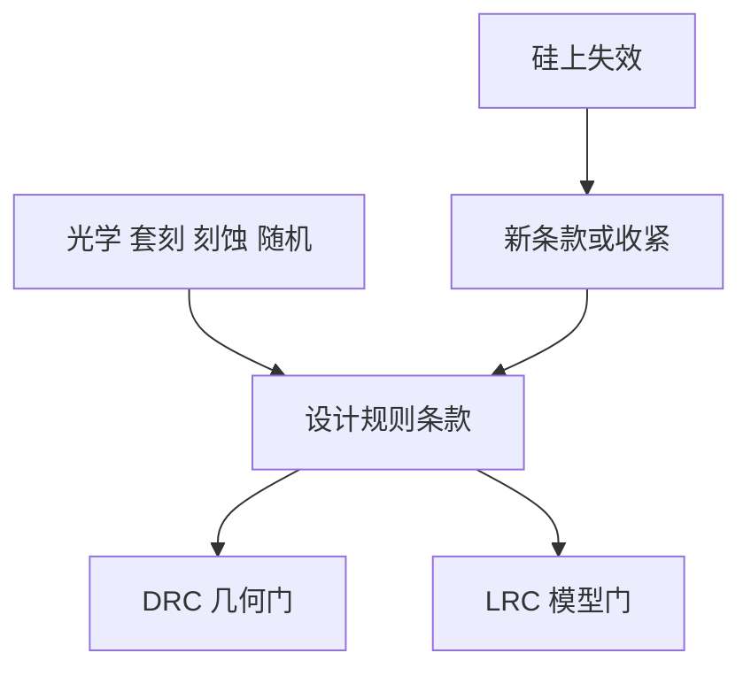

# 设计规则的起源

设计规则不是从瑞利公式抄下来的整数；它们是成像、套刻、刻蚀、电学与良率谈出来的可交货集合，写进手册之后才看起来像几何。

<footer>—— 对照 Levinson 对设计规则与工艺能力的讨论；DTCO 把规则当作协同输出</footer>

[上一课](/litho/decomposition-coloring-conflict)把不可染色写成硬失败。缺口是回溯：手册里最小间隔、最小宽度、via 覆盖、密度窗，最初是哪一截物理不够用。[DTCO](/litho/dtco-patterning) 已说规则是协同输出；本课钉起源清单，供后课把面积、轨道、SRAM 读成规则的后果。最小面积与 tip-to-tip 的专项，留给[下一课](/litho/min-area-tip-to-tip）。

## 问题

瑞利 $CD = k_1\lambda/\mathrm{NA}$ 只给节距量级。真实规则还包括：掩模可写（MRC）、胶塌缩与随机桥断、刻蚀 ARDE、CMP 密度、对准标记禁区、电学漏电与可靠性间距。每一条「min space = x nm」都是某一失效模式的代理，而不是光学分辨率的别名。

缺口是**把规则读成失效模式**，不是从第一性原理重讲成像。[套刻预算](/litho/overlay-budget) 已经分解位置误差；via 覆盖规则有一截就是这笔预算的几何化。把规则当神圣整数，LFD 无法谈判；把规则当随便可破，LRC 失门。

### 规则是冻结的窗口

工艺窗随胶、光源、腔体漂。规则版本必须与 OPC 模型、刻蚀核、分解选项同发。节点中期换 EUV 单次，旧双重规则应整段退休，而不是叠床架屋。起源课的用处是：改一条规则时知道要重开哪一扇窗。

同一数字可能同时服务光学与可靠性。收紧「只为了好印」可能在电学上无意义，或反过来。改规则要声明主失效。

## 方法

把手册条款映射到来源：光学/PV-band、分解/着色、套刻/覆盖、刻蚀/密度、CMP、可靠性、可制造性（填充、狭缝均匀）。每条附：计量如何验证、LRC 如何检查、例外是否存在（SRAM 常有自己的规则族）。与 [光刻流程](/litho/litho-process-flow) 的关系：规则是流程能力的接口，不是流程本身。

起源清楚后，LFD 才知道该改库还是该改工艺。

手册修订走变更控制：改一条 min space，要列出受影响的 OPC 核、分解选项、PWQ 矩阵和电学可靠性条款。Levinson 把设计规则写成工艺能力的接口；本课要求接口变更有追溯，而不是在邮件里改一个整数。

## 机制

光学给出可印节距与二维禁区；套刻把「不同层之间」变成覆盖与 tip 规则；刻蚀把密度变成填充规则；随机把稀疏孔的面积规则收得比均值 CD 更严。设计规则检查是这些物理在多边形上的投影。投影有信息损失：合法图形仍可能是热点，故需要 LRC；热点合法化又可能倒逼加规则。

## 边界

本课不重写限价簿或 Transformer。不把某代工厂未公开的规则数值表当作文献。规则起源随节点变，历史数字不可当现节点规格。

后课默认：读规则先问失效模式。下一课专攻面积与 tip-to-tip——二维图形化最常被光学和套刻同时咬的两条。

## 小结

- 设计规则是多物理失效模式的几何代理，不是瑞利公式的整数翻版。
- 版本与模型、分解、腔体同发。
- 合法不等于可印；LRC 补投影损失。
- 出处：Levinson《Principles of Lithography》；DTCO 与设计规则公开论述。
