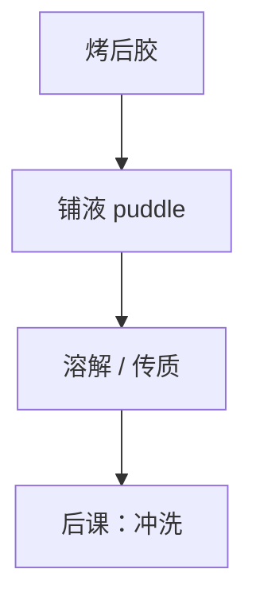

# 显影：搅拌与 puddle

溶解速率曲线给出材料能走多快；轨道给出液膜是静止 puddle 还是流动更新。传质一变，CD 跟着变。

<footer>—— 对照 Mack 溶解模型与轨道 puddle develop 公开流程</footer>

[上一课](/litho/soft-bake)给出固体膜。主干已有 [衬度曲线](/litho/resist-contrast-curve) 与 [Mack 溶解](/litho/dissolution-mack)。缺口是实现：显影液怎么铺、停多久、要不要搅。本课钉 puddle 与搅拌，化学物种留给下一课 TMAH。

## 问题

实验室喷淋与厂内 puddle 的边界层不同。静止 puddle 里溶解产物积累，局部 pH 与抑制剂浓度漂；旋转喷淋更新液体，但可能引入溅射缺陷。把所有 CD 偏差写成剂量，会漏掉这一段传质。

## 方法

典型正胶：喷嘴铺满 TMAH puddle，静止数秒至数十秒，再漂洗。时间是剂量之外的第二旋钮：过显影吃线宽，欠显影留残胶。搅拌（scan nozzle、轻微旋转）减薄边界层，加快到达体相速率。配方写清：铺液转速、puddle 时间、是否间歇旋转。

EUV 薄胶的绝对溶解量小，但对残膜与残渣更敏感。同一 puddle 时间，DUV 厚胶与 EUV 薄胶不是同一个工艺窗口。

## 机制

溶解是表面反应加产物扩散。边界层厚，有效速率被扩散限制，衬度曲线的「实验室搅拌」假设失效。产物若抑制溶解，静止 puddle 会自减速——看起来像欠剂量。

## 边界

本课不写负胶交联显影的溶剂体系细节。下一课钉 TMAH 浓度与表面活性剂，不改 puddle 运动学。

## 小结

- puddle 的传质与溶解曲线同样决定 CD。
- 搅拌与时间是轨道参数，不是扫描仪剂量的别名。
- 出处：Mack 溶解；轨道 puddle 通识。
